**AZ-400 Q & A**

1\. C. Cycle time - Cycle time measures the time it takes for your team
to complete work items once they begin actively working on them. Q- You
are configuring project metrics for dashboards in Azure DevOps. You need
to configure a chart widget that measures the elapsed time to complete
work items once they become active.Which of the following is the widget
you should use?

2\. B. Lead time - Lead time measures the total time elapsed from the
creation of work items to their completion.

3\. D. License procurement - Group membership changes, license
assignment, and assigning entitlements can all be automated using tools
such as Azure DevOps and Azure Active Directory. However, license
procurement involves purchasing licenses from a vendor, which typically
requires manual intervention. Q- You are making use of Azure DevOps
manage build pipelines, and also deploy pipelines. The development team
is quite large, and is regularly added to.You have been informed that
the management of users and licenses must be automated when it can be.
Which of the following is a task that can't be automated?

4\. B. Static code analysis - You can analyse your source code without
executing it(during CI phase), detect security weaknesses before
integrate your code to the main source code. Static code analysis tools
in the IDE provide the first line of defense to help ensure that
security vulnerabilities are not introduced into the CI/CD process.
Penetration testing, typically performed after CI/CD processes, identify
vulnerabilities and assess the security, simulating real-attack. Dynamic
code analysis, unlike Static code analysis this evaluates the app during
runtime (not during CI). Threat modeling, identifies potential threats
and vulnerabilities for the app during design and planning phase. . Q-
You have been tasked with strengthening the security of your team's
development process.You need to suggest a security tool type for the
Continuous Integration (CI) phase of the development process. Which of
the following is the option you would suggest?

5\. B. Using the TFS Database Import Service to perform the upgrade -
For upgrading TFS to the most recent RTW release. In Phase 3 of your
migration project, you will work on upgrading your Team Foundation
Server to one of the supported versions for the Database Import Service
in Azure Devops Services. Q- Your company is currently making use of
Team Foundation Server 2013 (TFS 2013), but intend to migrate to Azure
DevOps.

You have been tasked with supplying a migration approach that allows for
the preservation of Team Foundation Version Control changesets dates, as
well as the changes dates of work items revisions. The approach should
also allow for the migration of all TFS artifacts, while keeping
migration effort to a minimum. You have suggested upgrading TFS to the
most recent RTW release.Which of the following should also be suggested?

6\. The plan requires you to integrate Azure DevOps and Bitbucket, 1-
Self-hosted agent: This is a software application that you install on a
machine within your network (not necessarily the Bitbucket server) to
run jobs and tasks for your pipelines in Azure DevOps. It can be used
with the External Git service connection to interact with your Bitbucket
server without requiring inbound internet access. 2- External Git
service connection: This is a configuration in Azure DevOps that allows
it to connect to an external Git repository like your on-premises
Bitbucket server. It can be used in conjunction with a self-hosted agent
to access and interact with your Bitbucket repositories behind the
firewall. Q- You have an on-premises Bitbucket Server with a firewall
configured to block inbound Internet traffic. The server is used for
Git-based source control. You intend to manage the build and release
processes using Azure DevOps. This plan requires you to integrate Azure
DevOps and Bitbucket. Which of the following will allow for this
integration?

7\. D. CMMI - Choose CMMI when your team follows more formal project
methods that require a framework for process improvement and an
auditable record of decisions. With this process, you can track
requirements, change requests, risks, and reviews. Q- You are currently
developing a project for a client that will be managing work items via
Azure DevOps. You want to make sure that the work item process you use
for the client allows for requirements, change requests, risks, and
reviews to be tracked. Which of the following is the option you would
choose?

8\. B. No - Specifies the DSC configuration mode. Valid values are:
ApplyAndMonitor, ApplyAndAutocorrect, ApplyOnly. Answer is No; use
ApplyAndAutocorrect for "correctly configured, regardless of
configuration drift". Q-

You run the Register-AzureRmAutomationDscNode command in your company's
environment.You need to make sure that your company's test servers
remain correctly configured, regardless of configuration drift.

Solution: You set the -ConfigurationMode parameter to ApplyOnly.Does the
solution meet the goal?

9\. B. No - ApplyAndMonitor doesn't change the state of the machine if
there is a deviation from initial configuration. It only logs the
activity. Q- You run the Register-AzureRmAutomationDscNode command in
your company's environment. You need to make sure that your company's
test servers remain correctly configured, regardless of configuration
drift. Solution: You set the -ConfigurationMode parameter to
ApplyAndMonitor. Does the solution meet the goal

10\. A. Yes - DSC applies any new configurations. After initial
application of a new configuration, if the target node drifts from the
desired state, DSC reports the discrepancy in logs, and then re-applies
the current configuration. Q- You run the
Register-AzureRmAutomationDscNode command in your company's
environment.You need to make sure that your company's test servers
remain correctly configured, regardless of configuration drift.
Solution: You set the -ConfigurationMode parameter to
ApplyAndAutocorrect. Does the solution meet the goal?

11\. B. Hosted Windows Container: This type of agent pool specifically
provides Windows agents with Docker pre-installed and configured, making
them suitable for building Dockerized applications, including IIS web
apps. Q- You need to consider the underlined segment to establish
whether it is accurate. To compile an Internet Information Services
(IIS) web application that runs docker, you should use a Default build
agent pool.

12\. D. Configure conditional access in Azure Active Directory: This is
the correct option. Azure AD conditional access allows you to define
granular access policies based on various factors, including the user's
identity, device attributes (such as location), and other conditions. By
creating a conditional access policy that requires devices to be
connected to the company's on-premises network for accessing the Azure
DevOps environment, you can achieve the desired location-based access
control. Q- Your company has an Azure DevOps environment that can only
be accessed by Azure Active Directory users. You are instructed to make
sure that the Azure DevOps environment can only be accessed from devices
connected to the company's on-premises network. Which of the following
actions should you take?

13\. A. Github Enterprise - GitHub Enterprise is the on-premises version
of GitHub.com. GitHub Enterprise includes the same great set of features
as GitHub.com but packaged for running on your organization's local
network. All repository data is stored on machines that you control, and
access is integrated with your organization's authentication system
(LDAP, SAML, or CAS). Q- You are making use of Azure DevOps to configure
Azure Pipelines for project, named PROJ-01.You are preparing to use a
version control system that allows for source code to be stored on a
managed Windows server located on the company network. Which of the
following is the version control system you should use?

14\. D. boards - JIRA is a tool for agile project management, while
Azure DevOps is a set of development tools, services, and features that
enable teams to plan, develop, deliver, and maintain software more
efficiently. While Azure DevOps does include a build pipelines service,
it is not a replacement for JIRA. Instead, Azure DevOps has a feature
called Azure Boards, which is a tool for agile project management
similar to JIRA. Q- You need to consider the underlined segment to
establish whether it is accurate.When moving to Azure DevOps, JIRA must
be replaced with the build pipelines Azure DevOps service.

15\. C. npm install - WhiteSource Bolt: Scans your application for
vulnerabilities, including those in libraries with invalid licenses.
Scenario: You want to scan only production dependencies, excluding
development libraries identified by WhiteSource Bolt. Correct Command:
npm install --only=production (or --only=prod). Q- You scan a Node.js
application using WhiteSource Bolt. The scan finds numerous libraries
with invalid licenses, but are only used during development. You have to
make sure that only production dependencies are scanned by WhiteSource
Bolt. Which of the following is a command you should run?

16\. A. Red/Black deployment - Blue/green and Red/Black are same. Must
be 2 \['colored' paths\] to swap immediately between them. Read the line
"The strategy should also allow you to roll back in the shortest time
required". Q- You are currently defining a release strategy for an app,
named APP-01. The strategy should allow you to keep the time it takes to
deploy new releases of the app to a minimum. The strategy should also
allow you to roll back in the shortest time required. Which of the
following is the release strategy you should use?

17\. C. You should make use of a gate - Gates allow automatic collection
of health signals from external services and then promote the release
when all the signals are successful or stop the deployment on timeout.
Typically, gates are used in connection with incident management,
problem management, change management, monitoring, and external approval
systems. Scenarios and use cases for gates include✑ Quality validation.
Query metrics from tests on the build artifacts such as pass rate or
code coverage and deploy only if they are within required thresholds.
Use Quality Gates to integrate monitoring into your pre-deployment or
post-deployment. This ensures that you are meeting the key
health/performance metrics(KPIs) as your applications move from dev to
production and any differences in the infrastructure environment or
scale is not negatively impacting your KPIs. Q- Your company hosts a web
application in Azure, and makes use of Azure Pipelines for managing the
build and release of the application. When stakeholders report that
system performance has been adversely affected by the most recent
releases, you configure alerts in Azure Monitor. You are informed that
new releases must satisfy specified performance baseline conditions in
the staging environment before they can be deployed to production. You
need to make sure that releases not satisfying the performance baseline
are prevented from being deployed. Which of the following actions should
you take?

18\. C. deployment - When authoring an Azure Pipelines or TFS Release
pipeline, you can specify the deployment targets for a job using a
deployment group.If the target machines are Azure VMs, you can quickly
and easily prepare them by installing the Azure Pipelines Agent Azure VM
extension on each of the VMs, or by using the Azure Resource Group
Deployment task in your release pipeline to create a deployment group
dynamically. A deployment group is a logical set of deployment target
machines that have agents installed on each one. Deployment groups
represent the physical environments; for example, "Dev", "Test", or
"Production" environment. In effect, a deployment group is just another
grouping of agents, much like an agent pool. Q- You need to consider the
underlined segment to establish whether it is accurate. To deploy an
application to a number of Azure virtual machines, you should create a
universal group.

19\. Yeoman, Terratest - You can use the combination of Terraform and
Yeoman. Terraform is a tool for creating infrastructure on Azure. Yeoman
makes it easy to create Terraform modules. Terratest provides a
collection of helper functions and patterns for common infrastructure
testing tasks, like making HTTP requests and using SSH to access a
specific virtual machine. The following list describes some of the major
advantages of using Terratest:✑ Convenient helpers to check
infrastructure - This feature is useful when you want to verify your
real infrastructure in the real environment.✑ Organized folder
structure - Your test cases are organized clearly and follow the
standard Terraform module folder structure. Test cases are written in
Go - Many developers who use Terraform are Go developers. If you're a Go
developer, you don't have to learn another programming language to use
Terratest.✑ Extensible infrastructure - You can extend additional
functions on top of Terratest, including Azure-specific features. Q- You
are preparing to deploy an Azure resource group via Terraform.To achieve
your goal, you have to install the necessary frameworks. Which of the
following are the frameworks you should use?

20\. B. You should make use of views. - Views allow you to create a
filtered version of a feed, showing only specific packages or versions
that meet your criteria. You can create a view that excludes packages
marked as "development" from being accessed by users, even though they
exist in the original feed. Q- You intend to make use of Azure Artifacts
to share packages that you wrote, tested, validated, and deployed. You
want to use a solitary feed to release several builds of each package.
You have to make sure that the release of packages that are in
development is restricted. Which of the following actions should you
take?

21\. C. WhiteSource - WhiteSource, is a code security analysis tool
capable of identifying open-source libraries within your codebase.
Additionally, some WhiteSource features track changes over time,
potentially allowing you to pinpoint when specific libraries were
introduced. WhiteSource integrates into your build process, irrespective
of your programming languages, build tools, or development environments.
It works automatically, continuously, and silently in the background,
checking the security, licensing, and quality of your open source
components against WhiteSource constantly-updated definitive database of
open source repositories. Azure DevOps integration with WhiteSource Bolt
will enable you to:1. Detect and remedy vulnerable open source
components.2. Generate comprehensive open source inventory reports per
project or build.3. Enforce open source license compliance, including
dependencies' licenses.4. Identify outdated open source libraries with
recommendations to update. Q- You need to consider the underlined
segment to establish whether it is accurate.

To find when common open source libraries are added to the code base,
you should add Jenkins to the build pipeline.

22\. A. You should create a build task and use the WhiteSource Bolt
service- Since you need to scan your codebase during the build process
to identify vulnerabilities in open-source libraries, the most suitable
option is: This approach leverages the build task within your Azure
DevOps pipeline, ensuring the scan happens early in the development
lifecycle, allowing you to address potential vulnerabilities before
deployment. WhiteSource Bolt is a specific solution designed to address
your exact requirement of scanning open-source libraries for
vulnerabilities. Q- Your company has an Azure DevOps project, which
includes a build pipeline that makes use of roughly fifty open source
libraries.You have been tasked with making sure that you are able to
scan project for common security weaknesses in the open source
libraries. Which of the following actions should you take?

23\. A. No adjustment required - Secure and Manage Open Source Software.
Black Duck helps organizations identify and mitigate open source
security, license compliance and code-quality risks across application
and container portfolios against predefined set of policies to ensure
compliance with legal and company-specific licensing requirements.Black
Duck Hub and its plugin for Team Foundation Server (TFS) allows you to
automatically find and fix open source security vulnerabilities during
the build process, so you can proactively manage risk. The integration
allows you to receive alerts and fail builds when any Black Duck Hub
policy violations are met. Q- You need to consider the underlined
segment to establish whether it is accurate. Black Duck can be used to
make sure that all the open source libraries conform to your company's
licensing criteria.

24\. A. Azure Resource Manager (ARM) templates: These are JSON files
that define the infrastructure and configuration of your Azure
resources, including virtual machines. Using ARM templates ensures
consistent configuration across all VMs by defining the desired state in
code. This facilitates repeatable and automated deployments, reducing
manual configuration and potential errors, B. PowerShell Desired State
Configuration (DSC) extension for Windows: This extension allows you to
manage the configuration of your Windows VMs using DSC in an automated
fashion. DSC leverages declarative scripts to specify the desired state
of the system, and the extension ensures that the VMs converge towards
that configuration state. This method simplifies management and reduces
administrative effort, as you can configure settings centrally through
DSC scripts rather than manually on each VM. Q- You have created an
Azure DevOps project for a new application that will be deployed to a
number of Windows Server 2016 Azure virtual machines. You are preparing
a deployment solution that allows for the virtual machines to maintain a
uniform configuration, and also keep administrative effort with regards
to configuring the virtual machines to a minimum. Which of the following
should be part of your solution?

25\. D. Azure Security Center - This section has a set of
recommendations for each VM and computer, web and worker roles, Azure
App Service Web Apps, and Azure App Service Environment that Security
Center monitors. The first column lists the recommendation. The second
column shows the total number of resources that are affected by that
recommendation. The third column shows the severity of the issue. Q-
Your company has an application that contains a number of Azure App
Service web apps and Azure functions. You would like to view
recommendations with regards to the security of the web apps and
functions. You plan to navigate to Compute and Apps to achieve your
goal. Which of the following should you access to make use of Compute
and Apps?

26\. B. Azure Application Insights - Monitors web applications and
services: Collects performance-related data, including page load times,
user engagement, and exceptions. Provides detailed insights: Analyzes
data to identify performance bottlenecks and application health issues.
Offers visualizations: Presents data in dashboards and reports for easy
understanding. Q- Your company has a multi-tier application that has its
front end hosted in Azure App Service. To pinpoint the average load
times of the application pages, you should make use of Azure Event Hubs.

27\. B. No- Azure SQL Database Intelligent Insights and Azure
Application Insights use Kusto Query Language (KQL) for ad-hoc queries.
CQL is primarily used for querying Azure Monitor logs. Q- Your company
makes use of Azure SQL Database Intelligent Insights and Azure
Application Insights for monitoring purposes. You have been tasked with
analyzing the monitoring using ad-hoc queries. You need to utilize the
correct query language.

Solution: You use the Contextual Query Language (CQL). Does the solution
meet the goal?

28\. B. No. Q- Your company makes use of Azure SQL Database Intelligent
Insights and Azure Application Insights for monitoring purposes. You
have been tasked with analyzing the monitoring using ad-hoc queries. You
need to utilize the correct query language. Solution: You use the
Transact-SQL. Does the solution meet the goal?

29\. A. Yes - The language to use here is Kusto Query Language and it is
part of Azure Log Analytics. Q- Your company makes use of Azure SQL
Database Intelligent Insights and Azure Application Insights for
monitoring purposes. You have been tasked with analyzing the monitoring
using ad-hoc queries. You need to utilize the correct query language.
Solution: You use Azure Log Analytics. Does the solution meet the goal?

30\. 1. Azure Application Insights 2. Azure Logic Apps - Exceptions in
your live web app are reported by Application Insights.Note: Periodical
reports help keep a team informed on how their business critical
services are doing. Developers, DevOps/SRE teams, and their managers can
be productive with automated reports reliably delivering insights
without requiring everyone to sign in the portal. Such reports can also
help identify gradual increases in latencies, load or failure rates that
may trigger any alert rules.You can programmatically query Application
Insights data to generate custom reports on a schedule. The following
options can help you get started quickly: Automate reports with
Microsoft Flow, Automate reports with Logic Apps. Q- You have recently
created a web application for your company. You have been tasked with
making sure that a summary of the exceptions that transpire in the
application is automatically sent to Microsoft Teams on a daily basis.
Which of the following Azure services should you use? 

31\. A. The Microsoft Test & Feedback extension. - Integration with
Microsoft Visual Studio App Center is a comprehensive solution that
covers mobile app lifecycle management, including collecting bug
reports, distributing beta versions, and obtaining user feedback. It is
a robust option for teams looking for a complete solution for mobile app
development and testing. On the other hand, the Microsoft Test &
Feedback extension is specifically designed to facilitate the collection
of feedback and manual testing in web and desktop applications, but it
can also be used for mobile applications. It allows collecting bug
reports, distributing beta versions, and obtaining user feedback. It is
an option more focused on the manual testing phase and collaboration
between development teams and end users. Q- You are in the process of
building a mobile app aimed at Android and iOS devices.

All work items and release cycles are managed via Azure DevOps. You want
to make sure that crash reports for issue analysis is collected, and
that beta releases are distributed to your testers. Also, you want to
ensure that user feedback on the functionality of new apps is received.
Which of the following must be part of your solution?

Topic 2 - Question Set 2

1\. Box 1: Lead time -Lead time measures the total time elapsed from the
creation of work items to their completion. Box 2: Cycle time -Cycle
time measures the time it takes for your team to complete work items
once they begin actively working on them. Box 3: Burndown -Burndown
charts focus on remaining work within a specific time period. Q- You
need to recommend project metrics for dashboards in Azure DevOps. Which
chart widgets should you recommend for each metric?

2\. Percentile_duration_95 - This 95th percentile is the highest value
left when the top 5% of a numerically sorted set of collected data is
discarded. resultCode- To detect authentication issue we're interested
in 401 and 403. Success could be set to false not only due to
authentication issue, but other issues like unhandled exceptions 500,
and so on.

3\. B. Azure Monitor alert that has a dynamic threshold. alerts is
adjust based on "exceeds normal usage patterns"(dynamic threshold) A.
Azure Automation runbook. Script that can be executed when specific
conditions are met(Azure Monitor Alert) and increases the logging level.
Q- You manage an Azure web app that supports an e-commerce website. You
need to increase the logging level when the web app exceeds normal usage
patterns. The solution must minimize administrative overhead. Which two
resources should you include in the solution?

4\. Liveness Probes, Period Seconds; 15 - Readines Probes; The correct
answer is liveness because you want that your POD restart in case of
failure. Readiness remove the POD from Load Balancer, but doesn't
restart it. The kubelet uses liveness probes to know when to restart a
container. For example, liveness probes could catch a deadlock, where an
application is running, but unable to make progress. Restarting a
container in such a state can help to make the application more
available despite bugs, The kubelet uses readiness probes to know when a
container is ready to start accepting traffic. A Pod is considered ready
when all of its containers are ready. One use of this signal is to
control which Pods are used as backends for Services. When a Pod is not
ready, it is removed from Service load balancers. Q- You have an Azure
Kubernetes Service (AKS) pod. You need to configure a probe to perform
the following actions:✑ Confirm that the pod is responding to service
requests.✑ Check the status of the pod four times a minute.✑ Initiate a
shutdown if the pod is unresponsive.How should you complete the YAML
configuration file? 

5\. B. Create an Azure Application Insights availability test and alert-
There are three types of Application Insights availability tests: 1.URL
ping test: a simple test that you can create in the Azure portal. 2.
Multi-step web test 3. Custom Track Availability Tests Note: After
you've deployed your web app/website, you can set up recurring tests to
monitor availability and responsiveness. Azure Application Insights
sends web requests to your application at regular intervals from points
around the world. It can alert you if your application isn't responding,
or if it responds too slowly.You can set up availability tests for any
HTTP or HTTPS endpoint that is accessible from the public internet. You
don't have to make any changes to the website you're testing. In fact,
it doesn't even have to be a site you own. You can test the availability
of a REST API that your service depends on. Q- You have a Microsoft
ASP.NET Core web app in Azure that is accessed worldwide. You need to
run a URL ping test once every five minutes and create an alert when the
web app is unavailable from specific Azure regions. The solution must
minimize development time. What should you do?

6\. Azure Application Insights - Application Insights will tell you
about any performance issues and exceptions, and help you find and
diagnose the root causes.Application Insights can monitor both Java and
ASP.NET web applications and services, WCF services. They can be hosted
on-premises, on virtual machines, or as Microsoft Azure websites. On the
client side, Application Insights can take telemetry from web pages and
a wide variety of devices including iOS, Android, and Windows Store
apps. Q- You have a multi-tier application. The front end of the
application is hosted in Azure App Service. You need to identify the
average load times of the application pages. What should you use?

7\. configure the instance to receive telemetry data from an Azure web
app - Step 1: Create an instance of Azure Application Insights - Log
into your Azure account, Select Create a resource \> Developer tools \>
Application Insights. Step 2: Configure App Insights SDK. 1. Open your
ASP.NET Core Web App project in Visual Studio \> Right-click on the
AppName in the solution Explorer \> Select Add \> Application Insights
Telemetry.Select your account and subscription \> Select the Existing
Application Insight resource you created in the Azure portal \> Click
Register. SIM- You need to create an instance of Azure Application
Insights named az400-123456789-main and configure the instance to
receive telemetry data from an Azure web app named az400-123456789-main

8\. C. IT Service Management Connector (ITSM) - The IT Service
Management Connector (ITSMC) allows you to connect Azure and a supported
IT Service Management (ITSM) product/service. ITSMC supports connections
with the following ITSM tools:✑ ServiceNow✑ System Center Service
Manager✑ Provance✑ Cherwell. With ITSMC, you can -✑ Create work items in
ITSM tool, based on your Azure alerts (metric alerts, Activity Log
alerts and Log Analytics alerts).✑ Optionally, you can sync your
incident and change request data from your ITSM tool to an Azure Log
Analytics workspace. Q- Your company uses ServiceNow for incident
management.

You develop an application that runs on Azure. The company needs to
generate a ticket in ServiceNow when the application fails to
authenticate. Which Azure Log Analytics solution should you use?

9\. Developers : Basic -Assign Basic to users with a TFS CAL, with a
Visual Studio Professional subscription, and to users for whom you are
paying for Azure Boards & Repos in an organization. Pilot users:
Stakeholder -Assign Stakeholders to users with no license or
subscriptions who need access to a limited set of features.Note: You
assign users or groups of users to one of the following access
levels:Basic: provides access to most features VS Enterprise: provides
access to premium features. Stakeholders: provides partial access, can
be assigned to unlimited users for free. Q- Your company is building a
new web application. You plan to collect feedback from pilot users on
the features being delivered. All the pilot users have a corporate
computer that has Google Chrome and the Microsoft Test & Feedback
extension installed. The pilot users will test the application by using
Chrome. You need to identify which access levels are required to ensure
that developers can request and gather feedback from the pilot users.
The solution must use the principle of least privilege. Which access
levels in Azure DevOps should you identify

10\. A. Kusto Query Language (KQL) - Azure Monitor Logs is based on
Azure Data Explorer, and log queries are written using the same Kusto
query language (KQL). This is a rich language designed to be easy to
read and author, and you should be able to start using it with minimal.
Q- You use Azure SQL Database Intelligent Insights and Azure Application
Insights for monitoring. You need to write ad-hoc queries against the
monitoring data.

Which query language should you use?

11\. A. Azure Logic Apps-You can programmatically query Application
Insights data to generate custom reports on a schedule. The following
options can help you get started quickly:✑ Automate reports with
Microsoft Flow✑ Automate reports with Logic Apps , E. Azure Application
Insights - Exceptions in your live web app are reported by Application
Insights. Note: Periodical reports help keep a team informed on how
their business critical services are doing. Developers, DevOps/SRE
teams, and their managers can be productive with automated reports
reliably delivering insights without requiring everyone to sign in the
portal. Such reports can also help identify gradual increases in
latencies, load or failure rates that may not trigger any alert rules.
Q- Your company creates a web application. You need to recommend a
solution that automatically sends to Microsoft Teams a daily summary of
the exceptions that occur in the application. Which two Azure services
should you recommend? 

12\. 1. Feature Usage: User Flows 2. Number of people who used the
actions and its features: Users 3. The effect that the performance of
the application has on the usage of a page or a feature: Impact, 1.

The User Flows tool visualizes how users navigate between the pages and
features of your site. It's great for answering questions like:How do
users navigate away from a page on your site?What do users click on a
page on your site?Where are the places that users churn most from your
site?Are there places where users repeat the same action over and over?
2. The user behavior analytics tools don't currently support counting
users or sessions based on properties other than anonymous user ID,
authenticated user ID, or session ID. 3. Impact analyzes how load times
and other properties influence conversion rates for various parts of
your app. To put it more precisely, it discovers how any dimension of a
page view, custom event, or request affects the usage of a different
page view or custom event. Q- Your company wants to use Azure
Application Insights to understand how user behaviors affect an
application.Which Application Insights tool should you use to analyze
each behavior?

13\. B. Microsoft Visual Studio App Center integration: This service
offers features specifically designed for mobile app development,
including: Crash reporting: Collects and analyzes crash reports from
Android and iOS devices. Distribution: Manages beta releases and
distributes builds to testers for various platforms (Android, iOS). User
feedback: Enables testers to provide feedback directly within the app
through surveys and bug reports. A. Microsoft Test & Feedback extension:
This extension is primarily for providing feedback on web applications
within Visual Studio, not ideal for mobile app testing and crash
reporting. Q- Your company is building a mobile app that targets Android
and iOS devices.Your team uses Azure DevOps to manage all work items and
release cycles.You need to recommend a solution to perform the following
tasks:✑ Collect crash reports for issue analysis.✑ Distribute beta
releases to your testers.✑ Get user feedback on the functionality of new
apps.What should you include in the recommendation?

14\. C. Upload a custom script file to sa1: Since WebApp1 installation
and updates are managed by the Custom Script extension, you need to
modify the script in your Azure storage account (sa1) with the new
version that includes the UI change. D. Modify the Custom Script
extension settings of VMSS1: This allows you to point the extension to
the updated script location in sa1, triggering the installation of the
new WebApp1 version with the UI change on all VMs within the VMSS1 scale
set. E. Update the configuration of a virtual machine in VMSS1: While
this might seem tempting, it's crucial to remember that VMSS1 is a scale
set. Updating a single VM configuration wouldn't update the entire set,
and you might end up with an inconsistent environment. Q- You have an
Azure DevOps project named Project1 and an Azure subscription named
Sub1. Sub1 contains an Azure virtual machine scale set named VMSS1.VMSS1
hosts a web application named WebApp1. WebApp1 uses stateful
sessions.The WebApp1 installation is managed by using the Custom Script
extension. The script resides in an Azure Storage account named sa1.You
plan to make a minor change to a UI element of WebApp1 and to gather
user feedback about the change.You need to implement limited user
testing for the new version of WebApp1 on VMSS1.Which three actions
should you perform?

15\. go to the web, app go to metrics, got to alerts, go to
create/create new rule, select response time, select static, select
operator greater than set threshold 5, Period: Over the last 5 minutes,
next create an action group or select an existing one that send the
notification to the webhook, if you create a new action group just
select the action you need in this case webhook and set the url review
and create and the keep going with the alert configuration. SIM - You
need to create a notification if the peak average response time of an
Azure web app named az400-123456789-main is more than five seconds when
evaluated during a five-minute period. The notification must trigger the
\`https://contoso.com/notify\` webhook.

16\. Step 1: To create a general-purpose v2 storage account in the Azure
portal, follow these steps:1. On the Azure portal menu, select All
services. In the list of resources, type Storage Accounts. As you begin
typing, the list filters based on your input. Select Storage Accounts.2.
On the Storage Accounts window that appears, choose Add.3. Select the
subscription in which to create the storage account.4. Under the
Resource group field, select RG1lod1234567895. Next, enter a name for
your storage account named: az400lod123456789stor6. Select Create. Step
2: Enable boot diagnostics on existing virtual machineTo enable Boot
diagnostics on an existing virtual machine, follow these steps:1. Sign
in to the Azure portal, and then select the virtual machine VM1.2. In
the Support + troubleshooting section, select Boot diagnostics, then
select the Settings tab.3. In Boot diagnostics settings, change the
status to On, and from the Storage account drop-down list, select the
storage account az400lod123456789stor.4. Save the change. You must
restart the virtual machine for the change. SIM - You need to create and
configure an Azure Storage account named az400lod123456789stor in a
resource group named RG1lod123456789 to store the boot diagnostics for a
virtual machine named VM1.

17..Log in to AZ portal and navigate to the AZ SQL database 2. All
resources and make sure that there is a Log Analytics Workspace, if no
=\> create one 3. Under Monitoring -\> Diagnosstic settings 4. + Add
diagnostic setting 5. Give the diagnostic setting a name 6. Check Query
Store Runtime Statistics 7. Check basic 8. Check Send to Log Analytics
workspace and select the Log Analytics Workspace. SIM - You have a web
app that connects to an Azure SQL Database named db1.You need to
configure db1 to send Query Store runtime statistics to Azure Log
Analytics.

18\. Event \| where TimeGenerated \> ago(12h) \| order by TimeGenerated
desc \| summarize makeset(EventID) by Computer. Q-

You have several Azure virtual machines that run Windows Server 2019.

You need to identify the distinct event IDs of each virtual machine as
shown in the following table.

How should you complete the Azure Monitor query? 

19\. Box 1: requests - Failed requests (requests/failed):The count of
tracked server requests that were marked as failed. Kusto
code:requests\| where success == 'False', Box 2: success == false, Q-You
have an Azure web app named Webapp1. You need to use an Azure Monitor
query to create a report that details the top 10 pages of Webapp1 that
failed.

How should you complete the query? 

20\. D. Smart Detection- Smart Detection automatically warns you of
potential performance problems and failure anomalies in your web
application. It performs proactive analysis of the telemetry that your
app sends to Application Insights. If there is a sudden rise in failure
rates, or abnormal patterns in client or server performance, you get an
alert. Q- You are monitoring the health and performance of an Azure web
app by using Azure Application Insights.You need to ensure that an alert
is sent when the web app has a sudden rise in performance issues and
failures.What should you use?

21\. Box 1: subscribe -To start monitoring all pipelines in a project,
use the following command inside a channel:@azure pipelines subscribe
\[project url\], Box 2: <https://dev.azure.com/contoso/contoso-app/>
Subscribe to a pipeline or all pipelines in a project to receive
notifications: @azure pipelines subscribe \[pipeline url/ project
url\],Q-You have a project in Azure DevOps named Contoso App that
contains pipelines in Azure Pipelines for GitHub repositories.You need
to ensure that developers receive Microsoft Teams notifications when
there are failures in a pipeline of Contoso App.What should you run in
Teams?

22\. C. Add the Azure Boards app to the repository - To connect Azure
Boards to GitHub.com, connect and configure from Azure Boards. Or,
alternatively, install and configure the Azure Boards app from
GitHub.Both methods have been streamlined and support authenticating and
operating via the app rather than an individual.Note (see step 4
below):Add a GitHub connection:1. Sign into Azure Boards.2. Choose (1)
Project Settings, choose (2) GitHub connections and then (3) Connect
your GitHub account.3. If this is your first time connecting to GitHub
from Azure Boards, you will be asked to sign in using your GitHub
credentials. Choose an account for which you are an administrator for
the repositories you want to connect to.4. The Add GitHub Repositories
dialog automatically displays and selects all GitHub.com repositories
for which you are an administrator. Unselect any repositories that you
don't want to participate in the integration. Q- You have a private
GitHub repository.You need to display the commit status of the
repository on Azure Boards. What should you do first?

23\. C. From Microsoft Teams, run @azure pipelines subscriptions - as
the question states, the devops service is already subscribed from the
teams app. now you should add a subscription for the specific
requirement of Failed Builds. Q- You are integrating Azure Pipelines and
Microsoft Teams.You install the Azure Pipelines app in Microsoft
Teams.You have an Azure DevOps organization named Contoso that contains
a project name Project1.You subscribe to Project1 in Microsoft Teams.You
need to ensure that you only receive events about failed builds in
Microsoft Teams.What should you do first?

24\. B. From Microsoft Teams, configure a connector- Configuring
integration between Azure DevOps Server and Teams is a two-step process.
First set up a connector in Teams, then set up one or more service hook
subscriptions in your Azure DevOps Server project. Q- You have an Azure
DevOps organization named Contoso.You need to receive Microsoft Teams
notifications when work items are updated.What should you do?

25\. A. a failed attempt to delete the ASP-9bb7 resource- Administrative
: Contains the record of all create, update, delete, and action
operations performed through Resource Manager. Examples of
Administrative events include create virtual machine and delete network
security group. Every action taken by a user or application using
Resource Manager is modeled as an operation on a particular resource
type. If the operation type is Write, Delete, or Action, the records of
both the start and success or fail of that operation are recorded in the
Administrative category. Administrative events also include any changes
to Azure role-based access control in a subscription. Q- You create an
alert rule in Azure Monitor as shown in the following exhibit.Which
action will trigger an alert?

26\. A. Send to Log Analytics- the simplest way to archive data and to
generate the alert. Q-

You have a web app hosted on Azure App Service. The web app stores data
in an Azure SQL database.You need to generate an alert when there are
10,000 simultaneous connections to the database. The solution must
minimize development effort.Which option should you select in the
Diagnostics settings of the database?

27\. 1. 5 minutes 2. Static 3. Greater than, Aggregation granularity -
Select the interval that's used to group the data points by using the
aggregation type function. Choose an Aggregation granularity (period)
that's greater than the Frequency of evaluation to reduce the likelihood
of missing the first evaluation period of an added time series. Q- You
use Azure DevOps to manage the build and deployment of an app named
App1.You have a release pipeline that deploys a virtual machine named
VM1.You plan to monitor the release pipeline by using Azure Monitor.You
need to create an alert to monitor the performance of VM1. The alert
must be triggered when the average CPU usage exceeds 70 percent for five
minutes.The alert must calculate the average once every minute.How
should you configure the alert rule?

28\. A. the Dependency agent - Use the Dependency agent if you need to
use the Map feature VM insights or the Service Map solution.Note:
Consider the following when using the Dependency agent:The Dependency
agent requires the Log Analytics agent to be installed on the same
machine.On Linux computers, the Log Analytics agent must be installed
before the Azure Diagnostic Extension.On both the Windows and Linux
versions of the Dependency Agent, data collection is done using a
user-space service and a kernel driver. Q- You have an Azure virtual
machine that is monitored by using Azure Monitor.The virtual machine has
the Azure Log Analytics agent installed.You plan to deploy the Service
Map solution from the Azure Marketplace.What should you deploy to the
virtual machine to support the Service Map solution?

29\. Box 1: system.debug -To configure verbose logs for all runs, you
can add a variable named system.debug and set its value to true.Note:
Verbose logging is the practice of recording to a persistent medium as
much information as you possibly can about events that occur while the
software runs., Box 2: true. Q- You have a project in Azure DevOps that
contains a Continuous Integration/Continuous Deployment (CI/CD)
pipeline.You need to enable detailed logging by defining a pipeline
variable.How should you configure the variable?

30\. D. Import the Firebase module to UIApplicationDelegate- Step 1: Add
the Firebase Crashlytics SDK to your app. Configure the Firebase module:
Import the Firebase module in your App struct or UIApplicationDelegate.
Q- You build an iOS app.You receive crash reports from Crashlytics.You
need to capture the following data:✑ Crash-free users✑ Custom events✑
BreadcrumbsWhat should you do?

31\. C. Install the Dependency Tracker extension and create dependencies
for each project.- You use the Dependency Tracker to plan dependencies
at the beginning of an iteration or release, and to track the status
during development. For any given dependency, there are two parties
involved: Consumer: Feature team who has a need and starts a request for
work, Producer: Feature team who makes a commitment to deliver work. Q-
You have multiple teams that work on multiple projects in Azure
DevOps.You need to plan and manage the consumers and producers for each
project. The solution must provide an overview of all the projects.What
should you do?

32\. 1. stateDiagram 2. Processing - "A state diagram is a type of
diagram used in computer science and related fields to describe the
behavior of systems. State diagrams require that the system described is
composed of a finite number of states; sometimes, this is indeed the
case, while at other times this is a reasonable abstraction." "A
Sequence diagram is an interaction diagram that shows how processes
operate with one another and in what order.". Q- You have a GitHub
repository that contains the source code for an app named App1.You need
to create process documentation for App1. The solution must include a
diagram that displays the relationships between the phases of App1 as
shown in the following exhibit.

How should you complete the markdown code?

33\. 1. Disable adaptive sampling - "The ApplicationInsights.config and
.xml instructions don't apply to the .NET Core SDK. To configure .NET
Core applications, follow the instructions in Application Insights for
ASP.NET Core applications."The Application Insights SDK for ASP.NET Core
supports both fixed-rate and adaptive sampling. By default, adaptive
sampling is enabled. 2. Modify usage and estimated costs settings - You
can modify the sampling rate of the telemetry data processed by
AppInsights1 from the Usage and estimated costs settings. This will
allow you to adjust the sampling rate without having to redeploy
webapp1. Q- You have an Azure web app named webapp1 that uses the .NET
Core runtime stack. You have an Azure Application Insights resource
named AppInsights1 that collects telemetry data generated by webapp1.You
plan to deploy webapp1 by using an Azure DevOps pipeline.You need to
modify the sampling rate of the telemetry data processed by AppInsights1
without having to redeploy webapp1 after each modification.What should
you do?

34\. OpenTelemetry: This is a vendor-neutral tracing API that aims to
unify distributed tracing across different platforms. Application
Insights offers an OpenTelemetry exporter, allowing your microservices
to send tracing data directly to Application Insights for centralized
analysis. OpenCensus: OpenCensus is another open-source tracing library
that predated OpenTelemetry. While it's not actively developed anymore,
Application Insights still supports OpenCensus exporters for existing
applications using this library. Q- Your company has multiple
microservices-based apps that use the following tracing libraries:•
OpenTelemetry• OpenCensus• OpenTracing• Honeycomb• Jaeger, The company
purchases an Azure subscription and implements Application Insights in
Azure Monitor.You plan to centralize distributed tracing for the
apps.You need to identify which libraries can integrate directly with
Application Insights.Which two libraries should you identify?

35\. B. From the code repository of webapp1, modify the Startup.cs
file - For ASP.NET Core, make almost all configuration changes in the
ConfigureServices() method of your Startup.cs class, unless you're
directed otherwise. Q- Q- You have an Azure web app named webapp1 that
uses the .NET Core runtime stack. You have an Azure Application Insights
resource named AppInsights1. Webapp1 sends telemetry data to
AppInsights1.You need to ensure that webapp1 sends the telemetry data at
a fixed sampling rate.What should you do?

36\. Logs \| where timestamp \> ago(2d) \| join (Events \| where
continent == 'Asia' ) on RequestId Q- You have an app named App1. You
have a Log Analytics workspace named Workspace1 that contains two tables
named Events and Logs. App1 manages events in multiple locations and
writes logs to Workspace1.You need to query Workspace1 for all log
entries related to Asia that occurred during the last two days.In which
order should you arrange the query statements?

37\. performanceCounters \| where TimeGenerated \> ago(1d) \| where
counter == "% Processor Time" \| summarize avg(value) by
cloud_RoleInstance, bin(TimeGenerated, 1h) \| extend Threshold = 75. Q-
You have a web app named App1 that uses Application Insights in Azure
Monitor. You need to compare the hourly CPU usage of App1 from the last
24 hours. The solution must include a graph that has a threshold line at
75 percent.How should you complete the query?

38\. A. appsettings.json- Add AddApplicationInsightsTelemetry() to your
startup.cs or program.cs class. The choice depends on your .NET Core
version. Enable Application Insights server-side telemetry The
Application Insights for ASP.NET Core web applications NuGet package
encapsulates features to enable sending server-side telemetry to the
Application Insights resource in Azure. From the Visual Studio Solution
Explorer, open the Program.cs file. Screenshot of the Visual Studio
Solution Explorer with the Program.cs file highlighted. Q- You use Azure
Pipelines to build and deploy an app named App1.You plan to monitor App1
by using Application Insights.You create an Application Insights
instance named AI1.You need to configure App1 to use AI1.Which file
should you modify?

39\. Perf \| where TimeGenerated \> ago(7d) \| where Computer == "web1"
\| where CounterName == "Available MBytes" \| summarize
avg(CounterValue) by bin(TimeGenerated, 1h) \| render timechart Q- Q-
You have an Azure virtual machine named web1.You need to query the
amount of free memory that was available on web1 during the past seven
days. The solution must meet the following requirements:• Display the
data as a time chart.• Calculate the average value per hour.How should
you complete the KQL query?

40\. timestamp \>= 1h , project Q- You have a web app named App1 that
uses Application Insights in Azure Monitor to store log data. App1 has
users in multiple locations.You need to query App1 requests from London
and Paris that return a 404 error. The solution must meet the following
requirements. • Return the timestamp url, resultCode, and duration
fieldd• Only show requests made during the last hour.How should you
complete the query?

41\. Bottlenecks in the software development process: The Cumulative
Flow Diagram (CFD) widget is suitable for identifying bottlenecks. It
shows the count of work items for each column of a Kanban board over
time, allowing you to spot patterns and potential bottlenecks in your
team’s development cycle1, A burndown chart for the work in a single
iteration: The Sprint Burndown widget is designed for this purpose. It
displays a trend of remaining work across a single sprint or iteration,
helping you track whether the team is on track to complete the work by
the end of the iteration2, How long it takes to close a work item after
the item was started: The Cycle Time widget measures the time taken to
close a work item after work on it begins. This widget displays the
cycle time of work items closed in a specified timeframe for a single
team and backlog level. Q- Q- You have a project in Azure DevOps.You
need to configure a dashboard. The solution must include the following
metrics:• Bottlenecks in the software development process• A burndown
chart for the work in a single iteration• How long it takes to close a
work item after the item was startedWhich type of widget should you use
for each metric?

42\. To configure the Microsoft Enterprise Cloud Monitoring extension on
VM1, you need the following two values: - the secret key of WS1 - the ID
of WS1. Q- You have an Azure subscription that contains a Log Analytics
workspace named WS1 and a virtual machine named VM1.You need to install
the Microsoft Enterprise Cloud Monitoring extension on VM1.Which two
values are required to configure the extension?

43\. Events tool: How often are certain pages and features of your app
used? A page view is counted when a browser loads a page from your app,
provided you've instrumented it. Q-You have an app named App1 that uses
Application Insights to monitor application performance.You need to
analyze how often a page in App1 is accessed.Which pane in Application
Insights should you use?

44\. User1: Monitoring Contributor, User2: Monitoring Reader. Q- You
have a project in Azure DevOps that includes two users named User1 and
User2.You plan to use Azure Monitor to manage logs.You need to ensure
that the users can perform the actions shown in following the table.

The solution must follow the principle of least privilege.Which role
should you assign to each user?

Topic 3 - Question Set 3

1\. C. Create an Azure Service Health alert Provides information about
services incidents, planned maintenance and health advisories. Creating
an alert, you can receive notifications via email or SMS specifically
for planned maintenance events. D. Create and configure an action group
Define actions when an alert is triggered(e.g. send SMS notifications
when Azure Service Health alert rule is triggered) Azure Monitor alert
rule, primarily focus on monitoring metrics, logs and events related to
performance and health rather scheduled events.Q- You have an Azure
subscription that contains multiple Azure services.You need to send an
SMS alert when scheduled maintenance is planned for the Azure services.
Which two actions should you perform?

2\. B. No - An action group is a collection of notification preferences
defined by the owner of an Azure subscription. Azure Monitor, Service
Health and Azure Advisor alerts use action groups to notify users that
an alert has been triggered. Q- You have an Azure DevOps organization
named Contoso and an Azure subscription. The subscription contains an
Azure virtual machine scale set named VMSS1 that is configured for
autoscaling. You have a project in Azure DevOps named Project1. Project1
is used to build a web app named App1 and deploy App1 to VMSS1.You need
to ensure that an email alert is generated whenever VMSS1 scales in or
out.Solution: From Azure Monitor, configure the autoscale settings.Does
this meet the goal?

3\. B. Smart Detection uses the first 24 hours to establish the normal
behavior of the web app - After setting up Application Insights for your
project, and if your app generates a certain minimum amount of data,
Smart Detection of failure anomalies takes 24 hours to learn the normal
behavior of your app, before it is switched on and can send alerts. Q-
You configure Azure Application Insights and the shared service plan
tier for a web app.You enable Smart Detection.You confirm that standard
metrics are visible in the logs, but when you test a failure, you do not
receive a Smart Detection notification.What prevents the Smart Detection
notification from being sent?

4\. Box 1: Scrum - Choose Scrum when your team practices Scrum. This
process works great if you want to track product backlog items (PBIs)
and bugs on the Kanban board, or break PBIs and bugs down into tasks on
the taskboard, Box 2: Agile -Choose Agile when your team uses Agile
planning methods, including Scrum, and tracks development and test
activities separately. This process works great if you want to track
user stories and (optionally) bugs on the Kanban board, or track bugs
and tasks on the taskboard.Box 3: CMMI -Choose CMMI when your team
follows more formal project methods that require a framework for process
improvement and an auditable record of decisions. With this process, you
can track requirements, change requests, risks, and reviews. Q- You are
planning projects for three customers. Each customer's preferred process
for work items is shown in the following table.

The customers all plan to use Azure DevOps for work item
management.Which work item process should you use for each customer?

5\. C. a Request trigger - 1. Azure Application Insights availability
test -\> HTTP request(Request trigger, when availability is degraded) 2.
Logic app, send an email notification -\> customer In Logic app you
define the endpoint URL that will receive the HTTP request (from the
availability test). It uses the Action "When an HTTP request is
received" and defines it as HTTP Request trigger. But this is a Request
Trigger and not an HTTP Trigger. Please look at the document below where
it is explained the difference very well. You have to consider that http
trigger is used only for outbound requests from the logic app. You can't
use it for Inbound http requests. For those you have to use Request
Trigger. Q- You configure an Azure Application Insights availability
test.You need to notify the customer services department at your company
by email when availability is degraded.You create an Azure logic app
that will handle the email and follow up actions.Which type of trigger
should you use to invoke the logic app?

6\. A. Add a liveness probe to the YAML configuration of App1 - A
liveness probe is used to detect when an application is no longer
responding and take action to restart the application, such as
restarting the container. By adding a liveness probe to the YAML
configuration of App1, you can configure the probe to check if the
application is responding and if not, trigger a restart of the container
instance ACI1. Q- You have an Azure DevOps organization named Contoso
and an Azure subscription.You use Azure DevOps to build a containerized
app named App1 and deploy App1 to an Azure container instance named
ACI1.You need to restart ACI1 when App1 stops responding.What should you
do?

7\. D. Azure Log Analytics \>Collecting, storing, and analyzing log data
from various sources (Multi-tier application) \>Powerful query language
for querying log data (Support using ad-hoc queries to identify
baselines) \>Alerts based on log data (Trigger alerts when metrics in
the baseline are exceeded) \>Centralize and correlate logs for
monitoring, troubleshooting across your environment (Store application
and database metrics in a central location). While both Azure
Application Insights and Log Analytics can meet the question's
requirements, Microsoft likely chose to consider Log Analytics as the
correct answer because it is more widely used for collecting and
analyzing telemetry data in cloud environments. Log Analytics is a
powerful tool that provides advanced analytics and insights to help
monitor and troubleshoot cloud applications and infrastructure.
Additionally, Log Analytics is highly integrated into the Azure
ecosystem, making it a natural choice for this type of scenario.
However, it is important to note that Azure Application Insights is also
a valid and effective option for capturing and analyzing telemetry data
in web applications. Both solutions can be successfully used to meet the
requirements mentioned in the question. Q- You have a multi-tier
application that has an Azure Web Apps front end and an Azure SQL
Database back end.You need to recommend a solution to capture and store
telemetry data. The solution must meet the following requirements:✑
Support using ad-hoc queries to identify baselines.✑ Trigger alerts when
metrics in the baseline are exceeded.✑ Store application and database
metrics in a central location.What should you include in the
recommendation?

8\. A. the Smart Detection feature in Azure Application Insights -
Application Insights automatically alerts you in near real time if your
web app experiences an abnormal rise in the rate of failed requests. It
detects an unusual rise in the rate of HTTP requests or dependency calls
that are reported as failed. After setting up Application Insights for
your project, and if your app generates a certain minimum amount of
data, Smart Detection of failure anomalies takes 24 hours to learn the
normal behavior of your app, before it is switched on and can send
alerts. Q- You have an Azure DevOps organization named Contoso and an
Azure subscription. The subscription contains an Azure virtual machine
scale set named VMSS1 that is configured for autoscaling.You use Azure
DevOps to build a web app named App1 and deploy App1 to VMSS1. App1 is
used heavily and has usage patterns that vary on a weekly basis.You need
to recommend a solution to detect an abnormal rise in the rate of failed
requests to App1. The solution must minimize administrative effort.What
should you include in the recommendation?

9\. 1. Navigate in the Azure portal to your function app fa-11566895 and
click on Configuration in left panel 2. Go to the "General settings" 3.
Under "Debugging" set Remote Debugging to On and set Remote Visual
Studio version to 2017. SIM- You need to ensure that Microsoft Visual
Studio 2017 can remotely attach to an Azure Function named fa-11566895.

10\. D. Azure dashboards - Azure Dashboard allows you to create custom
dashboards with monitoring widgets and also supports adding formatted
text using Markdown. On the other hand, Azure Data Explorer provides
advanced capabilities of querying using Kusto Query Language (KQL) and
getting real-time data with the latest data. Choosing between the two
options will depend on the specific requirements of the project and the
level of customization and analysis required. Q- You have an Azure
subscription that contains resources in several resource groups.You need
to design a monitoring strategy that will provide a consolidated view.
The solution must support the following requirements:✑ Support
role-based access control (RBAC) by using Azure Active Directory (Azure
AD) identifies.✑ Include visuals from Azure Monitor that are generated
by using the Kusto query language.✑ Support documentation written in
markdown.✑ Use the latest data available for each visual.What should you
use to create the consolidated view?

11\. B. Selenium - Open-source framework for automating web browsers,
you can write automated test scripts that mimic user interactions with
the web application. Performing user interface (UI) testing as part of
the release pipeline is a great way of detecting unexpected changes, and
need not be difficult. Selenium can be used to test your website during
a continuous deployment release and test automation.
Microsoft.CodeAnalysis, primarily used for static code analysis. JaCoco,
tool used to analysing the code coverage of Java applications.
Xamarin.UITest, designed for automating UI testing of mobile
applications rather web applications. Q- You are automating the testing
process for your company.You need to automate UI testing of a web
application.Which framework should you use?

12\. C. From the code of the application, add Azure Application Insights
telemetry. E. From the code of the application, disable adaptive
sampling. By disabling adaptive sampling (E) and using Fixed Rate
Sampling, you can control the volume of telemetry data sent from your
application, reducing the storage cost. Adding Azure Application
Insights telemetry (C) will enable you to collect and analyze the
telemetry data from your ASP.NET Core application. Q- You are building
an ASP.NET Core application.You plan to create an application
utilization baseline by capturing telemetry data.You need to add code to
the application to capture the telemetry data. The solution must
minimize the costs of storing the telemetry data.Which two actions
should you perform?

13\. D. the Application Health extension - Monitoring your application
health is an important signal for managing and upgrading your
deployment. Azure virtual machine scale sets provide support for rolling
upgrades including automatic OS-image upgrades, which rely on health
monitoring of the individual instances to upgrade your deployment. You
can also use health extension to monitor the application health of each
instance in your scale set and perform instance repairs using automatic
instance repairs. For the use of VM Scale Set, using load balance via
code within your build of a web app in Azure DevOps for example, the
“Application Health extension” is used, which will play the role similar
to a Load Balancer Health probe within the portal. This extension used
in your code checks the response of a Vm Scale Set sizing instance. When
one of the instances to be scheduled does not respond through the
configured TCP port, it will have the status of Unhealthy. If you need
an autoscale and it doesn't respond, this extension can perform
automatic repairs for that instance. Example JSON code from a REST API.
It also runs on Azure PowerShell and Azure CLI 2.0. Q- You have an Azure
DevOps organization named Contoso and an Azure subscription. The
subscription contains an Azure virtual machine scale set named VMSS1 and
an Azure Standard Load Balancer named LB1. LB1 distributes incoming
requests across VMSS1 instances.You use Azure DevOps to build a web app
named App1 and deploy App1 to VMSS1. App1 is accessible via HTTPS only
and configured to require mutual authentication by using a client
certificate. You need to recommend a solution for implementing a health
check of App1. The solution must meet the following requirements:✑
Identify whether individual instances of VMSS1 are eligible for an
upgrade operation.✑ Minimize administrative effort.What should you
include in the recommendation?

14\. 1st box- every 5mins per location- Test frequency --- Sets how
often the test is run from each test location. With a default frequency
of five minutes and five test locations, your site is tested on average
every minute, 2nd Box: Since the parse option is enables, all data
(file, html, js code) should be loaded. Option 3 in second box - Parse
dependent requests: Test requests images, scripts, style files, and
other files that are part of the web page under test. The recorded
response time includes the time taken to get these files. The test fails
if any of these resources cannot be successfully downloaded within the
timeout for the whole test. If the option is not checked, the test only
requests the file at the URL you specified. Enabling this option results
in a stricter check. The test could fail for cases, which may not be
noticeable when manually browsing the site. Q- You have an application
named App1 that has a custom domain of app.contoso.com.You create a test
in Azure Application Insights as shown in the following exhibit.

15\. B. Clear Flaky tests included in test pass percentage

., D. Manually mark the test as flaky - D: You can mark or unmark a test
as flaky based on analysis or context, by choosing Flaky. To configure
flaky test management, choose Project settings, and select Test
management in the Pipelines section. Q- You have a build pipeline in
Azure Pipelines that occasionally fails.You discover that a test
measuring the response time of an API endpoint causes the failures.You
need to prevent the build pipeline from failing due to the test.Which
two actions should you perform?

16\. C. a gate - Quality validation. Query metrics from tests on the
build artifacts such as pass rate or code coverage and deploy only if
they are within required thresholds, Use Quality Gates to integrate
monitoring into your pre-deployment or post-deployment. This ensures
that you are meeting the key health/performance metrics (KPIs) as your
applications move from dev to production and any differences in the
infrastructure environment or scale is not negatively impacting your
KPIs. Note: Gates allow automatic collection of health signals from
external services, and then promote the release when all the signals are
successful at the same time or stop the deployment on timeout.
Typically, gates are used in connection with incident management,
problem management, change management, monitoring, and external approval
systems. Q- Your company hosts a web application in Azure. The company
uses Azure Pipelines for the build and release management of the
application.Stakeholders report that the past few releases have
negatively affected system performance.You configure alerts in Azure
Monitor.You need to ensure that new releases are only deployed to
production if the releases meet defined performance baseline criteria in
the staging environment first.What should you use to prevent the
deployment of releases that fall to meet the performance baseline?

17\. B. No - Instead implement Continuous Assurance for the project
Note: The Subscription Security health check features in AzSK contains a
set of scripts that examines a subscription and flags off security
issues, misconfigurations or obsolete artifacts/settings which can put
your subscription at higher risk.Q- You manage a project in Azure
DevOps.You need to prevent the configuration of the project from
changing over time.Solution: Perform a Subscription Health scan when
packages are created.Does this meet the goal?

18\. C. the Azure virtual machines that run the latest version of
Ubuntu, E. The Windows Server 2019 container images hosted in the Azure
Container Registry - In Azure Security Center, you can receive
vulnerability assessments for various resources. Some of the resources
for which you can receive vulnerability assessments include: Virtual
Machines, Azure App Service,Azure Kubernetes Service (AKS), Azure SQL
Database, Azure Functions, Azure Container Registry and Azure Storage
accounts. Q- Your company uses the following resources:✑ Windows Server
2019 container images hosted in an Azure Container Registry.✑ Azure
virtual machines that run the latest version of Ubuntu✑ An Azure Log
Analytics workspace✑ Azure Active Directory (Azure AD)✑ An Azure key
vaultFor which two resources can you receive vulnerability assessments
in Azure Security Center?

19\. B. Approve the pull request - DependaBot is a useful tool to
regularly check for dependency updates. By helping to keep your project
up to date, DependaBot can reduce technical debt and immediately apply
security vulnerabilities when patches are released. How does DependaBot
work?1. DependaBot regularly checks dependencies for updates2. If an
update is found, DependaBot creates a new branch with this upgrade and
Pull Request for approval3. You review the new Pull Request, ensure the
tests passed, review the code, and decide if you can merge the change.
Q- You use Azure Pipelines to manage build pipelines, GitHub to store
source code, and Dependabot to manage dependencies.You have an app named
App1.Dependabot detects a dependency in App1 that requires an
update.What should you do first to apply the update?

20\. B. No - Instead implement Continuous Assurance for the project. Q-
You need to prevent the configuration of the project from changing over
time.Solution: Add a code coverage step to the build pipelines.Does this
meet the goal?

21\. B. No. Instead implement Continuous Assurance for the project. Q-
You manage a project in Azure DevOps.You need to prevent the
configuration of the project from changing over time.Solution: Implement
Continuous Integration for the project.Does this meet the goal?

22\. A. Yes - The basic idea behind Continuous Assurance (CA) is to
setup the ability to check for "drift" from what is considered a secure
snapshot of a system. Support for Continuous Assurance lets us treat
security truly as a 'state' as opposed to a 'point in time' achievement.
This is particularly important in today's context when'continuous
change' has become a norm.There can be two types of drift:✑ Drift
involving 'baseline' configuration: This involves settings that have a
fixed number of possible states (often pre-defined/statically determined
ones). For instance, a SQL DB can have TDE encryption turned ON or
OFFג€¦or a Storage Account may have auditing
turned ON however the log retention period may be less than 365 days.✑
Drift involving 'stateful' configuration: There are settings which
cannot be constrained within a finite set of well-known states. For
instance, the IP addresses configured to have access to a SQL DB can be
any (arbitrary) set of IP addresses. In such scenarios, usually human
judgment is initially required to determine whether a particular
configuration should be considered 'secure' or not. However, once that
is done, it is important to ensure that there is no "stateful drift"
from the attested configuration. (E.g., if, in a troubleshooting
session, someone adds the IP address of a developer machine to the list,
the Continuous Assurance feature should be able to identify the drift
and generate notifications/alerts or even trigger 'auto-remediation'
depending on the severity of the change). Q- You manage a project in
Azure DevOps.You need to prevent the configuration of the project from
changing over time.Solution: Implement Continuous Assurance for the
project.Does this meet the goal?

23\. C. Azure App Configuration -Azure App Configuration provides a
service to centrally manage application settings and feature flags.
Modern programs, especially programs running in a cloud, generally have
many components that are distributed in nature. Spreading configuration
settings across these components can lead to hard-to-troubleshoot errors
during an application deployment. Use App Configuration to store all the
settings for your application and secure their accesses in one place.
The Feature Manager in the Azure portal for App Configuration provides a
UI for creating and managing the feature flags that you use in your
applications.App Configuration offers the following benefits:✑ A fully
managed service that can be set up in minutes✑ Flexible key
representations and mappings✑ Tagging with labels✑ Point-in-time replay
of settings✑ Dedicated UI for feature flag management✑ Comparison of two
sets of configurations on custom-defined dimensionsEnhanced security
through Azure-managed identities✑ Encryption of sensitive information at
rest and in transit✑ Native integration with popular frameworks App
Configuration complements Azure Key Vault, which is used to store
application secrets. Q- You are designing a configuration management
solution to support five apps hosted on Azure App Service. Each app is
available in the following three environments: development, test, and
production.You need to recommend a configuration management solution
that meets the following requirements:✑ Supports feature flags✑ Tracks
configuration changes from the past 30 days✑ Stores hierarchically
structured configuration values✑ Controls access to the configurations
by using role-based access control (RBAC) permissions✑ Stores shared
values as key/value pairs that can be used by all the appsWhich Azure
service should you recommend as the configuration management solution?

24\. C. a readiness probe - For containerized applications that serve
traffic, you might want to verify that your container is ready to handle
incoming requests. Azure Container Instances supports readiness probes
to include configurations so that your container can't be accessed under
certain conditions. Q- You have a containerized solution that runs in
Azure Container Instances. The solution contains a frontend container
named App1 and a backend container named DB1. DB1 loads a large amount
of data during startup.You need to verify that DB1 can handle incoming
requests before users can submit requests to App1.What should you
configure?

25\. B. the Azure Log Analytics agent, D. the Dependency agent - Log
Analytics agent is one of the agents for Windows "On hybrid machines,
use Azure Arc-enabled servers to deploy the Azure Monitor agent, Log
Analytics, and Azure Monitor Dependency VM extensions"Q- You are
designing a strategy to monitor the baseline metrics of Azure virtual
machines that run Windows Server.You need to collect detailed data about
the processes running in the guest operating system.Which two agents
should you deploy?

26\. 1. Create an Azure logic app This will serve for processing and
forwarding the error. 2. Select the HTTP request trigger In Logic app,
configure a HTTP trigger, this will receive the error details from the
alert. 3. Update the action group in Azure Monitor Update the action
group in Azure Monitor associated with the alert. Add a new action to
the action group, this will ensure that when the alert is triggered due
to an error in WebApp1, the error details are sent to the Logic App via
an HTTP request. Q- You use Azure Pipelines to automate Continuous
Integration/Continuous Deployment (CI/CD) for an Azure web app named
WebApp1.You configure an Azure Monitor alert that is triggered when
WebApp1 generates an error.You need to configure the alert to forward
details of the error to a third-party system. The solution must minimize
administrative effort.Which three actions should you perform in
sequence?

27\. B. No - VMs notifications would be on azure monitor or Azure
Autoscale. Q- You have an Azure DevOps organization named Contoso and an
Azure subscription. The subscription contains an Azure virtual machine
scale set named VMSS1 that is configured for autoscaling.You have a
project in Azure DevOps named Project1. Project1 is used to build a web
app named App1 and deploy App1 to VMSS1.You need to ensure that an email
alert is generated whenever VMSS1 scales in or out.Solution: From Azure
DevOps, configure the Notifications settings for Project1.Does this meet
the goal?

28\. B. No - service hooks required to integrate with azure devops.
enabling notification in vmss is correct. Q- You have an Azure DevOps
organization named Contoso and an Azure subscription. The subscription
contains an Azure virtual machine scale set named VMSS1 that is
configured for autoscaling.You have a project in Azure DevOps named
Project1. Project1 is used to build a web app named App1 and deploy App1
to VMSS1.You need to ensure that an email alert is generated whenever
VMSS1 scales in or out.Solution: From Azure DevOps, configure the
Service hooks settings for Project1.Does this meet the goal?

29\. A. Yes - When Azure Monitor data indicates that there might be a
problem with your infrastructure or application, an alert is triggered.
Alerts can contain action groups, which are a collection of notification
preferences. Azure Monitor, Azure Service Health, and Azure Advisor use
action groups to notify users about the alert and take an action.Q-You
have an Azure DevOps organization named Contoso and an Azure
subscription. The subscription contains an Azure virtual machine scale
set named VMSS1 that is configured for autoscaling.You have a project in
Azure DevOps named Project1. Project1 is used to build a web app named
App1 and deploy App1 to VMSS1.You need to ensure that an email alert is
generated whenever VMSS1 scales in or out.Solution: From Azure Monitor,
create an action group.Does this meet the goal?

30\. Box 1: Link width -The width of the lines indicates how many
dependencies exist in that area, the thicker the link the more
dependencies as indicated in the legend. 2. Link color- Q- You are using
the Dependency Tracker extension in a project in Azure DevOps.You
generate a risk graph for the project.What should you use in the risk
graph to identify the number of dependencies and the risk level of the
project?

Topic 4 - Question Set 4

1\. Permission type: Secret, Access method: Access Policy, Store
credential in Azure Key Vault by reference secret stored in key vault.To
reference a credential stored in Azure Key Vault, you need to:1.
Retrieve data factory managed identity2. Grant the managed identity
access to your Azure Key Vault. In your key vault -\> Access policies
-\> Add Access Policy, search this managed identity to grant. Get
permission in Secret permissions dropdown. It allows this designated
factory to access secret in key vault.3. Create a linked service
pointing to your Azure Key Vault.4. Create data store linked service,
inside which reference the corresponding secret stored in key vault.

A Key Vault access policy determines whether a given security principal,
namely a user, application or user group, can perform different
operations on Key Vault secrets, keys, and certificates. You can assign
access policies using the Azure portal, the Azure CLI, or Azure
PowerShell. Q- You have an Azure subscription that contains the
resources shown in the following table.

You plan to create a linked service in DF1. The linked service will
connect to SQL1 by using Microsoft SQL Server authentication. The
password for the SQL Server login will be stored in KV1.You need to
configure DF1 to retrieve the password when the data factory connects to
SQL1. The solution must use the principle of least privilege.How should
you configure DF1?

2\. D. conditional access - You can configure a Conditional Access
policy that requires MFA for access from untrusted networks. Q- You have
several Azure Active Directory (Azure AD) accounts.You need to ensure
that users use multi-factor authentication (MFA) to access Azure apps
from untrusted networks.What should you configure in Azure AD?

3\. A. personal access token (PAT) - PAT Supported only on Azure
Pipelines and TFS 2017 and newer. After you choose PAT, paste the PAT
token you created into the command prompt window. Use a personal access
token (PAT) if your Azure DevOps Server or TFS instance and the agent
machine are not in a trusted domain. PAT authentication is handled by
your Azure DevOps Server or TFS instance instead of the domain
controller. Q- You plan to provision a self-hosted Linux agent.Which
authentication mechanism should you use to register the self-hosted
agent?

4\. B. Create an app registration in Azure AD - Register your
application to use Azure Active Directory. Registering the application
means that your developers can use Azure AD to authenticate users and
request access to user resources such as email, calendar, and documents.
Q- Q- You are building a Microsoft ASP.NET application that requires
authentication.You need to authenticate users by using Azure Active
Directory (Azure AD).What should you do first?

5\. A. personal access tokens (PATs) in Azure DevOps - Personal access
tokens (PATs) give you access to Azure DevOps and Team Foundation Server
(TFS), without using your username and password directly. These tokens
have an expiration date from when they're created. You can restrict the
scope of the data they can access. Use PATs to authenticate if you don't
already have SSH keys set up on your system or if you need to restrict
the permissions that are granted by the credential. Q- You have an Azure
DevOps organization named Contoso.You need to recommend an
authentication mechanism that meets the following requirements:✑
Supports authentication from Git✑ Minimizes the need to provide
credentials during authenticationWhat should you recommend?

6\. D. Compute & apps in Azure Security Center - This section has a set
of recommendations for each VM and computer, web and worker roles, Azure
App Service Web Apps, and Azure App Service Environment that Security
Center monitors. The first column lists the recommendation. The second
column shows the total number of resources that are affected by that
recommendation. The third column shows the severity of the issue. Azure
Security Center is called Microsoft Defender for Cloud now. Q- You have
an application that consists of several Azure App Service web apps and
Azure functions.You need to assess the security of the web apps and the
functions.Which Azure feature can you use to provide a recommendation
for the security of the application?

7\. D. Add Azure Key Vault references to Azure Resource Manger templates
-!In my opinion D is the best answer because the requirement is to
minimize the likelihood that infrastructure credentials will be leaked.
The security is one of the highest priority, and for that the
possibility to know the secret name (as AKV task could consent) is not
the best practice. There is no mention of deploying using ARM... but it
refers to 'Infrastructure Secrets' And Infra should be deployed via ARM.
Option C would load the secret into the context of the Pipeline
deployment... With D it would never leave the Azure Control Plane. Q-
Your company has a project in Azure DevOps for a new web application.The
company identifies security as one of the highest priorities.You need to
recommend a solution to minimize the likelihood that infrastructure
credentials will be leaked.What should you recommend?

8\. Turn on System assigned managed identity for Azure Web app -
az400-123456789-main. (Based on role-based access control (RBAC) instead
of access policy) on Azure Key Vault 2. At the key vault
az400-123456789-kv1, go to: Access control (IAM) \> Add role assignment
\> Choose Key Vault Secrets User \> choose assign access to managed
identity \> Click select members \> Select the app system managed
identity. SIM- You need to ensure that an Azure web app named
az400-123456789-main can retrieve secrets from an Azure key vault named
az400-123456789-kv1 by using a system managed identity.The solution must
use the principle of least privilege.

9\. B. Get only - as for requirement of least privilege in a context of
secrets defined as web app configuration data. So in this scenario we
don't need to list the secrets in the application. We only need to use
them when required. Q- You create a Microsoft ASP.NET Core
application.You plan to use Azure Key Vault to provide secrets to the
application as configuration data.You need to create a Key Vault access
policy to assign secret permissions to the application. The solution
must use the principle of least privilege. Which secret permissions
should you use?

10\. 1) A key vault access policy (which is called "advanced" setting in
warning messages) 2) RBAC The answer options are out-of-date.
Explanation: Currently in the portal "Access configuration" you can
select "Azure role-based access control" or "Vault access policy".
Independent of this selection, there is a possibility to select "Azure
Resource Manager for template deployment". There is no word "Advanced"
anywhere. However, in warning messages, the last option is described as
an advanced access policy. Q- Your company has a project in Azure
DevOps.You plan to create a release pipeline that will deploy resources
by using Azure Resource Manager templates. The templates will reference
secrets stored in AzureKey Vault.You need to recommend a solution for
accessing the secrets stored in the key vault during deployments. The
solution must use the principle of least privilege.What should you
include in the recommendation?

11\. Organization ---\> Reader, Project ---\> User, Reader Members of
this role can view the agent pool as well as agents. You typically use
this to add operators that are responsible for monitoring the agents and
their health." "User Members of this role can use the project agent pool
when authoring pipelines. Q- You need to configure access to Azure
DevOps agent pools to meet the following requirements:✑ Use a project
agent pool when authoring build or release pipelines.✑ View the agent
pool and agents of the organization.✑ Use the principle of least
privilege.Which role memberships are required for the Azure DevOps
organization and the project?

12\. D: From the Security settings of the branch, modify the access
control for the user- By modifying the access control you can grant them
the necessary permissions to bypass the policy in the specific branch.
Modify access control at repository scope, break the rule to use the
principle of least privilege. Q- You have a branch policy in a project
in Azure DevOps. The policy requires that code always builds
successfully.You need to ensure that a specific user can always merge
changes to the master branch, even if the code fails to compile. The
solution must use the principle of least privilege.What should you do?

13\. A. Azure Key Vault - When you need to pass a secure value (like a
password) as a parameter during deployment, you can retrieve the value
from an Azure Key Vault. You retrieve the value by referencing the key
vault and secret in your parameter file. The value is never exposed
because you only reference its key vault ID. The key vault can exist in
a different subscription than the resource group you are deploying to.
Q- You have an Azure Resource Manager template that deploys a multi-tier
application.You need to prevent the user who performs the deployment
from viewing the account credentials and connection strings used by the
application.What should you use?

14\. 1. Select App Service az400-123456789-main 2. Under Settings -\>
click Backups 3. Configure custom backups 4. Select the storage account
and create new container if there is none 5. Set schedule: Repeats every
5 Hours 6. Click Configure. Q- Your company plans to implement a new
compliance strategy that will require all Azure web apps to be backed up
every five hours.You need to back up an Azure web app named
az400-123456789-main every five hours to an Azure Storage account in
your resource group.

15\. 11. Sign in to Azure portal 2. Locate virtual machine VM1. 3.
Select Identity 4. Enable the system-assigned identity for VM1 by
setting the Status to On. This creates an identity for the virtual
machine within Azure Active Directory (Azure AD).5. Allow the managed
identity of VM1 in Key vault using Access control (IAM) blade role
assignment. SIM - You need to configure a virtual machine named VM1 to
securely access stored secrets in an Azure Key Vault named
az400-123456789-kv.

16\. 1) an application registration in contoso.com: First, you need to
create an application registration (also known as a service principal)
in the Azure Active Directory tenant contoso.com. This application
registration represents the identity that will be used to authenticate
and authorize access to the AKS cluster. 2) a cluster: Once you have the
application registration in place, you can provision the AKS cluster in
Subscription1. During the creation process, you will associate the
cluster with the contoso.com Azure Active Directory tenant. 3) an RBAC
binding: After the AKS cluster is provisioned, you need to set the
permissions and access controls for the cluster using RBAC (Role-Based
Access Control). RBAC allows you to define roles and assign them to
specific users, groups, or service principals. In this step, you will
create an RBAC binding that references the identities in contoso.com and
grant them the appropriate roles and permissions for the AKS cluster.
Q - Your company has an Azure subscription named Subscription1.
Subscription1 is associated to an Azure Active Directory tenant named
contoso.com.You need to provision an Azure Kubernetes Services (AKS)
cluster in Subscription1 and set the permissions for the cluster by
using RBAC roles that reference the identities in contoso.com.Which
three objects should you create in sequence?

17\. Service connection type: Azure Resource Manager - This service
connection type specifically targets Azure resources, including Key
Vault. It allows your pipeline to interact with Key Vault using the
Managed Service Identity assigned to the Azure DevOps project,
Authentication/authorization method for the connection: Managed Service
Identity (MSI) authentication: This eliminates the need to store
sensitive information like credentials or tokens within your pipeline.
Instead, the pipeline leverages its assigned MSI to access resources
securely. Azure automatically manages and rotates the MSI credentials,
enhancing security and reducing the risk of exposure. Q- You manage
build and release pipelines by using Azure DevOps. Your entire managed
environment resides in Azure.You need to configure a service endpoint
for accessing Azure Key Vault secrets. The solution must meet the
following requirements:✑ Ensure that the secrets are retrieved by Azure
DevOps.✑ Avoid persisting credentials and tokens in Azure DevOps.How
should you configure the service endpoint?

18\. E. Deploy a virtual machine that uses a system-assigned managed
identity- deploy a VM that uses a system-assigned managed identity, A.
Configure RBAC for the key vault-configure RBAC for the Key Vault and
assign the system managed identity access, B. Modify the application to
access the key vault- modify the application to access the key vault as
desired, RBAC is now the recommended method for key vault, and access
policies are considered legacy by Microsoft. Q- You are deploying a
server application that will run on a Server Core installation of
Windows Server 2019.You create an Azure key vault and a secret.You need
to use the key vault to secure API secrets for third-party
integrations.Which three actions should you perform?

19\. Box 1: Microsoft Visual Studio App Center distribution Groups-
Distribution Groups are used to control access to releases. A
Distribution Group represents a set of users that can be managed jointly
and can have common access to releases. Example of Distribution Groups
can be teams of users, like the QA Team or External Beta Testers or can
represent stages or rings of releases, such as Staging. Box 2: Shared
-Shared distribution groups are private or public distribution groups
that are shared across multiple apps in a single organization. Shared
distribution groups eliminate the need to replicate distribution groups
across multiple apps.Note: With the Deploy with App Center Task in
Visual Studio Team Services, you can deploy your apps from Azure DevOps
(formerly known as VSTS) to App Center. By deploying to App Center, you
will be able to distribute your builds to your users. Q- Your company is
creating a suite of three mobile applications.You need to control access
to the application builds. The solution must be managed at the
organization level.What should you use?

20\. C. Create a variable group - Variable groups are specifically
designed to store and manage sensitive information like Key Vault
secrets within Azure DevOps. They offer several advantages: Centralized
management: You can store and manage all your secrets in one place,
making them easy to access and update across different pipelines within
the project. Security: Variable groups offer security features like
access control, which allows you to control who can access and modify
the stored secrets. Integration with pipelines: You can easily reference
secrets stored in variable groups within your build pipelines using
dedicated tasks. Q- You have an Azure DevOps organization named Contoso
that contains a project named Project1.You provision an Azure key vault
named Keyvault1.You need to reference Keyvault1 secrets in a build
pipeline of Project1.What should you do first?

21\. Group1: Organization-level Administrator - The Organization-level
Administrator role allows members to share and unshare a service
connection with other projects. Group2: Creator - The Creator role
allows members to rename a service connection and update the
description. Group3: User - The User role allows members to use the
service connection within build or release pipelines. Q- You have a
tenant in Microsoft Azure Active Directory (Azure AD), part of Microsoft
Entra. The tenant contains three groups named Group1, Group2, and
Group3. You create a new project in Azure DevOps named Project1.You need
to secure the service connections for Project1. The solution must meet
the following requirements:• The members of Group1 must be able to share
and unshare a service connection with other projects.• The members of
Group2 must be able to rename a service connection and update the
description.• The members of Group3 must be able to use the service
connection within build or release pipelines.• The principle of least
privilege must be followed.Which permission should you grant to each
group?

22\. B. ensures that all traffic to new Azure Storage accounts is
encrypted- The negative clauses that would effectively mean the https
rule is enforced, so the storage traffic is securely encrypted. the
policy is not going to apply to the existing resources, unless you run a
remediation task to force the policy to all the existing resources. Q-
You have the following Azure policy. You assign the policy to the Tenant
root group. What is the effect of the policy?

23\. A. Create a variable group in Project1 - because in a variable
group you can link a key vault. Then you can make the group available to
everyone. This way you can ensure that every pipeline can use the
variables. Better use ability then using tasks in every pipeline. Q- You
have an Azure DevOps organization named Contoso, an Azure DevOps project
named Project1, an Azure subscription named Sub1, and an Azure key vault
named vault1.You need to ensure that you can reference the values of the
secrets stored in vault1 in all the pipelines of Project1. The solution
must prevent the values from being stored in the pipelines.What should
you do?

24\. Step 1: From Developer settings in GitHub Enterprise Server,
register a new OAuth app- If you plan to use OAuth to connect Azure
DevOps Services or Azure DevOps Server with your GitHub Enterprise
Server, you first need to register the application as an OAuth App. Step
2: Organization settings in Azure DevOps, add an OAuth configuration-
Register your OAuth configuration in Azure DevOps Services.Note:1. Sign
into the web portal for Azure DevOps Services.2. Add the GitHub
Enterprise Oauth configuration to your organization.3. Open Organization
settings\>Oauth configurations, and choose Add Oauth configuration.4.
Fill in the form that appears, and then choose Create, Step 3: From
Project Settings in Azure DevOps, add a GitHub connection.Connect Azure
DevOps Services to GitHub Enterprise Server. Choose the Azure DevOps
logo to open Projects, and then choose the Azure Boards project you want
to configure to connect to your GitHub Enterprise repositories.Choose
(1) Project Settings, choose (2) GitHub connections and then (3) Click
here to connect to your GitHub Enterprise organization. Q- You use
GitHub Enterprise Server as a source code repository.You create an Azure
DevOps organization named Contoso.In the Contoso organization, you
create a project named Project1.You need to link GitHub commits, pull
requests, and issues to the work items of Project1. The solution must
use OAuth-based authentication.Which three actions should you perform in
sequence?

25\. Step 1: Create a service principal in Azure Active Directory (Azure
AD)- You will need a service principal to deploy an app to an Azure
resource from Azure Pipelines.Step 2: Configure an access policy in the
key vault- You need to secure access to your key vaults by allowing only
authorized applications and users. To access the data from the vault,
you will need to provide read. (Get) permissions to the service
principal that you will be using for authentication in the
pipeline.Select Access policy and then select + Add Access Policy to
setup a new policy. Step 3: Add an Azure Resource Manager service
connection to the pipeline- You need to authorize the pipeline to deploy
to Azure:1. Select Pipelines \| Pipelines,2. Go to Releases under
Pipelines and then select and Edit your pipeline.3. Under Tasks, notice
the release definition for Dev stage has a Azure Key Vault task. This
task downloads Secrets from an Azure Key Vault. You will need to point
to the subscription and the Azure Key Vault resource.4. Click Manage,
this will redirect to the Service connections page.5.Click on New
Service connection -\> Azure Resource Manager -\> Service Principal
(manual). Fill the information from previously created service
principal. Q- You are configuring an Azure DevOps deployment pipeline.
The deployed application will authenticate to a web service by using a
secret stored in an Azure key vault.You need to use the secret in the
deployment pipeline.Which three actions should you perform in sequence?

26\. User1: Project Administrators -You must have the permission Create
Repository to publish code as wiki. By default, this permission is set
for members of the Project Administrators group, User2: Contributors
-Anyone who is a member of the Contributors security group can add or
edit wiki pages.Anyone with access to the team project, including
stakeholders, can view the wiki. Q-You have a private project in Azure
DevOps and two users named User1 and User2.You need to add User1 and
User2 to groups to meet the following requirements:✑ User1 must be able
to create a code wiki.✑ User2 must be able to edit wiki pages.✑ The
solution must use the principle of least privilege.To which group should
you add each user?

27\. A. Run npm install and specify the --production flag - To resolve
NPM dependencies, you should first run "npm install" command on the
relevant folders before executing the plugin, C. Modify the
devDependencies section of the project's Package.json file - All npm
packages contain a file, usually in the project root, called
package.json " this file holds various metadata relevant to the project.
This file is used to give information to npm that allows it to identify
the project as well as handle the project's dependencies. It can also
contain other metadata such as a project description, the version of the
project in a particular distribution, license information, even
configuration data “ all of which can be vital to both npm and to the
end users of the package.Q- You use WhiteSource Bolt to scan a Node.js
application.The WhiteSource Bolt scan identifies numerous libraries that
have invalid licenses. The libraries are used only during development
and are not part of a production deployment.You need to ensure that
WhiteSource Bolt only scans production dependencies.Which two actions
should you perform?

28\. A. Yes- In fact however tools like WhiteSource Bolt or Black Duck
are used in the Continuous Integration process, so it is correct to
implement it. "You plan to update the Azure DevOps strategy of your
company". The strategy would be to implement continuous integration and
as part of that strategy you can use tools lik WhiteSource. Q- You plan
to update the Azure DevOps strategy of your company.You need to identify
the following issues as they occur during the company's development
process:✑ Licensing violations✑ Prohibited librariesSolution: You
implement continuous integration.Does this meet the goal?

29\. B. No - Instead use implement continuous integration.Q- You plan to
update the Azure DevOps strategy of your company.You need to identify
the following issues as they occur during the company's development
process:✑ Licensing violations✑ Prohibited librariesSolution: You
implement pre-deployment gates.Does this meet the goal?

30\. B. No - All of us know that the solution here is using a tool like
WhiteSource Bolt, or Black Duck. These tools work at the build level and
they are not security testing tools but code analyzers tools. In fact
they don't connect to an online application or try the code execution to
test it. And because the code analysis happens during the continuous
integration process, during the build process, we can consider
Continuous Integration the solution. Q- You plan to update the Azure
DevOps strategy of your company.You need to identify the following
issues as they occur during the company's development process:✑
Licensing violations✑ Prohibited librariesSolution: You implement
automated security testing.Does this meet the goal?

31\. B. No. Q - You plan to update the Azure DevOps strategy of your
company.You need to identify the following issues as they occur during
the company's development process:✑ Licensing violations ✑ Prohibited
librariesSolution: You implement continuous deployment.Does this meet
the goal?

32\. From the Azure portal, open your server or managed instance. Under
the Security heading, select Defender for Cloud. Select Enable Microsoft
Defender for SQL. SIM - You manage a website that uses an Azure SQL
Database named db1 in a resource group named RG1lod11566895.You need to
modify the SQL database to protect against SQL injection.

33.1.Microsoft.Resources/subscriptions/resourceGroups 2. Append- Append
properties An append effect only has a details array, which is required.
As details is an array, it can take either a single field/value pair or
multiples. Refer to definition structure for the list of acceptable
fields. Append is intended for use with non-tag properties. While Append
can add tags to a resource during a create or update request, it's
recommended to use the Modify effect for tags instead. Q- Your company
has an Azure subscription.The company requires that all resource groups
in the subscription have a tag named organization set to a value of
Contoso.You need to implement a policy to meet the tagging requirement.
How should you complete the policy?

34\. B. Register GitHub in Azure AD - When you connect to a Git
repository from your Git client for the first time, the credential
manager prompts for credentials. Provide your Microsoft account or Azure
AD credentials.Note: Git Credential Managers simplify authentication
with your Azure Repos Git repositories. Credential managers let you use
the same credentials that you use for the Azure DevOps Services web
portal. Credential managers support multi-factor authentication through
Microsoft account or Azure Active Directory (Azure AD). Besides
supporting multi-factor authentication with Azure Repos, credential
managers also support two-factor authentication with GitHub
repositories. Q- You need to configure GitHub to use Azure Active
Directory (Azure AD) for authentication.What should you do first?

35\. A. Add a deployment gate - You can check policy compliance with
gates.You can extend the approval process for the release by adding a
gate. Gates allow you to configure automated calls to external services,
where the results are used to approve or reject a deployment.You can use
gates to ensure that the release meets a wide range or criteria, without
requiring user intervention. Q-You have an Azure DevOps project named
Project1 and an Azure subscription named Sub1.You need to prevent
releases from being deployed unless the releases comply with the Azure
Policy rules assigned to Sub1.What should you do in the release pipeline
of Project1?

36\. Step 1: Create a YAML file. (rbac-virtual-kubelet.yaml): Define a
service account for the virtual kubelet. Specify the necessary role
bindings to grant the service account required permissions within the
AKS cluster. Step 2: Run kubectl apply: Apply the
rbac-virtual-kubelet.yaml file using this command. This creates the
service account and assigns the role bindings, enabling the virtual
kubelet to interact with the cluster resources. Step 3: Run helm init
--service-account tiller: This step becomes relevant only when using
Helm with the virtual kubelet. Q- You have an Azure Kubernetes Service
(AKS) implementation that is RBAC-enabled.You plan to use Azure
Container Instances as a hosted development environment to run
containers in the AKS implementation.You need to configure Azure
Container Instances as a hosted environment for running the containers
in AKS.Which three actions should you perform in sequence?

37\. C. WhiteSource Bolt - WhiteSource provides WhiteSource Bolt, a
lightweight open source security and management solution developed
specifically for integration with Azure DevOps and Azure DevOps
Server.Note: WhiteSource is the leader in continuous open source
software security and compliance management. WhiteSource integrates into
your build process, irrespective of your programming languages, build
tools, or development environments. It works automatically,
continuously, and silently in the background, checking the security,
licensing, and quality of your open source components against
WhiteSource constantly-updated definitive database of open source
repositories. Q- You have an Azure DevOps project that contains a build
pipeline. The build pipeline uses approximately 50 open source
libraries.You need to ensure that all the open source libraries comply
with your company's licensing standards.Which service should you use?

38\. D. SonarQube - There is a plugin (dependency-check) for SonarQube
that do exactly what it is required by the questions. Not a scan of the
dependencies but a control based on known security issues. Q- You are
designing the security validation strategy for a project in Azure
DevOps.You need to identify package dependencies that have known
security issues and can be resolved by an update.What should you use?

39\. B. Contributor - Feeds have four levels of access: Owners,
Contributors, Collaborators, and Readers. Owners can add any type of
identity-individuals, teams, and groups-to any access level.

Q- You administer an Azure DevOps project that includes package
feeds.You need to ensure that developers can unlist and deprecate
packages. The solution must use the principle of least privilege.Which
access level should you grant to the developers?

40\. Box 1: No - According to the configuration in the second
screenshot, Delete dashboards permission is disabled. Box 2: Yes -
Everyone can view a dashboard. Box 3: Yes - Only project administrators
can. Q- You have a project in Azure DevOps that has three teams as shown
in the Teams exhibit. (Click the Teams tab.)

You create a new dashboard named Dash1.

You configure the dashboard permissions for the Contoso project as shown
in the Permissions exhibit. (Click the Permissions tab.)

All other permissions have the default values set.

41\. C. Black Duck - Black Duck by Synopsys helps organizations identify
and manage open source security, license compliance and operational
risks across applications and containers. Black Duck Hub and its plugin
for Team Foundation Server (TFS) allows you to automatically find and
fix open source security vulnerabilities during the build process, so
you can proactively manage risk. The integration allows you to receive
alerts and fail builds when any Black Duck Hub policy violations are
met. Q-

Your company is concerned that when developers introduce open source
libraries, it creates licensing compliance issues.

You need to add an automated process to the build pipeline to detect
when common open source libraries are added to the code base.

What should you use?

42\. Feed registry information: The .npmrc file in the project- One
.npmrc should live at the root of your git repo adjacent to your
project's package.json. It should contain a "registry" line for your
feed and it should not contain credentials since it will be checked into
git. , Credentials: The .npmrc file in the user's home folder- On your
development machine, you will also have a .npmrc in \$home for Linux or
Mac systems or \$env.HOME for win systems. This .npmrc should contain
credentials for all of the registries that you need to connect to. The
NPM client will look at your project's .npmrc, discover the registry,
and fetch matching credentials from \$home/.npmrc or \$env.HOME/.npmrc.
Q- You are implementing a package management solution for a Node.js
application by using Azure Artifacts.You need to configure the
development environment to connect to the package repository. The
solution must minimize the likelihood that credentials will be
leaked.Which file should you use to configure each connection?

43\. Box 1: A Build task -Trigger a build. You have a Java code
provisioned by the Azure DevOps demo generator. You will use WhiteSource
Bolt extension to check the vulnerable components present in this
code.1. Go to Builds section under Pipelines tab, select the build
definition WhiteSourceBolt and click on Queue to trigger a build.2. To
view the build in progress status, click on ellipsis and select View
build results. Box 2: WhiteSource Bolt -WhiteSource is the leader in
continuous open source software security and compliance management.
WhiteSource integrates into your build process, irrespective of your
programming languages, build tools, or development environments. It
works automatically, continuously, and silently in the background,
checking the security, licensing, and quality of your open source
components against WhiteSource constantly-updated definitive database of
open source repositories. Q- You have an Azure DevOps project that
contains a build pipeline. The build pipeline uses approximately 50 open
source libraries.You need to ensure that the project can be scanned for
known security vulnerabilities in the open source libraries.What should
you do?

44\. C. Black Duck. Q- You have an Azure DevOps project that contains a
build pipeline. The build pipeline uses approximately 50 open source
libraries.You need to ensure that all the open source libraries comply
with your company's licensing standards.Which service should you use?

45\. To connect AKS with RBAC-enabled and uses a custom service
principal.1. az ad sp create-for-rbac - create the service principle.
you create a Service Principal (sp) which will provide a client_id and a
client_secret. 2. az aks create - create the aks with the service
principal- To use an existing service principal when you create an AKS
cluster using the az aks create command, use the --service-principal and
--client-secret parameters to specify the appId and password from the
output of the az ad sp create-for-rbac command: 3. az role assignment -
delegate access to other resources. To delegate permissions, create a
role assignment using the az role assignment create command. Assign the
appId to a particular scope, such as a resource group or virtual network
resource. Q- You plan to use Azure Kubernetes Service (AKS) to host
containers deployed from images hosted in a Docker Trusted Registry.You
need to recommend a solution for provisioning and connecting to AKS. The
solution must ensure that AKS is RBAC-enabled and uses a custom service
principal.Which three commands should you recommend be run in sequence?

46\. C. .p12 - A successful IOS device build will produce an ipa file.
In order to install the build on a device, it needs to be signed with a
valid provisioning profile and certificate. To sign the builds produced
from a branch, enable code signing in the configuration pane and upload
a provisioning profile (.mobileprovision) and a valid certificate
(.p12), along with the password for the certificate. Q- Your company
develops an app for iOS. All users of the app have devices that are
members of a private distribution group in Microsoft Visual Studio App
Center.You plan to distribute a new release of the app.You need to
identify which certificate file you require to distribute the new
release from App Center.Which file type should you upload to App Center?

47\. 1. Open Microsoft Azure Portal and Log into your Azure account.2.
Select network security group (NSG) named az400-123456789-nsg13. Select
Settings, Outbound security rules, and click Add4. Click Advanced 5.
Change the following settings:✑ Destination Port range: 8080✑ Protocol.
TCP✑ Action: Allow Note: By default, Azure DevOps Server uses TCP Port
8080. The default Inbound NSG rule denies all i-net traffic, while the
outbound rule allows it under Rule "AllowInternetOutBound" with priority
65001. Note that this rule refers to 'any' in regards with port,
protocol and source, while sets internet for the destination =\> we have
to create a 2nd outbound rule that denies all traffic for service
tag=internet and set its priority to be lower than the rule allowing
port 443. SIM - You need to prepare a network security group (NSG) named
az400-123456789-nsg1 to host an Azure DevOps pipeline agent. The
solution must allow only the required outbound port for Azure DevOps and
deny all other inbound and outbound access to the Internet.

48\. 1- create a service principle 2- in project 1 create a service
connection ( ARM / Manual ) and provide the service principle details
created in step 1 3- in pipeline 1, authorize the service connection.
this way only pipeline 1 will get access to the webapp and pipeline2
not. also, project permissions id for users and groups not for
pipelines.Q- You have a project in Azure DevOps named Project1 that
contains two Azure DevOps pipelines named Pipeline1 and Pipeline2.You
need to ensure that Pipeline1 can deploy code successfully to an Azure
web app named webapp1. The solution must ensure that Pipeline2 does not
have permission to webapp1.Which three actions should you perform in
sequence?

49\. Pull request ---\> static code analysis Continuous Integration
---\> static code analysis Continuous delivery ---\> Penetration
testing, Threat modeling is typically conducted during the design and
planning phases of software development to identify potential security
threats and vulnerabilities in a system. While it's not common to
perform threat modeling directly within a pull request (PR) itself, the
findings from threat modeling activities can certainly inform the
development process, including code reviews and pull requests. Q- You
need to increase the security of your team's development process.Which
type of security tool should you recommend for each stage of the
development process?

50\. D. WhiteSource Bolt - WhiteSource provides WhiteSource Bolt, a
lightweight open source security and management solution developed
specifically for integration with Azure DevOps and Azure DevOps
Server.Note: WhiteSource is the leader in continuous open source
software security and compliance management. WhiteSource integrates into
your build process, irrespective of your programming languages, build
tools, or development environments. It works automatically,
continuously, and silently in the background, checking the security,
licensing, and quality of your open source components against
WhiteSource constantly-updated definitive database of open source
repositories. Q- Your company is concerned that when developers
introduce open source libraries, it creates licensing compliance
issues.You need to add an automated process to the build pipeline to
detect when common open source libraries are added to the code base.What
should you use?

51\. B. an Azure Artifacts Credential Provider - The Azure Artifacts
Credential Provider automates the acquisition of credentials needed to
restore NuGet packages as part of your .NET development workflow. It
integrates with MSBuild, dotnet, and NuGet(.exe) and works on Windows,
Mac, and Linux. Any time you want to use packages from an Azure
Artifacts feed, the Credential Provider will automatically acquire and
securely store a token on behalf of the NuGet client you're using. Q-You
plan to use a NuGet package in a project in Azure DevOps. The NuGet
package is in a feed that requires authentication.You need to ensure
that the project can restore the NuGet package automatically.What should
the project use to automate the authentication?

52\. A. Third-party application access via OAuth - The Azure Pipelines
app uses the OAuth authentication protocol, and requires Third-party
application access via OAuth for the organization to be enabled. To
enable this setting, navigate to Organization Settings \> Security \>
Policies, and set the Third-party application access via OAuth for the
organization setting to On. Q - You use Azure Pipelines to manage
project builds and deployments.You plan to use Azure Pipelines for
Microsoft Teams to notify the legal team when a new build is ready for
release.You need to configure the Organization Settings in Azure DevOps
to support Azure Pipelines for Microsoft Teams.What should you turn on?

53\. B. GitHub App - The Azure Pipelines GitHub App is the recommended
authentication type for continuous integration pipelines. After you
install the GitHub App in your GitHub account or organization, your
pipeline will run without using your personal GitHub identity. Builds
and GitHub status updates will be performed using the Azure Pipelines
identity. The app works with GitHub Checks to display build, test, and
code coverage results in GitHub. Q- You have an existing project in
Azure DevOps.You plan to integrate GitHub as the repository for the
project.You need to ensure that Azure Pipelines runs under the Azure
Pipelines identity.Which authentication mechanism should you use?

54\. 1. Create Azure key vault and store key 2. Create Azure Monitor
Logs dedicated cluster with system-assigned managed identity 3. Grant
system-assigned managed identity key permissions for key vault 4.
Configure key vault properties for cluster 5. Link the Log Analytics
workspace to cluster. Q-You have an Azure subscription that uses Azure
Monitor and contains a Log Analytics workspace.You have an encryption
key.You need to configure Azure Monitor to use the key to encrypt log
data.Which five actions should you perform in sequence?

55\. 1. Enable soft delete for key vault 2. Create log analytics cluster
3. Grant permissions to key vault 4. Link the workspace, The Azure Key
Vault must be configured as recoverable, to protect your key and the
access to your data in Azure Monitor. You can verify this configuration
under properties in your Key Vault, both Soft delete and Purge
protection should be enabled, Cluster creation triggers resource
allocation and provisioning. This operation can take a few hours to
complete. Dedicated cluster is billed once provisioned regardless data
ingestion and it's recommended to prepare the deployment to expedite the
provisioning and workspaces link to cluster. Verify the following: A
list of initial workspace to be linked to cluster is identified You have
permissions to subscription intended for the cluster and any workspace
to be linked.Q- You have an Azure Key Vault that contains an encryption
key named key1.You plan to create a Log Analytics workspace that will
store logging data.You need to encrypt the workspace by using key1.
Which four actions should you perform in sequence?

56\. A. Store the secrets in the environment variables instead of the
pipeline variables. Environment variables are not shown in the build
logs unless you explicitly log them as part of your pipeline script.
Store secrets in pipeline variables, they can be easily accessed and
potentially exposed in the logs, by default, pipeline variables are
logged in plaintext in the build logs. Q- You use release pipelines in
Azure Pipelines to deploy an app. Secrets required be the pipeline are
stored as pipeline variables. Logging of commands is enabled for the
Azure Pipelines agent.You need to prevent the values of the secrets from
being logged.What should you do?

57\. Box 1: Readers -Project managers must only be able to view the
repository.Only read permission necessary.Box 2: Project Administrators
-The lead developer must be able to create repositories, manage
permissions, manage policies, and contribute to the repository.Add to
the Project Collection Administrators security group users tasked with
managing organization or collection resources.Box 3: Contributors
-Developers must be able to contribute to the repository and create
branches, but NOT bypass policies when pushing builds.Add to the
Contributors security group full-time workers who contribute to the code
base or manage projects. Q- You need to deploy a new project in Azure
DevOps that has the following requirements:\* The lead developer must be
able to create repositories, manage permissions, manage policies, and
contribute to the repository.\* Developers must be able to contribute to
the repository and create branches, but NOT bypass policies when pushing
builds.\* Project managers must only be able to view the repository.\*
The principle of least privilege must be used.You create a new Azure
DevOps project team for each role.To which Azure DevOps groups should
you add each team?

58\. 1. Readers - Has permissions to view project information, the code
base, work items, and other artifacts but not modify them. 2. Project
Admins -Has permissions to administer all aspects of teams and project,
although they can't create team projects. 3. Contributors - Has
permissions to contribute fully to the project code base and work item
tracking. The main permissions they don't have are those that manage or
administer resources. Q- You have an Azure subscription that contains a
project in Azure DevOps named Project1. You have three Azure Active
Directory (Azure AD) users that require access to Project1 as shown in
the following table.

You need to ensure that the users have the appropriate permissions. The
solution must use the principle of least privilege.To which permission
group in Azure DevOps should you add each user?

59\. D. Upgrade the license of the Azure Active Directory (Azure AD)
tenant - Using Azure AD Privileged Identity Management (PIM) requires
Azure AD Premium P2 licenses. Q- You have an Azure subscription linked
to an Azure Active Directory Premium Plan 1 tenantA security review
indicates that too many users have privileged access to resources.You
need to deploy a privileged access management solution that meets the
following requirements:• Enforces time limits on the use of privileged
access• Requires approval to activate privileged acces• Minimizes
costsWhat should you do first?

60\. C. Encrypt the secret value and store the value in the repository.
Store the decryption key in the repository-level GitHub secrets - This
solution minimizes administrative effort because it only requires you to
create one secret in the repository. The secret value is encrypted and
stored in the repository, so it is not accessible to anyone who does not
have access to the repository. The decryption key is stored in the
repository-level GitHub secrets, so it is only accessible to the
workflow. Q- You plan to create a GitHub workflow that will use GitHub
Actions. The actions will require a 256-KB secret.You need to recommend
a solution to store and encrypt the secret. The secret value must be
accessible only to the workflow. The solution must minimize
administrative effortWhat should you recommend?

61\. A. Purchase a GitHub Advanced Security license- To enable push
protection for secret scanning of the account repositories.Secret
scanning alerts for partners run automatically on all public
repositories. If you have a license for GitHub Advanced Security, you
can enable and configure secret scanning alerts for users for any
repository owned by an organization. Q- You have a GitHub Enterprise
account.You need to enable push protection for secret scanning of the
account repositories.What should you do first?

62\. A. Configure personal access token (PAT)-based authentication. B.
Perform a custom installation of Git for Windows that includes Git Large
File Storage (LFS). C. Configure Git Large File Storage (LFS) file
tracking, To create a Git repository for Project1 that supports large
binary files, stores binary files outside of the repository, and uses a
standard Git workflow to maintain the metadata of the binary files by
using commits to the repository, you should perform the following
actions in sequence on each developer’s Windows 10 device: Configure
personal access token (PAT)-based authentication (B): This will allow
the developer to authenticate with Azure DevOps and access the Git
repository for Project1. Perform a custom installation of GIT for
Windows that includes GIT Large File Storage (LFS) (E): This will
install the necessary tools on the developer's device to support the use
of Git LFS. Configure GIT Large File Storage (LFS) file tracking (D):
This will enable Git LFS file tracking, allowing the developer to work
with large binary files in a standard Git workflow. Note that these
actions should be performed in the correct order to achieve the desired
result. By following these steps, developers will be able to work with
large binary files in a Git repository for Project1 without storing them
in the repository itself, using a standard Git workflow to maintain the
metadata of the binary files by using commits to the repository. Q- Your
company has a project in Azure DevOps named Project1.All the developers
at the company have Windows 10 devices.You need to create a Git
repository for Project1. The solution must meet the following
requirements:• Support large binary files.• Store binary files outside
of the repository.• Use a standard Git workflow to maintain the metadata
of the binary files by using commits to the repository.Which three
actions should you perform in sequence on each developer’s device?

63\. C. In Azure AD, configure conditional access. - Conditional access
in Azure AD allows you to define access policies that determine the
conditions under which users and devices can access Azure DevOps and
other Microsoft services. Q- Your company uses Azure DevOps and
Microsoft Azure Active Directory (Azure AD), part of Microsoft
Entra.Only users who have accounts in Azure AD can access the Azure
DevOps environment.You need to ensure that only devices that are
connected to the on-premises network can access the Azure DevOps
environment.What should you do?

64\. B. a user-assigned managed identity - You may also create a managed
identity as a standalone Azure resource. You can create a user-assigned
managed identity and assign it to one or more Azure Resources. When you
enable a user-assigned managed identity. Q- You have an Azure
subscription that contains four Azure virtual machines.You need to
configure the virtual machines to use a single identity. The solution
must meet the following requirements:• Ensure that the credentials for
the identity are managed automatically.• Support granting privileges to
the identity.Which type of identity should you use?

65\. Store the password as a : Secret, Grant pipeline1 access to Vault1
by modifying the: Access Control(IAM) settings. Q- You have an Azure
subscription that contains an Azure key vault named Vault1, an Azure
pipeline named Pipeline1, and an Azure SQL database named DB1.Pipeline1
is used to deploy an app that will authenticate to DB1 by using a
password.You need to store the password in Vault1. The solution must
ensure that the password can be accessed by Pipeline1.What should you
do?

66\. B. Recreate the secret at the repository level- For secrets stored
at the organization-level, you can use access policies to control which
repositories can use organization secrets. Organization-level secrets
let you share secrets between multiple repositories, which reduces the
need for creating duplicate secrets. Updating an organization secret in
one location also ensures that the change takes effect in all repository
workflows that use that secret. Q- You have a GitHub repository that
contains multiple workflows and a secret stored at the environment
level.You need to ensure that the secret can be used by all the
workflows.What should you do first?

67\. 1. Write - Recommended for contributors who actively push to your
project 2. Triage -Recommended for contributors who need to proactively
manage issues, discussions, and pull requests without write access 3.
Maintain- Recommended for project managers who need to manage the
repository without access to sensitive or destructive actions. Q- You
have a GitHub organization that contains three users named User1, User2,
and User3. You have a project that contains a repository named repo1.You
need to configure permissions for repo1. The solution must meet the
following requirements:• Ensure that User1 can actively push to repo1.•
Ensure that User2 can manage issues and pull requests for repo1.• Ensure
that User3 can manage repo1.• Prevent User3 from accessing sensitive
data in repo1.Which role should you assign to each user?

68\. C. a user-assigned managed identity - Since the managed identity is
specific to each server and cannot be shared between different servers,
this would not meet the requirement of minimizing the number of
permission grants required, since you would have to grant access
permissions to each managed identity individually. Q - You have an Azure
key vault named KV1 and three web servers.You plan to deploy an app
named App1 to the web servers.You need to ensure that App1 can retrieve
a secret from KV1. The solution must meet the following requirements:•
Minimize the number of permission grants required. • Follow the
principle of least privilege.What should you include in the solution?

69\. A. Microsoft Defender for Containers- Kubernetes is a containerized
solution for web apps. Q- You plan to use Azure DevOps to build and
deploy an app that will be hosted in a Kubernetes cluster.You need to
scan the app image for vulnerabilities before the image is deployed to
the cluster.What should you include in the solution?

70\. 1. Pull OWASP ZAP Weekly 2. Start a Container 3. Run the baseline
4. Report the Results. Q- You have an Azure Pipelines application CI/CD
pipeline named Pipeline1.You need to add OWASP ZAP testing to
Pipeline1.Which four actions should you add to Pipeline1 in sequence?

71\. A. Mend Bolt Q- You have an app named App1 that is built by using
Azure Pipelines. The source code for App1 is stored in Azure Repos and
contains open source libraries.You need to identify security
vulnerabilities in the open source code.What should you use?

72\. The two actions that will trigger a Dependabot scan automatically
are: A. The dependency graph of a repository changes. E. A new advisory
is added. Dependabot scans are triggered when the dependency graph
changes, such as when dependencies are added or updated. Additionally,
when a new advisory is added to the GitHub Advisory Database, Dependabot
will check for dependencies affected by the advisory. Q- You manage code
by using GitHub.You plan to use Dependabot to scan for code
dependencies.You need to identify when scanning will be triggered
automatically.Which two actions will trigger a scan?

Topic 5 - Question Set 5

1\. C. SonarCloud analysis - You need to recommend a solution for
continuous inspection of the company's code base to locate common code
patterns that are known to be problematic: SonarCloud is a cloud service
offered by SonarSource and based on SonarQube. SonarQube is a widely
adopted open source platform to inspect continuously the quality of
source code and detect bugs, vulnerabilities and code smells in more
than 20 different languages.Note: The SonarCloud Azure DevOps extension
brings everything you need to have your projects analyzed on SonarCloud
very quickly. Q- You are designing the development process for your
company.You need to recommend a solution for continuous inspection of
the company's code base to locate common code patterns that are known to
be problematic.What should you include in the recommendation?

2\. A. Yes - The lead developer at your company reports that adding new
application features takes longer than expected due to a large
accumulated technical debt. You need to recommend changes to reduce the
accumulated technical debt: reducing code coupling and dependency cycles
can be an effective way to reduce accumulated technical debt. Technical
debt can occur when developers take shortcuts, such as copying and
pasting code or creating dependencies between different parts of the
codebase. This can lead to an accumulation of technical debt over time,
which makes it harder to add new features or make changes to the
existing codebase. Reducing code coupling and dependency cycles can help
break down these dependencies and make the codebase more modular and
easier to work with. By reducing code coupling, you can make it easier
to modify specific parts of the codebase without affecting other parts.
Similarly, by reducing dependency cycles, you can break down complex
relationships between different parts of the codebase and make it easier
to understand and modify the code. Q- The lead developer at your company
reports that adding new application features takes longer than expected
due to a large accumulated technical debt.You need to recommend changes
to reduce the accumulated technical debt.Solution: You recommend
reducing the code coupling and the dependency cycles?Does this meet the
goal?

3\. B. Configure pre-deployment approvals in the deployment pipeline -
Teams can also take advantage of the Approvals and Gates feature to
control the workflow of the deployment pipeline. Each stage in a release
pipeline can be configured with pre-deployment and post-deployment
conditions that can include waiting for users to manually approve or
reject deployments, and checking with other automated systems that
specific conditions are met, C. Integrate Azure DevOps and SonarQube.-
SonarQube is a static code analysis tool that can be used to identify
technical debt in Java code. By integrating SonarQube with Azure DevOps,
you can automatically scan your code for technical debt and generate
reports that can be used to prioritize and track the debt.Q- Your
company uses Azure DevOps for the build pipelines and deployment
pipelines of Java-based projects.You need to recommend a strategy for
managing technical debt.Which two actions should you include in the
recommendation?

4\. A. Gradle - SonarQube is a set of static analyzers that can be used
to identify areas of improvement in your code. It allows you to analyze
the technical debt in your project and keep track of it in the future.
With Maven and Gradle build tasks, you can run SonarQube analysis with
minimal setup in a new or existing Azure DevOps Services build task.
Prepare Analysis Configuration task, to configure all the required
settings before executing the build. ✑ This task is mandatory.✑ In case
of .NET solutions or Java projects, it helps to integrate seamlessly
with MSBuild, Maven and Gradle tasks. Q- Your company is building a new
solution in Java.The company currently uses a SonarQube server to
analyze the code of .NET solutions.You need to analyze and monitor the
code quality of the Java solution.Which task types should you add to the
build pipeline?

5\. 1. Markdown (.md)- Github understands several text formats,
including .txt and .md. .md stands for a file written in Markdown.
Markdown is an easy-to-read, easy-to-write language for formatting plain
text. You can use Markdown syntax, along with some additional HTML tags,
to format your writing on GitHub, in places like repository READMEs and
comments on pull requests and issues. 2. Mermaid diagrams - You can
create diagrams in Markdown using three different syntaxes: mermaid,
geoJSON and topoJSON, and ASCII STL. Mermaid is a Markdown-inspired tool
that renders text into diagrams. Mermaid lets you create diagrams and
visualizations using text and code. It is a Javascript based diagramming
and charting tool that renders Markdown-inspired text definitions to
create and modify diagrams dynamically. Q- Your company uses GitHub for
source control. GitHub repositories store source code and store process
documentation. The process documentation is saved asMicrosoft Word
documents that contain simple flow charts stored as .bmp files.You need
to optimize the integration and versioning of the process documentation
and the flow charts. The solution must meet the following requirements:✑
Store documents as plain text.✑ Minimize the number of files that must
be maintained.✑ Simplify the modification, merging, and reuse of flow
charts.Simplify the modification, merging, and reuse of documents.

6\. C. Maven - SonarQube is a set of static analyzers that can be used
to identify areas of improvement in your code. It allows you to analyze
the technical debt in your project and keep track of it in the future.
With Maven and Gradle build tasks, you can run SonarQube analysis with
minimal setup in a new or existing Azure DevOps Services build task. Q-
Your company is building a new solution in Java.The company currently
uses a SonarQube server to analyze the code of .NET solutions.You need
to analyze and monitor the code quality of the Java solution.Which task
types should you add to the build pipeline?

7\. Step 1: Prepare Analysis Configuration- Prepare Analysis
Configuration task, to configure all the required settings before
executing the build. This task is mandatory.In case of .NET solutions or
Java projects, it helps to integrate seamlessly with MSBuild, Maven and
Gradle tasks. Step 2: Visual Studio Build - Reorder the tasks to respect
the following order:Prepare Analysis Configuration task before any
MSBuild or Visual Studio Build task. Step 3: Visual Studio Test -
Reorder the tasks to respect the following order:Run Code Analysis task
after the Visual Studio Test task. Step 4: Run Code Analysis -Run Code
Analysis task, to actually execute the analysis of the source code.This
task is not required for Maven or Gradle projects, because scanner will
be run as part of the Maven/Gradle build. Q- You are developing a full
Microsoft .NET Framework solution that includes unit tests.You need to
configure SonarQube to perform a code quality validation of the C# code
as part of the build pipelines.Which four tasks should you perform in
sequence?

8\. B. Integrate Azure DevOps and SonarQube - You can manage technical
debt with SonarQube and Azure DevOps. Q- Your company uses Azure DevOps
for the build pipelines and deployment pipelines of Java-based
projects.You need to recommend a strategy for managing technical
debt.Which action should you include in the recommendation?

9\. Step 1: Create a dependency graph for the application. By linking
work items and other objects, you can track related work, dependencies,
and changes made over time. All links are defined with a specific link
type. For example, you can use Parent/Child links to link work items to
support a hierarchical tree structure. Whereas, the Commit and Branch
link types support links between work items and commits and branches,
respectively. Step 2: Group the related components.Packages enable you
to share code across your organization: you can compose a large product,
develop multiple products based on a common shared framework, or create
and share reusable components and libraries. Step 3: Assign ownership to
each component graph. Q- You need to find and isolate shared code. The
shared code will be maintained in a series of packages.Which three
actions should you perform in sequence?

10\. 1. Create a new Azure Artifacts feed: This is where you'll be
hosting your NuGet package privately. Azure Artifacts allows you to host
and share packages within your organization, making it a perfect choice
for your use case. 2. Publish a package: After creating the Azure
Artifacts feed, the next step is to publish your NuGet package to this
feed. You'll need to make sure you've properly configured your package
for publishing, which includes providing the necessary metadata in the
.nuspec file. 3. Connect to an Azure Artifacts feed: Once the package is
published, you or your development team will need to connect to the
Azure Artifacts feed to consume the package. This typically involves
adding the feed to your NuGet configuration in Visual Studio or another
development environment. 4. Install a package: The final step in
verifying that the package can be consumed is to actually install it.
Using the NuGet CLI or the package management functionality in your
development environment, you can install the package from the Azure
Artifacts feed and confirm that it works as expected. Q- You are
creating a NuGet package.You plan to distribute the package to your
development team privately.You need to share the package and test that
the package can be consumed.Which four actions should you perform in
sequence?

11\. B. In a Maven build task, select Run PMD -PMD: (Programming Mistake
Detector) is a static code analysis tool specifically designed for Java.
It excels at identifying common code quality issues, including unused
variables, empty catch blocks, unnecessary object creation, and other
potential problems. There is an Apache Maven PMD Plugin which allows you
to automatically run the PMD code analysis tool on your project's source
code and generate a site report with its results. Q- During a code
review, you discover many quality issues. Many modules contain unused
variables and empty catch blocks.You need to recommend a solution to
improve the quality of the code.What should you recommend?

12\. B. Create a new feed in Azure Artifacts - By using your custom
NuGet package feed within your Azure DevOps (previously VSTS) instance,
you'll be able to distribute your packages within your organization with
ease. Start by creating a new feed, A. Publish the package to a feed -
We can publish, pack and push the built project to our NuGet feed, E.
Add the package URL to the NuGet Package Manager settings in Visual
Studio - Consume your private NuGet Feed. Go back to the Packages area
in Azure DevOps, select your feed and hit
ג€Connect to feedג€.
You'll see some instructions for your feed, but it's fairly simple to
set up.Just copy your package source URL, go to Visual Studio, open the
NuGet Package Manager, go to its settings and add a new source. Choose a
fancy name, insert the source URL. Done.Search for your package in the
NuGet Package Manager and it should appear there, ready for
installation. Make sure to select the appropriate feed (or just all
feeds) from the top right select box. Q- Your development team is
building a new web solution by using the Microsoft Visual Studio
integrated development environment (IDE).You need to make a custom
package available to all the developers. The package must be managed
centrally, and the latest version must be available for consumption in
Visual Studio automatically.Which three actions should you perform?

13\. A. the git filter-branch command- Lets you rewrite Git revision
history by rewriting the branches mentioned in the \<rev-list options\>,
applying custom filters on each revision. Those filters can modify each
tree (e.g. removing a file or running a perl rewrite on all files) or
information about each commit. Otherwise, all information (including
original commit times or merge information) will be preserved, B. BFG
Repo-Cleaner- The BFG Repo-Cleaner is a tool that's built and maintained
by the open source community. It provides a faster, simpler alternative
to git filter-repo for removing unwanted data, Q- You use GitHub for
source control.A file that contains sensitive data is committed
accidentally to the Git repository of a project.You need to delete the
file and its history form the repository.Which two tools can you use?

14\. C. Select Never assign certain team members - To always skip
certain members of the team, select Never assign certain team members.
Then, select one or more team members you'd like to always skip. E. Set
Routing algorithm to Load balance.- The load balance algorithm chooses
reviewers based on each member's total number of recent review requests
and considers the number of outstanding reviews for each member. The
load balance algorithm tries to ensure that each team member reviews an
equal number of pull requests in any 30 day period. Q- Your company uses
GitHub for source control. The company has a team that performs code
reviews.You need to automate the assignment of the code reviews. The
solution must meet the following requirements:✑ Prioritize the
assignment of code reviews to team members who have the fewest
outstanding assignments.✑ Ensure that each team member performs an equal
number of code reviews in any 30-day period.✑ Prevent the assignment of
code reviews to the team leader.Which two actions should you perform?

15\. D. From Import a Git repository, click Import - You can import an
existing Git repo from GitHub, Bitbucket, GitLab, or other location into
a new or empty existing repo in your project in Azure DevOp. Import into
a new repo -✑ Select Repos, Files.✑ From the repo drop-down, select
Import repository.✑ If the source repo is publicly available, just enter
the clone URL of the source repository and a name for your new Git
repository. Q-You have a GitHub repository.You create a new repository
in Azure DevOps.You need to recommend a procedure to clone the
repository from GitHub to Azure DevOps.What should you recommend?

16\. B. No - Instead reduce the code complexity. Note: Technical debt is
the accumulation of sub-optimal technical decisions made over the
lifetime of an application. Eventually, it gets harder and harder to
change things: it's the 'sand in the gears' that sees IT initiatives
grind to a halt. Reusability measures whether existing assets—such as
code—can be used again. Assets are more easily reused if they have
modularity or loose coupling characteristics. The number of
interdependencies can measure reusability. Running a static analyzer can
help you identify these interdependencies. Q- The lead developer at your
company reports that adding new application features takes longer than
expected due to a large accumulated technical debt.You need to recommend
changes to reduce the accumulated technical debt.Solution: You recommend
increasing the code duplication.Does this meet the goal?

17\. B. No - Instead reduce the code complexity.Q- The lead developer at
your company reports that adding new application features takes longer
than expected due to a large accumulated technical debt.You need to
recommend changes to reduce the accumulated technical debt.Solution: You
recommend increasing the test coverage.Does this meet the goal?

18\. A. Yes- Reducing code complexity will decrease the difficulty of
developing new code and lead to a decreased tech debt. Q- The lead
developer at your company reports that adding new application features
takes longer than expected due to a large accumulated technical debt.You
need to recommend changes to reduce the accumulated technical
debt.Solution: You recommend reducing the code complexity. Does this
meet the goal?

19\. A. In a Maven build task, select Run PMD - PMD is a source code
analyzer. It finds common programming flaws like unused variables, empty
catch blocks, unnecessary object creation, and so forth.There is an
Apache Maven PMD Plugin which allows you to automatically run the PMD
code analysis tool on your project's source code and generate a site
report with its results. Q- During a code review, you discover quality
issues in a Java application.You need to recommend a solution to detect
quality issues including unused variables and empty catch blocks.What
should you recommend?

20\. B. Create a new feed for the package- Azure Artifacts provides an
easy way to share packages to users outside your organization and even
external customers using public feeds. Packages that are stored in
public feeds can be restored and installed by anyone on the Internet. Q-
You use Azure Artifacts to host NuGet packages that you create.You need
to make one of the packages available to anonymous users outside your
organization. The solution must minimize the number of publication
points. What should you do?

21\. A. Automatically watch teams, C. Automatically watch repositories -
By default, anytime you gain access to a new repository, you will
automatically begin watching that repository. Anytime you join a new
team, you will automatically be subscribed to updates and receive
notifications when that team is @mentioned. If you don't want to
automatically be subscribed, you can unselect the automatic watching
options in your notification settings. Q- You need to ensure that you
receive email notifications only for discussions in which you commented
or in which you are mentioned.Which two Notifications settings should
you clear?

22\. C. the Source control settings for the Automation account- Source
control integration in Azure Automation supports single-direction
synchronization from your source control repository. Source control
allows you to keep your runbooks in your Automation account up to date
with scripts in your GitHub or Azure DevOps source control repository.
This feature makes it easy to promote code that has been tested in your
development environment to your production Automation account. Q- You
have an Azure Automation account that contains a runbook. The runbook is
used to configure the application infrastructure of an Azure
subscription.You have a project in Azure DevOps named Project1. Project1
contains a repository that stores code for the runbook.You need to
ensure that every committed change to the code will update automatically
and publish the runbook to Azure Automation.What should you configure?

23\. B. Add the name of the non-default branch to the on:push
specification in the code scanning workflow, D. Update the code in the
pull request - The solution in this situation is to add the name of the
base branch to the on:push and on:pull_request specification in the code
scanning workflow on that branch and then make a change that updates the
open pull request that you want to scan. Q- You raise a pull request
from a non-default branch. In the code scanning output, you receive the
following error message: “Analysis not found.”You need to ensure that
the code scanning completes successfully for the pull request.

24\. 1. - 'releases/\*\*' 2. - 'src/\*\*' 3. - '\*\*/\*.md'. Q- You have
a GitHub repository named repo1 that stores the code of an app named
App1.You need deploy a workflow for repo1 by using GitHub Actions. The
solution must meet the following requirements:• Scan on pushes to the
main branch.• Scan on pull requests to the main branch.• Scan on pull
requests to any branch that has a prefix of releases/.• Scan all the
files in the subdirectories of the src directory.• Exclude scanning of
markdown files. How should you complete the code?

25\. D. the branch - If you want to use a particular, fixed version of
the template, be sure to pin to a ref. The refs are either branches
(refs/heads/\<name\>) or tags (refs/tags/\<name\>). If you want to pin a
specific commit, first create a tag pointing to that commit, then pin to
that tag. Q- You have a GitHub repository that contains multiple
versions of an Azure Pipelines template.You plan to deploy multiple
pipelines that will use a template stored in the repository.You need to
ensure that you use a fixed version of the template.What should you use
to reference which version of the template repository to use?

26\. 1. git clone --bare <https://github.com/contoso/project1.git> 2. cd
project1.git 3. git push --mirror
<https://dev.azure.com/contoso/project1/_git/proj>, Q- You need to
migrate the contents of the GitHub repository to the Azure Repos
repository. The solution must ensure that the Azure Repos repository
only contains branches and history from the GitHub repository. Which
three commands should you run in sequence? 

27\. git submodule add - Let’s start by adding an existing Git
repository as a submodule of the repository that we’re working on. To
add a new submodule you use the git submodule add command with the
absolute or relative URL of the project you would like to start
tracking. Q- You have a GitHub repository that contains the code for an
app named App1.App1 depends on a library of functions from a repository
at <https://github.com/contoso/afeed.You> need to keep a clone of the
afeed repository as a subdirectory of the App1 repository.How should you
complete the Git command?

28\. 1. reflog 2. gc, now - The value "now" may be used to disable this
grace period and always prune unreachable objects immediately. Q- You
use Git for source control.You need to optimize the performance of a
repository. The solution must meet the following requirements:•
Permanently remove all items referenced only in the reflog.• Remove
history that is NOT in any current branch.How should you complete the
command?

29\. 1. Create SSH keys using ssh-keygen 2. Sign into Azure DevOps 3.
Add the SSH public key 4. Clone repo1. Q- You have an Azure Repos Git
repository named repo1. You need to ensure that you can authenticate to
repo1 by using SSH. Q- You have an Azure Repos Git repository named
repo1.You need to ensure that you can authenticate to repo1 by using
SSH.Which four actions should you perform in sequence?

30\. 1. git log 2. git checkout \[hash\]~1 path/to/file 3. git restore
path/to/file Q- You use Git for source control.You delete a file, commit
the changes, and continue to work.You need to recover the deleted
fileWhich three commands should you run in sequence?

31\. 1. checkout 2. --source - Restore the working tree files with the
content from the given tree. It is common to specify the source tree by
naming a commit, branch or tag associated with it. Q- You use Git for
source control. You have an app named App1.In the main branch, you need
to restore the third most recent revision of a file named
App.exe.config.How should you complete the command?

32\. 1. production code: Main 2. Preproduction code :Develop - Gitflow
is a legacy Git workflow that was originally a disruptive and novel
strategy for managing Git branches. Gitflow has fallen in popularity in
favor of trunk-based workflows, which are now considered best practices
for modern continuous software development and DevOps practices. Gitflow
also can be challenging to use with CI/CD. This post details Gitflow for
historical purposes. Q- You company uses a Git source-code
repository.You plan to implement GitFlow as a workflow strategy.You need
to identify which branch types are used for production code and
preproduction code in the strategy.Which branch type should you identify
for each code type?

33\. 1. scalar clone \< repourl using https\> 2. cd repo1/src 3. git
sparse-checkout set web. Q- You have an Azure Repos repository named
repo1. You need to clone repo1. The solution must clone only a directory
named src/web

34\. B. Use the Microsoft Teams for GitHub app and configure a
subscription to receive notifications in the Teams channel - This option
allows you to set up a direct integration between GitHub and Microsoft
Teams, allowing you to receive automatic notifications in the Teams
channel for every commit without the need to develop custom solutions.
You can customize your notifications by subscribing to activity that is
relevant to your Teams channel, and unsubscribing from activity that is
less helpful to your project. Below features are enabled by default, and
can be disabled with the @github unsubscribe owner/repo \[feature\]
command: - commits - New commits on the default branch (usually main).
Q- You use GitHub for source control and Microsoft Teams for
collaboration.You need to send a notification to a Teams channel for
each commit. The solution must minimize development effort.What should
you do?

35\. C. a webhook - Triggering the webhook will not prevent the rebase
from running. The webhook can be configured to trigger a PowerShell
script to run before the rebase operation takes place, but the rebase
itself will still happen normally. The PowerShell script can be used to
perform specific actions before or after the rebase, such as performing
additional checks or updates. Q- You manage source code control and
versioning by using GitHub.You need to ensure that a PowerShell script
is executed automatically before rebase operations are performed.

36\. 1. repo2 clone url, 2. repo2, 3. repo1 repo URL, git clone --bare
\<Azure-Repos-clone-URL\>.git, cd \<name-of-repo\>, git remote add
--mirror=fetch upstream \<original-repo-URL\> git fetch upstream --tags,
git push origin --all. Q- You have a GitHub repository named repo1.You
migrate repo1 to an Azure Repos repository named repo2.After the
migration, changes are made to repo1.You need to sync the changes to
repo2.

37\. - git log : to find the related hash - git checkout \[hash\] : to
navigate to the hash - git branch features/feature11: to create a new
branch from current point. Q- You have an Azure Repos repository named
repo1. You delete a branch named features/feature11. You need to recover
the deleted branch.

38\. B. 11.2.1 - Given a version number MAJOR.MINOR.PATCH, increment
the: - MAJOR version when you make backword incompatible API changes -
MINOR version when you add functionality in a backward compatible
manner - PATCH version when you make backward compatible bug fixes. Q-
You use GitHub to host container packages that use Semantic Versioning
(SemVer).You have an app named App1. The current version of App1 is
11.2.0.You change the code of App1 to fix a bug that was introduced in
version 10.5.1.Which version number should you assign to the release?

39\.

git lfs install \# Initialize Git LFS in the repository

git lfs track "\*.psd" \# Track the large PSD files using Git LFS

git add .gitattributes \# Generated by lfs track, contains the LFS
tracking information

git commit -m "commit changes"

git lfs migrate import --include="\*.psd" --everything \# Migrate the
existing large PSD files git push \# Send the commit changes to Azure
Repo. Q- You have an Azure Repos repository that contains large PSD
files.You need to configure Git LFS to manage all the files.How should
you complete the script?

40\. B. Configure Dependabot alerts - GitHub sends Dependabot alerts
when we detect that your repository uses a vulnerable dependency or
malware. Dependabot alerts tell you that your code depends on a package
that is insecure. If your code depends on a package with a security
vulnerability, this can cause a range of problems for your project or
the people who use it. You should upgrade to a secure version of the
package as soon as possible. If your code uses malware, you need to
replace the package with a secure alternative. Q- You manage code by
using GitHub.You need to ensure that repository owners are notified if a
new vulnerable dependency or malware is found in their repository.What
should you do?

41\. D. the secret scanning partner - When you make a repository public,
or push changes to a public repository, GitHub always scans the code for
secrets that match partner patterns. Public packages on the npm registry
are also scanned. If secret scanning detects a potential secret, we
notify the service provider who issued the secret. The service provider
validates the string and then decides whether they should revoke the
secret, issue a new secret, or contact you directly. Their action will
depend on the associated risks to you or them. You cannot change the
configuration of secret scanning for partner patterns on public
repositories. Q- You have a public GitHub repository named Public1.A
commit is made to Public1. The commit contains a pattern that matches a
regular expression.Who is notified first when the commit is made?

42\. C. CodeQL actions - Dependabot also automatically checks
dependencies for vulnerabilities in your code. It is designed to monitor
and notify of package and dependency updates, including information
about known vulnerabilities. Therefore, Dependabot is a valid option to
check dependencies in your repository for vulnerabilities. However, if
you want to check all parts of the code, including vulnerabilities in
the source code itself, "CodeQL actions" can provide a more
comprehensive analysis. Q- You have a GitHub repository.You need to
ensure that all the code in the repository is scanned for
vulnerabilities.What should you use?

43\. Work items must be linked to a pull request: Use a Branch policy.
In Azure Repos, you can enforce linking work items to pull requests by
configuring a branch policy, Pull requests must complete a code review
by a third-party tool: Use a Status policy. Status checks are used to
enforce external services (like third-party tools) to report their
findings or results back to Azure Repos before a pull request can be
completed, Pull requests must have a minimum of two reviewers: Use a
Branch policy. In Azure Repos, you can enforce a minimum number of
reviewers for pull requests by setting a branch policy. Q- You create a
Git repository named Repo1 in Azure Repos.You need to configure Repo1 to
meet the following requirements:• Work items must be linked to a pull
request.• Pull requests must have a minimum of two reviewers.• Pull
requests must complete a code review by using a third-party tool.The
solution must minimize administrative effort.Which type of policy should
you use for each requirement?

44\. B. git clone –-filter=blob:none
<git@ssh.dev.azure.com:v3/org/Project1/repo1> - In case you want to
clone an Azure DevOps repository (repo1) that is 1TB. And if you want to
minimize the clone's time, eliminating all the history of that clone in
your cloning. You must be able to search the commit history of the /src
directory. The command is as follows: - git clone --filter=blob:none
<git@ssh.dev.azure.com:v3/org/Project1/repo1> Pay attention to the
filter used (filter= blob:none), you are indicating that you do not want
to include the history of blobs. Q- You have a 1-TB Azure Repos
repository named repo1.You need to clone repo1. The solution must meet
the following requirements:• You must be able to search the commit
history of the /src directory• The amount of time it takes to clone the
repository must be minimizedWhich command should you run?

45\. A. minimizes the impact of upstream source availability
issues-Resilience against Upstream Outages (A): When proxying, your
MyGet feed acts as a cache for the upstream feed. If the upstream feed
becomes unavailable, your developers can still access packages from the
cached copies within your MyGet feed, minimizing disruptions to their
workflow. C. provides automatic authentication- Simplified
Authentication (C): MyGet handles authentication against the upstream
private feed automatically during the proxying process. This eliminates
the need for developers to configure individual credentials in their
tools or manage complex authentication mechanisms. Q- You use GitHub for
source control.You are evaluating whether to use proxying to add a
private upstream MyGet package feed to your MyGet feed.What are two
possible advantages of this approach?

46\. A. bfg - BFG Repo-Cleaner is a simpler, faster alternative to
git-filter-branch for cleansing bad data out of your Git repository
history. It can be used to remove unwanted large files from your
repository history, which can help to reduce the size of the repository.
This tool will help you to remove the large file that was committed
accidentally. Please note that once the file is removed with BFG, it's
important to make sure that all clones of the repository are updated,
because the history has been rewritten. Q- You manage source code
control and versioning by using GitHub.A large file is committed to a
repository accidentally.You need to reduce the size of the repository.
The solution must remove the file from the repository.

47\. • Automatically open a pull request to resolve an alert: A
dependency graph, Automatically open a pull request when a dependency is
updated- Security updates - If you enable security updates, Dependabot
also raises pull requests to update vulnerable dependencies. When
Dependabot identifies an outdated dependency, it raises a pull request
to update the manifest to the latest version of the dependency. Q- You
have a GitHub repository.You need to configure Dependabot dependency
scanning. The solution must meet the following requirements:•
Automatically open a pull request to resolve an alert.• Automatically
open a pull request when a dependency is updated.What should you enable
for each requirement?

48\. 1. Scalar run: Scalar is a relatively new tool designed to improve
working with large Git repositories on platforms like GitHub. The scalar
run command is the primary way to interact with Scalar. scalar run acts
like a replacement for git clone 2. git sparse-checkout: git
sparse-checkout is a built-in Git feature that allows you to selectively
download and work with a subset of files and directories from a
repository. Q- You have a large repository named Repo1 that contains a
directory named directory1.You plan to modify files in directory1.You
need to create a clone of Repo1. The solution must minimize the amount
of transferred data. How should you complete the script?

49\. A. branch policies - Branch policies in Azure DevOps allow you to
define rules and configurations for branches in your version control
system. Q- You need to implement a new branching solution. The solution
must ensure that all pull requests meet • Include linked work items.•
Pass build validation policies.• Require at least three reviewers.

50\. 1. Install the Git LFS (Large File Storage) extension and associate
the extension to ZIP files- Git LFS is designed specifically for
handling large files in Git repositories. It stores the large file
content (the 3-GB ZIP in this case) outside the main Git repository,
typically on a server. Git LFS keeps track of the file using a pointer
within the repository, ensuring versioning and association with the
corresponding code commits, E. Store files in Azure Storage and enable
blob versions- While Git LFS doesn't require a specific storage
solution, using Azure Blob storage with enabled versioning aligns well
with the requirements. Azure Blob storage provides a reliable and
scalable location to store the actual content of the large file
referenced by Git LFS. Enabling blob versions ensures that historical
versions of the file are retained, matching the versioning requirement.
Q- You use Git for source control. You need to commit a 3-GB ZIP file
that contains virtual machines used for testing. The solution must meet
the following requirements:• The file must be versioned.• The file must
be associated with the corresponding code commits.

Topic 6 - Question Set 6

1\. D. Stories and Tasks -Scrum: Epic \> Feature \> Product backlog item
\> Task, Agile (including Scrum): Epic \> Feature \> User story \> Task.
Q- Your company has 60 developers who are assigned to four teams. Each
team has 15 members.The company uses an agile development
methodology.You need to structure the work of the development teams so
that each team owns their respective work while working together to
reach a common goal.Which parts of the taxonomy should you enable the
team to perform autonomously?

2\. A. Kanban boards - Customizing Kanban boards. To maximize a team's
ability to consistently deliver high quality software, Kanban emphasize
two main practices. The first, visualize the flow of work, requires you
to map your team's workflow stages and configure your Kanban board to
match. Your Kanban board turns your backlog into an interactive
signboard, providing a visual flow of work. Q- Your company creates a
new Azure DevOps team. You plan to use Azure DevOps for sprint planning.
You need to visualize the flow of your work by using an agile
methodology.

3\. C. What could have gone better? D. What went well? E. What should we
try next?- Retrospective NEVER focus on individuals, they always focus
on the WHAT. What went well, what could have been done better, what do
we want to try next, what do we want to do less, what do we want to stop
doing or avoid doing and so on. Q- Your company implements an Agile
development methodology.You plan to implement retrospectives at the end
of each sprint.Which three questions should you include?

4\. D. a single long-running branch with multiple short-lived feature
branches - Topic/feature branches, however, are useful in projects of
any size. A topic branch is a short-lived branch that you create and use
for a single particular feature or related work. This is something
you've likely never done with a VCS before because it's generally too
expensive to create and merge branches. But in Git it's common to
create, work on, merge, and delete branches several times a day. Q- You
need to recommend a branching strategy for the team's Git repository.
The strategy must meet the following requirements✑ Provide the ability
to work on multiple independent tasks in parallel.✑ Ensure that
checked-in code remains in a releasable state always.✑ Ensure that new
features can be abandoned at any time.✑ Encourage experimentation.

5\. B. No - The "build completed" event in Azure DevOps is triggered
when a build pipeline run is completed, not when a developer commits
changes to a branch in Azure Repos. To achieve the goal of sending a
notification to Jenkins when a developer commits changes to a branch in
Azure Repos, a service hook subscription needs to be created that uses
the code push event or the pull request created event. Therefore,
creating a service hook subscription that uses the "build completed"
event would not meet the goal. Q- You integrate a cloud-hosted Jenkins
server and a new Azure DevOps deployment.You need Azure DevOps to send a
notification to Jenkins when a developer commits changes to a branch in
Azure Repos.Solution: You create a service hook subscription that uses
the build completed event.Does this meet the goal?

6\. D. Jira - Jira Software is a development tool used by agile teams to
plan, track, and manage software releases. Using Azure Pipelines, teams
can configure CI/CD pipelines for applications of any language,
deploying to any platform or any cloud.Note: Microsoft and Atlassian
have partnered together to build an integration between Azure Pipelines
and Jira Software.This integration connects the two products, providing
full tracking of how and when the value envisioned with an issue is
delivered to end users. This enables teams to setup a tight development
cycle from issue creation through release. Key development milestones
like builds and deployments associated to a Jira issue can then be
tracked from within Jira Software. Q- You have a project in Azure DevOps
that has a release pipeline.You need to integrate work item tracking and
an Agile project management system to meet the following requirements:✑
Ensure that developers can track whether their commits are deployed to
production.✑ Report the deployment status.✑ Minimize integration effort.

7\. D. Github Codespaces - You can develop in your codespace directly in
Visual Studio Code by connecting the GitHub Codespaces extension with
your account on GitHub. Q- You plan to onboard 10 new developers.You
need to recommend a development environment that meets the following
requirements:✑ Integrates with GitHub✑ Provides integrated debugging
tools✑ Supports remote workers and hot-desking environments✑ Supports
developers who use browsers, tablets, and Chromebooks

8\. B. No -You can create a service hook for Azure DevOps Services and
TFS with Jenkins. Service Hooks support: Build Completed, Code Pushed,
Pull Request merge Completed and Release Deployment completed events in
the use of Jenkins and even with that it is in regard to trigger generic
build and trigger guild build actions. Q- You integrate a cloud-hosted
Jenkins server and a new Azure DevOps deployment.You need Azure DevOps
to send a notification to Jenkins when a developer commits changes to a
branch in Azure Repos.Solution: You create an email subscription to an
Azure DevOps notification.Does this meet the goal?

9\. A. Yes - You can create a service hook for Azure DevOps Services and
TFS with Jenkins.The code push event is triggered when the code is
pushed to a Git repository. Q- You integrate a cloud-hosted Jenkins
server and a new Azure DevOps deployment. You need Azure DevOps to send
a notification to Jenkins when a developer commits changes to a branch
in Azure Repos.Solution: You create a service hook subscription that
uses the code pushed event. Does this meet the goal?

10\. B. No - Keep in mind this is about the notification to Jenkins that
is sent after code is pushed to Azure repo.. this doesn't require the
build pipeline trigger. Moreover, the build trigger is not in Azure
Repo. The build is triggered in Jenkins, hence you would not need to add
a trigger to the Jenkins build pipeline to send a notification to
itself. Q- You integrate a cloud-hosted Jenkins server and a new Azure
DevOps deployment.You need Azure DevOps to send a notification to
Jenkins when a developer commits changes to a branch in Azure
Repos.Solution: You add a trigger to the build pipeline.Does this meet
the goal?

11\. B. Git - Git history: File history is replicated on the client dev
machine and can be viewed even when not connected to the server. You can
view history in Visual Studio and on the web portal.Note: Azure Repos
supports two types of version control: Git and Team Foundation Version
Control (TFVC). Q- You plan to create in Azure DevOps. Multiple
developers will work on the project. The developers will work offline
frequently and will require access to the full project history while
they are offline.

12\. D. Visual Studio Codespaces - Visual Studio Codespaces is built to
accommodate the widest variety of projects or tasks, including GitHub
and integrating debugging.Visual Studio Codespaces conceptually and
technically extends the Visual Studio Code Remote Development
extensions.In addition to "backend" environments, Visual Studio
Codespaces supports these "frontend" editors:✑ Visual Studio Code✑
Visual Studio Code-based editor in the browser. Q- You plan to onboard
10 new developers.You need to recommend a development environment that
meets the following requirements:✑ Integrates with GitHub✑ Provides
integrated debugging tools✑ Supports remote workers and hot-desking
environments✑ Supports developers who use browsers, tablets, and
ChromebooksWhat should you recommend?

13\. D. Creates a service hook subscription - You don't need a service
connection for this, just a service hook subscription. You will
subscribe to publish build messages on specific URL (which is your slack
service). A service connection is needed for other tasks, like building
outside of Azure, when you tell for example GitHub Enterprise to build
your project. Create a service hook for Azure DevOps with Slack to post
messages to Slack in response to events in your Azure DevOps
organization, such as completed builds, code changes, pull requests,
releases, work items changes, and more.Note:1. Go to your project
Service Hooks
page:https://{orgName}/{project_name}/\_settings/serviceHooks, Select
Create Subscription.2. Choose the types of events you want to appear in
your Slack channel.3. Paste the Web Hook URL from the Slack integration
that you created and select Finish.4. Now, when the event you configured
occurs in your project, a notification appears in your team's Slack
channel. Q- You have a build pipeline in Azure Pipelines.You create a
Slack App Integration.You need to send build notifications to a Slack
channel named \#Development.What should you do first?

14\. B. Create an Azure logic app that has an HTTP request trigger. D.
Modify an action group in Azure Monitor. - In Azure Monitor action group
configure a webhook, the url of the webhook must be the url (trigger) of
the Logic App. In the Logic App you can use the Team connector to send a
message to a Teams channel. Q- You have an Azure DevOps organization
named Contoso and an Azure subscription.You use Azure DevOps to build
and deploy a web app named App1. Azure Monitor is configured to generate
an email notification in response to alerts generated whenever App1
generates a server-side error.You need to receive notifications in
Microsoft Teams whenever an Azure Monitor alert is generated.

15\. Box 1: subscribe -To start monitoring all Git repositories in a
project, use the following slash command inside a channel: /azrepos
subscribe \[project url\], Box 2:
<https://dev.azure.com/contoso/contoso-app> You can also monitor a
specific repository using the following command:/azrepos subscribe
\[repository url\]The repository URL can be to any page within your
repository that has your repository name. Q- You need to ensure that
developers receive Slack notifications when there are pull requests
created for Contoso App.What should you run in Slack?

16\. C. In Project1, create an Azure DevOps repository - Every team
project can have a wiki. Use the wiki to share information with your
team to understand and contribute to your project. Each team project
wiki is powered by a Git repository in the back-end. When you create a
team project, a Wiki Git repo is not created by default. Provision a Git
repository to store your wiki Markdown files, or publish existing
Markdown files from a Git repository to a wiki. Q- You have an Azure
DevOps organization that contains a project named Project1.You need to
create a published wiki in Project1.

17\. D. Microsoft Teams - ✑ Within each team, users can create different
channels to organize their communications by topic. Each channel can
include a couple of users or scale to thousands of users.✑ Microsoft
Teams works on Android, iOS, Mac and Windows systems and devices. It
also works in Chrome, Firefox, Internet Explorer 11 and Microsoft Edge
web browsers.✑ The guest-access feature in Microsoft Teams allows users
to invite people outside their organizations to join internal channels
for messaging, meetings and file sharing. This capability helps to
facilitate business-to-business project management.✑ Teams integrates
with Azure DevOps.Q- our company plans to use an agile approach to
software development.You need to recommend an application to provide
communication between members of the development team who work in
locations around the world. The applications must meet the following
requirements:✑ Provide the ability to isolate the members of different
project teams into separate communication channels and to keep a history
of the chats within those channels.✑ Be available on Windows 10, Mac OS,
iOS, and Android operating systems.✑ Provide the ability to add external
contractors and suppliers to projects.✑ Integrate directly with Azure
DevOps.What should you recommend?

18\. B. availability tests in Azure Application Insights- After you've
deployed your web app or website, you can set up recurring tests to
monitor availability and responsiveness. Application Insights sends web
requests to your application at regular intervals from points around the
world. It can alert you if your application isn't responding or responds
too slowly. You can set up availability tests for any HTTP or HTTPS
endpoint that's accessible from the public internet. You don't have to
make any changes to the website you're testing. In fact, it doesn't even
have to be a site that you own. You can test the availability of a REST
API that your service depends on. Q- You are developing a multi-tier
application. The application will use Azure App Service web apps as the
front end and an Azure SQL database as the back end.The application will
use Azure functions to write some data to Azure Storage.You need to send
the Azure DevOps team an email message when the front end fails to
return a status code of 200.

19\. D. Drag and drop the pages in the navigation pane - Reorder a wiki
page -You can reorder pages within the wiki tree view to have pages
appear in the order and hierarchy you want. You can drag-and-drop a page
title in the tree view to do the following operations:✑ Change the
parent-child relationship of a page✑ Change the order of the page within
the hierarchy. Q- You have a project in Azure DevOps named Project1.
Project1 contains a published wiki.You need to change the order of pages
in the navigation pane of the published wiki in the Azure DevOps portal.

20\. 1. <https://github.com/orgs/%3COrganization> ID\> 2.
<https://github.com/orgs/%3COrganization> ID\>/saml/consume 3.
<https://github.com/orgs/%3COrganization> ID\>/sso - On the Basic SAML
Configuration section, enter the values for the following fields: a. In
the Identifier (Entity ID) text box, type a URL using the following
pattern: <https://github.com/orgs/%3COrganization> ID\> b. In the Reply
URL text box, type a URL using the following pattern:
<https://github.com/orgs/%3COrganization> ID\>/saml/consume c. In the
Sign on URL text box, type a URL using the following pattern:
<https://github.com/orgs/%3COrganization> ID\>/sso Q- You need to enable
single sign-on (SSO) in Azure Active Directory (Azure AD) for the users
in org1.Which URIs should you use for the SAML configuration in Azure
AD?

21\. D. Slack - Slack is a popular team collaboration service that helps
teams be more productive by keeping all communications in one place and
easily searchable from virtually anywhere. All your messages, your
files, and everything from Twitter, Dropbox, Google Docs, Azure DevOps,
and more all together. Slack also has fully native apps for iOS and
Android to give you the full functionality of Slack wherever you go.

Integrated with Azure DevOps -This integration keeps your team informed
of activity happening in its Azure DevOps projects. With this
integration, code check-ins, pull requests, work item updates, and build
events show up directly in your team's Slack channel. Q- Your company
plans to use an agile approach to software development.You need to
recommend an application to provide communication between members of the
development team who work in locations around the world. The
applications must meet the following requirements:✑ Provide the ability
to isolate the members of different project teams into separate
communication channels and to keep a history of the chats within those
channels.✑ Be available on Windows 10, Mac OS, iOS, and Android
operating systems.✑ Provide the ability to add external contractors and
suppliers to projects.✑ Integrate directly with Azure DevOps.What should
you recommend?

22\. A. \${{parameters.outputfile}}, E.
\${{parameters\['outputfile'\]}} - Parameters are only available at
template parsing time. Parameters are expanded just before the pipeline
runs so that values surrounded by \${{ }} are replaced with parameter
values. Use variables if you need your values to be more widely
available during your pipeline run. Q- You are designing a YAML template
for use with Azure Pipelines. The template will include the outputfile
parameter.Which two methods can you use to reference the parameter?

23\. B. a Docker registry- Docker Registry service connection : Use to
define a connection to a container registry for either Azure Container
Registry or Docker Hub or others. Q - You have a pipeline named
Pipeline1 in Azure Pipelines. You need to create a service connection to
enable Pipeline1 to download a public container image.

24\. D. @azure boards link -@azure boards link \[project url\] Link a
project to this channel to create work items and receive notifications
Q- You have a project in Azure DevOps named Project1 that contains a
Kanban board named Board1. Q- You create a Microsoft Teams channel and
add the Azure Boards app to the channel. You need to ensure that users
can create work items in Board1 from Microsoft Teams

25\. D. Fixes \#123- The three supported keywords to trigger a
resolution mention are fix, fixes, and fixed (case insensitive).
Optionally, a colon can follow the keyword. Most forms of punctuation
can precede or proceed the resolution mention, excluding another pound
sign (#). Examples: Fixes \#123, This fixed \#123!, Change behavior to
fix: \#123, Fixes \#123 and fixes \#124. Q- You manage a project by
using Azure Board, and you manage the project code by using Azure
Repos.You have a bug work item that has an ID of 123. You need to set
the work item state to Resolved. What should you add to the commit
message?

26\. A. JSON- The LogRhythm Open Collector brings modern logs, usually
in JSON format, from cloud log sources, flat file, or other formats,
into the LogRhythm SIEM. It is designed for easy mapping of JSON fields
to the LogRhythm Schema Dictionary and Guide. Q- You have an Azure
subscription that contains a storage account and 20 virtual machines.You
plan to use LogRhythm for aggregation and analysis of the virtual
machine logs.You need to configure AzLog to export the logs and push
them to the storage account.In which format should you export the logs?

27\. 1. Register an Exabeam application in Microsoft Azure AD, part of
Microsoft Entra- During this process, you will get a Client ID, which is
essential for the OAuth flow. You have the option to generate a client
secret, 2. Create a client secret. Unique secret value generated during
application's registration in Azure AD. It serves as a credential that
only Azure ID and third-API know, 3. Configure API permissions. Ensures
that the Exabeam application has the required authorization to interact
with the Azure resources securely. Q- You use Exabeam Fusion SIEM and
the Azure cloud platform.You need to integrate Exabeam and Azure. The
solution must use OAuth authentication.

28\. C. title, E. description- From a GitHub commit, pull request or
issue, use the following syntax to create a link to your Azure Boards
work item. Enter the AB#ID within the text of a commit message. Or, for
a pull request or issue, enter the AB#ID within the title or description
(not a comment). Q- You use GitHub for source control and Azure Boards
for project management. GitHub and Azure Boards are integrated. You plan
to create a pull request in GitHub.You need to automatically link the
request to an existing Azure Boards work item by using the text of AB#.

29\. 1. Lead time 2. Cycle time - Both lead time and cycle time widgets
are useful to teams. They both indicate how long it takes for work to
flow through their development pipeline. Lead time measures the total
time elapsed from the creation of work items to their completion. Cycle
time measures the time it takes for your team to complete work items
once they begin actively working on them. Q- You are using Agile process
methodologies in Azure DevOps.You need to deploy a dashboard that will
provide progress reports for the following work items:• How long it took
to close a work item after it was created.• How long it took to close a
work item after the work was started.Which type of widget should you use
for each work item?

30\. D. GitHub user credentials E. a personal access token (PAT) - The
following authentication options are supported based on the GitHub
platform you want to connect to. GitHub.com. - user account
(Recommended) - Personal access token (PAT). Q- You are integrating an
Azure Boards project and a GitHub repository.You need to authenticate
Azure Boards to GitHub. Which two authentication methods can you use?

31\. B. AB#715 - When GitHub and Azure Boards are integrated, Azure
Boards recognizes keywords within commit messages. The format AB#
followed by the work item ID (e.g., AB#715) triggers an automatic update
in the linked work item within Azure Boards. Q- You have a GitHub
repository that is integrated with Azure Boards. Azure Boards has a work
item that has the number 715. You need to ensure that when you commit
source code in GitHub, the work item is updated automatically.

32\. A. cycle time - Both lead time and cycle time widgets are useful to
teams. They both indicate how long it takes for work to flow through
their development pipeline. Lead time measures the total time elapsed
from the creation of work items to their completion. Cycle time measures
the time it takes for your team to complete work items once they begin
actively working on them. Q- You are creating a dashboard in Azure
Boards.You need to visualize the time from when work starts on a work
item until the work item is closed.Which type of widget should you use?

33\. B. Fixes \#AB456, \#AB457, \#AB458 - Correct answer should be using
AB#ID instead. Fixes AB#456, AB#457, AB#458. Q- You manage a project by
using Azure Boards. You manage the project code by using GitHub. You
have three work items that have IDs of 456, 457, and 458.You need to
create a pull request that will be linked to all the work items. The
solution must set the state of work item 456 to done.What should you add
to the commit message?

34\. B. .github/ - To create the CODEOWNERS file for ensuring that code
changes are reviewed by code owners in GitHub, you should create the
file in the root directory of your repository. Q- You manage code by
using GitHub.You plan to ensure that all GitHub Actions are validated by
a security team.You create a branch protection rule requiring that code
changes be reviewed by code owners.You need to create the CODEOWNERS
file.Where should you create the file?

35\. 1. Cycle Time - Cycle time measures when work has started and when
it must end, 2.Defect Escape Rate - it is the number of defects
identified by your end users

.

36\. D. \#AB456, \#AB457, \#AB458 Completed \#AB456 When using Azure
Boards with GitHub, work items can be linked by specifying the Azure
Boards work item ID in the format AB#ID in the commit message. So,
\#AB456, \#AB457, and \#AB458 will link the pull request to these work
items. To set the state of work item 456 to done, you include
'Completed' before the identifier. So, "Completed \#AB456" would set the
state of work item 456 to done. Q- You manage a project by using Azure
Boards. You manage the project code by using GitHub.You have three work
items that have IDs of 456, 457, and 458.You need to create a pull
request that will be linked to all the work items. The solution must set
the state of work item 456 to done.What should you add to the commit
message?

37\. A. az acr task run. Q- You have an Azure subscription that contains
an Azure container registry. The container registry contains an ACR
Tasks task named Task1. Task1 is configured to run once every five
days.You need to trigger Task1 to run immediately.

38\. A. \#AB456, \#AB457, \#AB45 Completed \#AB456. Q- You manage a
project by using Azure Boards. You manage the project code by using
GitHub. You have three work items that have IDs of 456, 457, and 458.
You need to create a pull request that will be linked to all the work
items. The solution must set the state of work item 456 to done. What
should you add to the commit message?

39\. B. From Backlogs, open the context menu, select Add link, and then
select itemA. Set Link type to Successor and add the ID of itemB- In
Azure DevOps, you can manage work item dependencies using the
"Predecessors" and "Successors" fields. A depends on B, i.e. A is
consumer (or successor), while B is producer (or predecessor). Q- You
manage projects by using Azure Boards.You have a current work item name
itemA that is dependant on a work item named itemB. You need to define
the dependency for itemA.

40\. B. From Backlogs, open the context menu, select Add link, and then
select itemA. Set Link type to Successor and add the ID of itemB. Q- You
manage projects by using Azure Boards.You have a current work item name
itemA that is dependant on a work item named itemB. You need to define
the dependency for itemA. What should you do in the web portal for Azure
DevOps?

41\. C. Service1 and Service2 Q- You manage a project by using Azure
Boards.You need to notify the services of build status changes. Which
services can be notified by using a webhook?

42\. 1 = Resolved - implemented not yet verified and appears on the
backlog. 2 = Proposed - not started but appears on the backlog. 3 =
Completed and doesn't appear on the backlog.

Q- You are using Agile process methodologies and Azure Boards in Azure
DevOps.You import the work items shown in the following table.

You need to categorize the items.Which state should you assign to each
item?

43\. C. a subscription. Q- You have an Azure subscription that contains
an Azure Pipelines pipeline named Pipeline1 and an app named App1.
Pipeline1 is used to automate the building of App1.You have a Slack
channel named App1chat that includes an incoming webhook.You need to
ensure that when a successful build of App1 is created, a notification
is sent to App1chat by using the webhook.

44\. A. In the Development section for work item 123, select Add link,
and then enter the URL of the pull request- Explicit Linking: This
option directly connects the work item to the pull request within Azure
Boards. It creates a clear traceability between the development task and
the code changes, B. To the description of the pull request, add
\#AB123- Keyword Referencing: GitHub allows referencing work items by
including their ID (e.g., \#AB123) in the pull request description. This
automatically links the work item to the pull request within Azure
Boards if the project and work item tracking are properly configured. Q-
You manage projects by using Azure Boards. You manage project code by
using GitHub.You have a work item that has an ID of 123. You need to
link work item 123 to a new pull request.

45\. Frequent discovery of bugs in production: KPI: Defect escape rate:
This KPI measures the percentage of bugs that make it to production,
indicating how effective your development processes are at catching bugs
before release. High escape rates suggest frequent bugs in production.
Increasing detection of bugs by customers: KPI: Bug report rates: This
KPI tracks the number of bugs reported by customers. While some bugs
might be identified internally, increasing customer reports indicate
issues slipping through the cracks. Slow resolution of bugs and slow
resumption of production: Application failure rates

46\. D. From itemA, open the Links tab, and then select Add link. Set
Link type to Successor and add the ID of itemB- Successor is the
appropriate link type to indicate a dependency. It signifies that itemA
cannot be completed until itemB is finished. Opening the Links tab
within itemA allows you to manage its linked work items. Adding the ID
of itemB establishes the specific dependency between the two work items.
Q- You manage projects by using Azure Boards.You have a current work
item name itemA that is dependant on a work item named itemB.You need to
define the dependency for itemA.

47\. D. cycle time - Cycle time measures the average time it takes to
complete a work item, from the moment it's activated (when work begins)
to when it's closed (considered finished). This aligns perfectly with
your need to track how long it takes to close work items after work
commences.

48\. D. Fixes \#123 - Using "Fixes" is a common convention within
development teams to signal bug resolution through commits. Q- You
manage a project by using Azure Board, and you manage the project code
by using Azure Repos.You have a bug work item that has an ID of 123.You
need to set the work item state to Resolved

Topic 7 - Question Set 7

1\. B. No - We need a self host agent, Microsoft's agents can not access
to On-premise resources. Q- You need to recommend an integration
strategy for the build process of a Java application. The solution must
meet the following requirements:✑ The build must access an on-premises
dependency management system.✑ The build outputs must be stored as
Server artifacts in Azure DevOps.✑ The source code must be stored in a
Git repository in Azure DevOps.

2\. C. extends: template: templatel.yml parameters: usersteps: - task:
MyTask@1 - script: echo Done - Azure Pipelines offers two kinds of
templates: includes and extends. Included templates behave like
\#include in C++: it's as if you paste the template's code right into
the outer file, which references it. To continue the C++ metaphor,
extends templates are more like inheritance: the template provides the
outer structure of the pipeline and a set of places where the template
consumer can make targeted alterations

3\. D. Purchase an additional parallel job. - In this specific scenario
where delays occur before the pipeline even starts, the issue lies in
the availability of a free agent to handle the build job. Purchasing an
additional parallel job increases the number of concurrent pipelines
that can be executed on the same agent, potentially reducing the
queueing time for your pipeline to find an available agent. Q- You have
an Azure solution that contains a build pipeline in Azure Pipelines.You
experience intermittent delays before the build pipeline starts.You need
to reduce the time it takes to start the build pipeline.

4\. B. No - You cannot use Microsoft-hosted agents or the Azure
Pipelines agent pool with on-premises TFS or Azure DevOps Server. Q- You
need to recommend an integration strategy for the build process of a
Java application. The solution must meet the following requirements:✑
The build must access an on-premises dependency management system.✑ The
build outputs must be stored as Server artifacts in Azure DevOps.✑ The
source code must be stored in a Git repository in Azure DevOps.

5\. B. a personal access token (PAT) - PATs are short-lived,
limited-privilege tokens. Provided by Azure DevOps, can be used to
authenticate/authorize API requests to Azure DevOps services. Personal
access tokens (PATs) give you access to Azure DevOps and Team Foundation
Server (TFS), without using your username and password. Q- You store
source code in a Git repository in Azure Repos. You use a third-party
continuous integration (CI) tool to control builds.What will Azure
DevOps use to authenticate with the tool?

6\. 1. Git in Azure Repos - You can store YAML pipeline config files in
Azure Repos Git to be referenced in your Pipelines. 2. GitHub
Enterprise - Only solution here that enables you to host your Git Repo
on premise privately 3. Assembla Subversion - SVN is a centralized
version control. Q- You are configuring Azure Pipelines for three
projects in Azure DevOps as shown in the following table.

Which version control system should you recommend for each project? 

7\. B. No - because the question asks for using the Package Application
task in the build pipeline. And it's clearly wrong for CI process. this
task is the first step to deployment not for build. Q- You need to
recommend an integration strategy for the build process of a Java
application. The solution must meet the following requirements:✑ The
builds must access an on-premises dependency management system.✑ The
build outputs must be stored as Server artifacts in Azure DevOps.✑ The
source code must be stored in a Git repository in Azure DevOps.Solution:
Configure an Octopus Tentacle on an on-premises machine. Use the Package
Application task in the build pipeline.Does this meet the goal?

8\. A. Yes - Install and configure a self-hosted build agent on an
on-premises machine. Configure the build pipeline to use the Default
agent pool. Include the Java. Tool Installer task in the build pipeline.
Q - You need to recommend an integration strategy for the build process
of a Java application. The solution must meet the following
requirements:✑ The builds must access an on-premises dependency
management system.✑ The build outputs must be stored as Server artifacts
in Azure DevOps.The source code must be stored in a Git repository in
Azure DevOps.

9\. B. No. Q- You need to recommend an integration strategy for the
build process of a Java application. The solution must meet the
following requirements:✑ The builds must access an on-premises
dependency management system.✑ The build outputs must be stored as
Server artifacts in Azure DevOps.✑ The source code must be stored in a
Git repository in Azure DevOps.Solution: Configure the build pipeline to
use a Hosted VS 2019 agent pool. Include the Java Tool Installer task in
the build pipeline.

10\. B. No. Q- You need to recommend an integration strategy for the
build process of a Java application. The solution must meet the
following requirements. ✑ The builds must access an on-premises
dependency management system.✑ The build outputs must be stored as
Server artifacts in Azure DevOps.✑ The source code must be stored in a
Git repository in Azure DevOps.Solution: Configure the build pipeline to
use a Hosted Ubuntu agent pool. Include the Java Tool Installer task in
the build pipeline.

11\. A. squash merge - Squash merging is a merge option that allows you
to condense the Git history of topic branches when you complete a pull
request. Instead of each commit on the topic branch being added to the
history of the default branch, a squash merge takes all the file changes
and adds them to a single new commit on the default branch.A simple way
to think about this is that squash merge gives you just the file
changes, and a regular merge gives you the file changes and the commit
history.Note: Squash merging keeps your default branch histories clean
and easy to follow without demanding any workflow changes on your team.
Contributors to the topic branch work how they want in the topic branch,
and the default branches keep a linear history through the use of squash
merges. The commit history of a master branch updated with squash merges
will have one commit for each merged branch. You can step through this
history commit by commit to find out exactly when work was done. Q- Your
company uses a Git repository in Azure Repos to manage the source code
of a web application. The master branch is protected from direct
updates.Developers work on new features in the topic branches.Because of
the high volume of requested features, it is difficult to follow the
history of the changes to the master branch.You need to enforce a pull
request merge strategy. The strategy must meet the following
requirements:✑ Consolidate commit histories.✑ Merge the changes into a
single commit.Which merge strategy should you use in the branch policy?

12\. D. Create a PAT in your Azure DevOps account. Unique identifier and
a secret that you can use to authenticate Jenkins with Azure Devops.
Serves as the credentials for Jenkins to access your Azure Repos
securely. B. Add the Team Foundation Server (TFS) plug-in to Jenkins.
Enables Jenkins to communicate with Azure DevOps and allows it to use
the created PAT for authentication. C. Add the PAT to your Jenkins
account. You provide the PAT during the plug-in configuration to allow
Jenkins to authenticate itself and access Azure Repos securely. Q- Your
company uses cloud-hosted Jenkins for builds.You need to ensure that
Jenkins can retrieve source code from Azure Repos.

13\. 1. TFVS 2. Git 3. Git 4. Git - TFVC lets you apply granular
permissions and restrict access down to a file level. Because your team
checks all its work into Azure DevOps Server, you can easily audit
changes and identify which user checked in a changeset. By using compare
and annotate, you can identify the exact changes that they made, git -
The following table summarizes the policies you can define to customize
a branch. - Check for linked work items Encourage traceability by
checking for linked work items on pull requests. - Automatically
included reviewers Add one or more policies to designate code reviewers
to automatically include when pull requests change certain areas of
code. Can also enable or disable policies. Set up permissions to control
who can read and update the code in a branch on your Git repo. You can
set permissions for individual users and groups, and inherit and
override permissions as needed from your repo permissions. Q- You plan
to use Azure Repos for all the projects.Which version control system
should you use for each project?

14\. C. JaCoCo - JaCoCo is a free code coverage library for Java, which
has been created by the EclEmma team based on the lessons learned from
using and integration existing libraries for many years. Use Publish
Code Coverage Results task in a build pipeline to publish code coverage
results to Azure Pipelines or TFS, which were produced by a build in
Cobertura or JaCoCo format. Q- You are automating the build process for
a Java-based application by using Azure DevOps.You need to add code
coverage testing and publish the outcomes to the pipeline.

15\. 1)3 stages -build vm, deploy_to_dev, deploy_to_uat. 2) 1 Job
-Initialize Build

16\. 1. An application that runs on iOS: c. Hosted macOS : For building
an application that runs on iOS, you should use the \*\*Hosted macOS\*\*
build agent pool (Option C). This pool provides a macOS environment with
the necessary tools for building iOS applications. 2. An internet
Information Services (IIS) web application that runs in Docker: a.
Hosted Windows Container: For building an IIS web application that runs
in Docker, you should use the \*\*Hosted Windows Container\*\* build
agent pool (Option A). This pool provides a Windows environment with
support for running Docker containers. Q- You are configuring Azure
DevOps build pipelines. You plan to use hosted build agents. Which build
agent pool should you use to compile each application type?Q- You
company uses Azure DevOps to deploy infrastructures to Azure.Pipelines
are developed by using YAML.You execute a pipeline and receive the
results in the web portal for Azure Pipelines as shown in the following
exhibit.

17\. A. Cobertura - Use Publish Code Coverage Results task in a build
pipeline to publish code coverage results to Azure Pipelines or TFS,
which were produced by a build in Cobertura or JaCoCo format. Cobertura
is a popular code coverage tool for Java-based applications. Coverlet is
a cross platform code coverage framework for .NET. Bullseye Coverage is
a code coverage tool for C++. Q- You are automating the build process
for a Java-based application by using Azure DevOps.You need to add code
coverage testing and publish the outcomes to the pipeline.

18\. A. a self-hosted agent - When you run a pipeline on a self-hosted
agent, by default, none of the subdirectories are cleaned in between two
consecutive runs. As a result, you can do incremental builds and
deployments, provided that tasks are implemented to make use of that.
You can override this behavior using the workspace setting on the job.
Q- You have an existing build pipeline in Azure Pipelines.You need to
use incremental builds without purging the environment between pipeline
executions.

19\. App1: rolling -A rolling deployment replaces instances of the
previous version of an application with instances of the new version of
the application on a fixed set of virtual machines (rolling set) in each
iteration. Incremental rollout of the new version across all nodes in a
controlled manner while minimizing disruption, App2: canary -Canary
deployment strategy is an advanced deployment strategy that helps
mitigate the risk involved in rolling out new versions of applications.
By using this strategy, you can roll out the changes to a small subset
of servers first. As you gain more confidence in the new version, you
can release it to more servers in your infrastructure and route more.
Gradual rollout of new version to a subset of users or nodes Used to
test new features, allowing for risk mitigation and early issue
detection. Q- You need to configure the YAML strategy value for each
app. The solution must minimize app downtime.Which value should you
configure for each app?

20\. D. Contributor - All valid users with standard access can create
queries and folders under the My Queries area. To create queries and
query folders under Shared Queries, you must have the Contribute
permission set. Q- You have a private project in Azure DevOps. You need
to ensure that a project manager can create custom work item queries to
report on the project's progress. The solution must use the principle of
least privilege

21\. A. Azure Resource Manager templates and the PowerShell Desired
State Configuration (DSC) extension for Windows - "Ensure that the
virtual machines maintain a consistent configuration" - 'Maintains"!
This is a job for DSC. Q- Your company has a project in Azure DevOps for
a new application. The application will be deployed to several Azure
virtual machines that run Windows Server 2019.You need to recommend a
deployment strategy for the virtual machines. The strategy must meet the
following requirements:✑ Ensure that the virtual machines maintain a
consistent configuration.✑ Minimize administrative effort to configure
the virtual machines.

22\. B. upstream sources - Upstream sources enable you to use a single
feed to store both the packages you produce and the packages you consume
from "remote feeds". This includes both public feeds, such as npmjs.com
and nuget.org, and authenticated feeds, such as other Azure DevOps feeds
in your organization. Once you've enabled an upstream source, any user
connected to your feed can install a package from the remote feed, and
your feed will save a copy. Q- You have an Azure DevOps project that
uses many package feeds.You need to simplify the project by using a
single feed that stores packages produced by your company and packages
consumed from remote feeds. The solution must support public feeds and
authenticated feeds.What should you enable in DevOps?

23\. 1. Create a DSC metaconfiguration 2. Copy the metaconfiguration to
the virtual machines 3. From the virtual machines, run
setdsclocalconfigurationmanager.py - - If you can't apply the PowerShell
DSC metaconfigurations remotely, copy the metaconfigurations
corresponding to the remote machines from the folder to the Linux
machines. - Add code to call Set-DscLocalConfigurationManager.py locally
on each Linux machine to enable for State Configuration. Q - Your
company has two virtual machines that run Linux in a third-party public
cloud.You plan to use the company's Azure Automation State Configuration
implementation to manage the two virtual machines and detect
configuration drift.You need to onboard the Linux virtual machines.You
install PowerShell Desired State Configuration (DSC) on the virtual
machines, and then run register.py. Which three actions should you
perform next in sequence?

24\. You need to ensure that runbooks can run the Azure PowerShell
cmdlets for Azure Active Directory. Add the AzureAD PowerShell Module to
the modules section in the automation account. Done. Credential Object
is not a requirement based on the task required. 1. select the
Automation account with the runbook 2. select Modules, the "browse
gallery" 3. search "AzureAD" and install it. Q- You plan to deploy a
runbook that will create Azure AD user accounts.You need to ensure that
runbooks can run the Azure PowerShell cmdlets for Azure Active
Directory.

25\. Box 1: mcr.microsoft.com/dotnet/sdk:5.0- The first group of lines
declares from which base image we will use to build our container on top
of. If the local system does not have this image already, then docker
will automatically try and fetch it. The
mcr.microsoft.com/dotnet/core/sdk:5.0 comes packaged with the .NET core
5.0 SDK installed, so it's up to the task of building ASP .NET core
projects targeting version 5.0, Box 2: dotnet publish -c Release -o out,
Box 3: mcr.microsoft.com/dotnet/aspnet:5.0- When building container
images, it's good practice to include only the production payload and
its dependencies in the container image. We don't want the .NET core SDK
included in our final image because we only need the .NET core runtime,
so the dockerfile is written to use a temporary container that is
packaged with the SDK called build-env to build the app, Q- You are
creating a container for an ASP.NET Core app.You need to create a
Dockerfile file to build the image. The solution must ensure that the
size of the image is minimized.How should you configure the file?

26\. Action 1: Committed code must compile successfully Policy: Build
policy- A build policy is used to ensure that any changes made to the
code can be successfully built. This means that before changes can be
merged, the code must compile successfully, which is the requirement
you're trying to enforce. By using a build policy, you can ensure that
every pull request builds successfully before it's merged into the main
branch, Action 2: Pull requests must have a Quality Gate status of
Passed in SonarCloud Policy: Status policy - A status policy requires
that an external service posts a status to the pull request. In this
case, the external service would be SonarCloud. SonarCloud can analyze
the code and check whether it meets the defined quality standards
(Quality Gates). If it does, SonarCloud can then post a Passed status to
the pull request. The status policy will then check this status before
allowing the pull request to be merged. Check-in policy is a term
associated with TFVC (Team Foundation Version Control), not Git, hence
it is not applicable here. Q- You are configuring the settings of a new
Git repository in Azure Repos.You need to ensure that pull requests in a
branch meet the following criteria before they are merged:✑ Committed
code must compile successfully.✑ Pull requests must have a Quality Gate
status of Passed in SonarCloud.Which policy type should you configure
for each requirement?

27\. A. branch policies of the default branch - Branch policies help
teams protect their important branches of development. Policies enforce
your team's code quality and change management standards. Q- You use a
Git repository in Azure Repos to manage the source code of a web
application. Developers commit changes directly to the default branch.
You need to implement a change management procedure that meets the
following requirements:✑ The default branch must be protected, and new
changes must be built in the feature branches first.✑ Changes must be
reviewed and approved by at least one release manager before each
merge.✑ Changes must be brought into the default branch by using pull
requests.What should you configure in Azure Repos?

28\. B.No- There is No "Fast Forward merge" on azure repo Azure repo has
4 merge option : 1) Basic (no fast forward) 2) Squash 3) rebase with
fast forward 4) rebase with merge commit As i think the correct options
which meet the requirement here is - Squash And - rebase with fast
forward. Q- Your company uses Azure DevOps to manage the build and
release processes for applications. You use a Git repository for
applications source control.You need to implement a pull request
strategy that reduces the history volume in the master branch.Solution:
You implement a pull request strategy that uses fast-forward merges.

29\. A.Yes - Squash merge are user just to condensate the history and
all the topic commits in only one. Q- Your company uses Azure DevOps to
manage the build and release processes for applications. You use a Git
repository for applications source control. You need to implement a pull
request strategy that reduces the history volume in the master
branch.Solution: You implement a pull request strategy that uses squash
merges.

30\. B. No - Explicit merge is relevant to "No fast forward merge
because No fast forward will copy all commits history and add a commit
message to the target branch. Q- Your company uses Azure DevOps to
manage the build and release processes for applications. You use a Git
repository for applications source control. You need to implement a pull
request strategy that reduces the history volume in the master
branch.Solution: You implement a pull request strategy that uses an
explicit merge.

31\. B. No - Use squash merge. Q- Your company

uses Azure DevOps to manage the build and release processes for
applications.You use a Git repository for applications source control.
You need to implement a pull request strategy that reduces the history
volume in the master branch.Solution: You implement a pull request
strategy that uses a three-way merge.Does this meet the goal?

32\. A. multi-stage builds - Multi-stage builds are a new feature
requiring Docker 17.05 or higher on the daemon and client. Multistage
builds are useful to anyone who has struggled to optimize Dockerfiles
while keeping them easy to read and maintain. Q- You need to recommend a
Docker container build strategy that meets the following requirements:✑
Minimizes image sizes✑ Minimizes the security surface area of the final
image. What should you include in the recommendation?

33\. C. 4- Final image shall not be sdk but runtime image. Q- You plan
to create an image that will contain a .NET Core application.You have a
Dockerfile file that contains the following code. (Line numbers are
included for reference only.)You need to ensure that the image is as
small as possible when the image is built.Which line should you modify
in the file?

34\. B. No- "Continuous integration (CI) is the process of automatically
building and testing code every time a team member commits code changes
to version control. Note: Batch changes -Select this check box if you
have many team members uploading changes often and you want to reduce
the number of builds you are running. If you select this option, when a
build is running, the system waits until the build is completed and then
queues another build of all changes that have not yet been built. Q-
Your company has a project in Azure DevOps for a new web application.You
need to ensure that when code is checked in, a build runs
automatically.Solution: From the Triggers tab of the build pipeline, you
select Batch changes while a build is in progress.Does this meet the
goal?

35\. Containers must only be published internally: Azure Container
Registry -Azure services like Azure Container Registry (ACR) and Azure
Container Instances (ACI) can be used and connected from independent
container orchestrators like kubernetes (k8s). You can set up a custom
ACR and connect it to an existing k8s cluster to ensure images will be
pulled from the private container registry instead of the public docker
hub, AKS clusters must be able to create and manage containers in Azure:
An Azure service principal- When you're using Azure Container Registry
(ACR) with Azure Kubernetes Service (AKS), an authentication mechanism
needs to be established. You can set up. AKS and ACR integration during
the initial creation of your AKS cluster. To allow an AKS cluster to
interact with ACR, an Azure Active Directory service principal is used.
Q- You need to deploy Azure Kubernetes Service (AKS) to host an
application. The solution must meet the following requirements:✑
Containers must only be published internally.✑ AKS clusters must be able
to create and manage containers in Azure.What should you use for each
requirement?

36\. B. Add a devDependencies section to Package-lock.json - Within your
package.json file be sure you split out your npm dependencies between
devDependencies and (production) dependencies. The key part is that you
must then make use of the --production flag when installing the npm
packages. The --production flag will exclude all packages defined in the
devDependencies section. Adding a devDependencies section to the
package.json file in order to run npm install --omit-dev is a valid
approach for reducing the size of the installed packages and the time it
takes to install them, but it is not the correct solution for minimizing
the number of libraries reports by WhiteSource to only the libraries
that you explicitly reference. The devDependencies section in
package.json is used to specify the packages that are only required for
development and testing, and not for the production use of the project.
By default, the npm install command installs all dependencies, including
those specified in devDependencies. However, by running npm install
--omit-dev, you can exclude the packages listed in devDependencies from
being installed. This can help reduce the size of the installed packages
and the time it takes to install them, especially in production
environments where only the packages needed for runtime are required.
But to minimize the number of libraries reports by WhiteSource to only
the libraries that you explicitly reference, you need to delete the
npm-shrinkwrap.json and package-lock.json files and only keep the
package.json file in each of the 50 Node.js-based projects. Q- You have
50 Node.js-based projects that you scan by using WhiteSource. Each
project includes Package.json, Package-lock.json, and
Npm-shrinkwrap.json files.You need to minimize the number of libraries
reports by WhiteSource to only the libraries that you explicitly
reference.What should you do?

37\. A. a task executed in the continuous integration pipeline and a
scheduled task that analyzes the image registry - You can use the Docker
task to sign into ACR and then use a subsequent script to pull an image
and scan the container image for vulnerabilities.Use the docker task in
a build or release pipeline. This task can be used with Docker or Azure
Container registry. Q- Your company deploys applications in Docker
containers.You want to detect known exploits in the Docker images used
to provision the Docker containers.You need to integrate image scanning
into the application lifecycle. The solution must expose the exploits as
early as possible during the application lifecycle.What should you
configure?

38\. D. Azure DevOps self-hosted agents on virtual machines that run on
Azure Stack - As the question says that some applications are build
using Erlang and Hack (which could be something dependent component)
that is needed for the build to execute.. for which self-hosted agent on
VM is needed as the build execution will happen on the build server.
Q-Azure Stack.The company uses Azure DevOps for its full CI/CD
pipelines. Some applications are built by using Erlang and Hack.You need
to ensure that Erlang and Hack are supported as part of the build
strategy across the hybrid cloud. The solution must minimize management
overhead.

39\. D. Personal Access Token (PAT): A PAT is the primary way for a
self-hosted agent to authenticate with Azure DevOps Pipelines., E. Run
config.cmd: This command is crucial for configuring the self-hosted
agent. It registers the agent with your Azure DevOps organization,
establishing the connection and allowing the agent to communicate with
Azure DevOps Pipelines. Q- Your company has an Azure DevOps project,The
source code for the project is stored in an on-premises repository and
uses on an on-premises build server.You plan to use Azure DevOps to
control the build process on the build server by using a self-hosted
agent.You need to implement the self-hosted agent.You download and
install the agent on the build server.Which two actions should you
perform next?

40\. A. the tenant ID, B. the subscription ID, D. the app ID- Create an
Azure Resource Manager service connection with an existing service
principalAB: Enter the information about your service principal into the
Azure subscription dialog textboxes:✑ Tenant ID✑ Subscription ID✑
Subscription name✑ Service principal ID, Either the service principal
client key or, if you have selected Certificate, enter the contents of
both the certificate and private key sections of the \*.pem file.D: To
deploy to a specific Azure resource, the task will need additional data
about that resource.If you're using the classic editor, select data you
need. For example, the App service name.If you're using YAML, then go to
the resource in the Azure portal, and then copy the data into your code.
For example, to deploy a web app, you would copy the name of the App
Service into the WebAppName value. Q- You have an Azure subscription
that contains an Azure Active Directory (Azure AD) tenant.You are
configuring a build pipeline in Azure Pipelines that will include a task
named Task1. Task1 will authenticate by using an Azure AD service
principal.Which three values should you configure for Task1?

41\. 1. Create a DSC configuration script: Write a DSC configuration
script that includes the necessary steps to ensure the desired Windows
feature is installed on the virtual machines. The configuration script
defines the desired state of the system, 2. Upload the DSC configuration
script to an accessible location: Store the DSC configuration script in
a location that the virtual machines can access, such as Azure Storage,
a version control repository, or a shared network location, 3. Configure
the DSC extension on the virtual machines: Use the Azure portal, Azure
PowerShell, Azure CLI, or Azure Resource Manager (ARM) templates to
configure the DSC extension on the virtual machines. Specify the
location of the DSC configuration script and any additional settings
required for the extension. Q- You are deploying a new application that
uses Azure virtual machines.You plan to use the Desired State
Configuration (DSC) extension on the virtual machines.You need to ensure
that the virtual machines always have the same Windows feature
installed.

42\. C. a multi-stage Dockerfile - The goal is to execute tests within
the pipeline without impacting the final image or published test
results. We want to isolate the testing environment from the build
process. Build and test in a build pipeline: builds and tests execute in
the pipeline and test results are published using the Publish Test
Results task. Build and test with a multi-stage Dockerfile: builds and
tests execute inside the container using a multi-stage Docker file, as
such test results are not published back to the pipeline. Build, test,
and publish results with a Dockerfile: builds and tests execute inside
the container, and results are published back to the pipeline. Q- need
to execute inline testing of an Azure DevOps pipeline that uses a Docker
deployment model. The solution must prevent the results from being
published to the pipeline.What should you use for the inline testing?

43\. D. the percentage of overall time spent on rework-Technical Debt is
the estimated cost to fix code elements issues.Technical Debt Ratio:
Ratio between the cost to develop the software and the cost to fix it.
The Technical Debt Ratio formula is:Remediation cost / Development
costWhich can be restated as:Remediation cost / (Cost to develop 1 line
of code \* Number of lines of code). Q- You are designing an Azure
DevOps strategy for your company's development team.You suspect that the
team's productivity is low due to accumulate technical debt.You need to
recommend a metric to assess the amount of the team's technical
debt.What should you recommend?

44\. B. GitHub App - Write permission for the Checks API is only
available to GitHub Apps.Note: Authenticating as a GitHub App lets you
do a couple of things:✑ You can retrieve high-level management
information about your GitHub App.✑ You can request access tokens for an
installation of the app. Q- You are developing an open source solution
that uses a GitHub repository.You create a new public project in Azure
DevOps.You plan to use Azure Pipelines for continuous build. The
solution will use the GitHub Checks API.Which authentication type should
you use?

45\. B. No - Continuous integration (CI) is the process of automatically
building and testing code every time a team member commits code changes
to version control. Q- Your company has a project in Azure DevOps for a
new web application.You need to ensure that when code is checked in, a
build runs automatically.Solution: From the Continuous deployment
trigger settings of the release pipeline, you enable the Pull request
trigger setting.

46\. B. No. Q- Your company has a project in Azure DevOps for a new web
application.You need to ensure that when code is checked in, a build
runs automatically.Solution: From the Pre-deployment conditions settings
of the release pipeline, you select After stage.

47\. B. No. Q- Your company has a project in Azure DevOps for a new web
application.You need to ensure that when code is checked in, a build
runs automatically.Solution: From the Pre-deployment conditions settings
of the release pipeline, you select Batch changes while a build is in
progress.Does this meet the goal?

48\. 1. Call the baseline plan, 2. Download the file, 3. Convert report
format 4. Publish the results 5. Destroy OWASP container - Defining the
Release Pipeline -Once the application portion of the Release pipeline
has been configured, the security scan portion can be defined. In our
example, this consists of 8 tasks, primarily using the Azure CLI task to
create and use the ACI instance (and supporting structures).Otherwise
specified, all the Azure CLI tasks are Inline tasks, using the default
configuration options.

Q- You need to complete the pipeline to configure OWASP ZAP for security
testing.Which five Azure CLI tasks should you add in sequence?

49\. 1. build.sh 2. ne(variables.CACHE_RESTORED, 'true'), Q- You have an
Azure DevOps pipeline that is used to deploy a Node.js app.You need to
ensure that the dependencies are cached between builds.How should you
configure the deployment YAML?

50\. C. Increase Parallel Jobs: By splitting the architecture
compilation tasks into multiple jobs running concurrently, you can
significantly reduce the total build time. Each job can focus on a
specific architecture, leading to parallel processing and faster overall
execution. E. Create an Agent Pool: Using an agent pool allows you to
define a set of build agents (virtual machines) that can run pipeline
jobs. By scaling up the number of agents in the pool, you can distribute
the workload across multiple machines, further accelerating the parallel
execution of your jobs. Q- You have a build pipeline in Azure Pipelines
that uses different jobs to compile an application for 10 different
architectures. The build pipeline takes approximately one day to
complete. You need to reduce the time it takes to execute the build
pipeline.Which two actions should you perform?

51\. B. Configure flaky tests - This test can be considered as flaky
because the third party components are out of our control and the
overall test may or may not fail depending on them. Q- You are creating
a build pipeline in Azure Pipelines.You define several tests that might
fail due to third-party applications.You need to ensure that the build
pipeline completes successfully if the third-party applications are
unavailable.

52\. E. Create a deployment group. Logical group of target machines on
which you can deploy your apps(choose your 4 VMs). D. Add the Azure
Pipelines Agent extension to the virtual machines. Component that enable
communitation between Azure pipelines and VMs C. Add and configure a
deployment group job for the pipeline. You define the steps needed to
deploy your application to the VMs(deployment group created before) D.
Execute the pipeline. Start the deployment process. Q- You have an Azure
subscription that contains a resources group named RG1. RG1 contains the
following resources:✑ Four Azure virtual machines that run Windows
Server and have Internet Information Services (IIS) installed.✑ SQL
Server on an Azure virtual machine.✑ An Azure Load Balancer.You need to
deploy an application to the virtual machines in RG1 by using Azure
Pipelines.Which four actions should you perform in sequence?

53\. A. Yes - In Visual Designer you enable continuous integration (CI)
by:1. Select the Triggers tab.2. Enable Continuous integration.A
continuous integration trigger on a build pipeline indicates that the
system should automatically queue a new build whenever a code change is
committed. Q- Your company has a project in Azure DevOps for a new web
application.You need to ensure that when code is checked in, a build
runs automatically.Solution: From the Triggers tab of the build
pipeline, you select Enable continuous integration.Does this meet the
goal?

54\. B. ubuntu-16.04, C. win1803- The application asks to build
Container images that can host Microsoft .NET Framework apps with full
compatibility. The build of container images is done with docker. So to
answer the question we must first ask in which of the Microsoft-Hosted
images is supported. The answer must also take into account the period
in which the question was generated, which in this case is clearly
obsolete and you can tell by the options available in the answer. So it
is necessary not to think about images that have been deprecated today.
Q- You have an Azure DevOps organization named Contoso and an Azure
DevOps project named Project1. You plan to use Microsoft-hosted agents
to build container images that will host full Microsoft .NET Framework
apps in a YAML pipeline in Project1.What are two possible virtual
machine images that you can use for the Microsoft-hosted agent pool?

55\. JIRA - Boards (Mostly to effort tracking, boards is an appropriate
answer), Jenkins - Build pipelines (Can do CI & CD both, but here it can
be used as a Build pipeline), Octopus - Release pipeline (Considering
its nature, its just a deployment tool) Q- You currently use JIRA,
Jenkins, and Octopus as part of your DevOps processes.You plan to use
Azure DevOps to replace these tools. Which Azure DevOps service should
you use to replace each tool?

56\. B. deployment queue settings - The options you can choose for a
queuing policy are:✑ Number of parallel deployments✑ If you specify a
maximum number of deployments, two more options appear:- Deploy all in
sequence- Deploy latest and cancel the others: Use this option if you
are producing releases faster than builds, and you only want to deploy
the latest build. Q- Your company has a project in Azure DevOps.You need
to ensure that when there are multiple builds pending deployment, only
the most recent build is deployed. What should you use?

57\. D. build - We do static analysis during build, not during testing,
specially not integration testing. static code analysis is done at
compile time not runtime.We usually use Dynamic code analysis in
integration testing stage and static code analysis in the early stages
of Software development life cycle as build stage . Q- Your company
develops a client banking application that processes a large volume of
data.Code quality is an ongoing issue for the company. Recently, the
code quality has deteriorated because of an increase in time pressure on
the development team.You need to implement static code analysis.During
which phase should you use static code analysis?

58\. 1.Create an Azure Artifacts feed that uses upstream sources-
Upstream sources enable you to use a single feed to store both the
packages you produce and the packages you consume from both public
packages managers (npmjs.com, NuGet.org, Maven Central, and PyPI) and
Artifacts feeds. You'll consolidate all your packages from various
sources acting as the central repository for your packages. 2. Modify
the configuration files to reference the Azure Artifacts- Since they
were referencing the public feeds. To point to this new feed as the
package source and your projects will pull the packages from the
consolidated feed. 3. Run an initial package restore- This will trigger
the retrieval of packages from the consolidated feed and ensure that
your projects are now using packages from the new centralized location.
Packages belonging to an upstream are available downstream soon after
they are published, but will only show up in the feed's UI once they
have been 'ingested,' which requires installing the package version for
the first time in the downstream feed. Q- You have a project in Azure
DevOps that uses packages from multiple public feeds. Some of the feeds
are unreliable.You need to consolidate the packages into a single
feed.Which three actions should you perform in sequence?

59\. Box 1: 1 -The Cloud agent job only, Box 2: 4- The pipeline has the
four tasks: NuGet restore, Compile Application, Copy Files, and Publish
Artifact.

60\. 1. Open Microsoft Azure Portal2. Log into your Azure account,
select App Services in the Azure portal left navigation, and then select
configure az400-123456789-func1.3. On the app page, select Deployment
Center in the left menu.4. On the Build provider page, select Azure
Pipelines (Preview), and then select Continue.5. On the Configure page,
in the Code section:For GitHub, drop down and select the Organization,
Repository, and Branch you want to deploy continuously.6. Select
Continue.7. On the Test page, choose whether to enable load tests, and
then select Continue.8. Depending on your App Service plan pricing tier,
you may see a Deploy to staging page. Choose whether to enable
deployment slots, and then select Continue.9. After you configure the
build provider, review the settings on the Summary page, and then
select. SIM- You have an Azure function hosted in an App Service plan
named az400-123456789-func1.You need to configure az400-123456789-func1
to upgrade the functions automatically whenever new code is committed to
the master branch of <https://>
github.com/Azure-Samples/functions-quickstart.

61\. 1) Assign the node configuration 2) Upload a configuration to Azure
Automation State Configuration 3) Compile a configuration into a node
configuration 4) Onboard the virtual machines to Azure Automation State
Configuration 5) Check the compliance status of the node. Q- You need to
use Azure Automation State Configuration to manage the ongoing
consistency of virtual machine configurations.Which five actions should
you perform in sequence?

62\. A. Rebase - Overriding History: Rebasing allows you to rewrite the
commit history of your branch. You can replay the commits from the
experimentation branch on top of the latest commit of the main branch,
effectively integrating the changes while discarding the original
history of the experimentation branch. Q- You are developing an
application. The application source has multiple branches.You make
several changes to a branch used for experimentation.You need to update
the main branch to capture the changes made to the experimentation
branch and override the history of the Git repository.Which Git option
should you use?

63\. B. No - "Pipeline caching can help reduce build time by allowing
the outputs or downloaded dependencies from one run to be reused in
later runs, thereby reducing or avoiding the cost to recreate or
redownload the same files again. Caching is especially useful in
scenarios where the same dependencies are downloaded over and over at
the start of each run. This is often a time consuming process involving
hundreds or thousands of network calls. Caching can be effective at
improving build time provided the time to restore and save the cache is
less than the time to produce the output again from scratch. Because of
this, caching may not be effective in all scenarios and may actually
have a negative impact on build time." Q- You use Azure Pipelines to
build and test a React.js application.You have a pipeline that has a
single job.You discover that installing JavaScript packages from npm
takes approximately five minutes each time you run the pipeline.You need
to recommend a solution to reduce the pipeline execution time.Solution:
You recommend defining a container job that uses a custom container that
has the JavaScript packages preinstalled.

64\. A. Yes - npm-cache is a command line utility that caches
dependencies installed via npm, bower, jspm and composer.It is useful
for build processes that run \[npm\|bower\|composer\|jspm\] install
every time as part of their build process. Since dependencies don't
change often, this often means slower build times. npm-cache helps
alleviate this problem by caching previously installed dependencies on
the build machine. Q- You use Azure Pipelines to build and test a
React.js application.You have a pipeline that has a single job.You
discover that installing JavaScript packages from npm takes
approximately five minutes each time you run the pipeline.You need to
recommend a solution to reduce the pipeline execution time.Solution: You
recommend enabling pipeline caching.

65\. B. No- since the pipeline has a single job, parallel jobs make no
sense. Q- You use Azure Pipelines to build and test a React.js
application.You have a pipeline that has a single job.You discover that
installing JavaScript packages from npm takes approximately five minutes
each time you run the pipeline.You need to recommend a solution to
reduce the pipeline execution time.Solution: You recommend enabling
parallel jobs for the pipeline.

66\. B.No- For small to medium solutions, a single template is easier to
understand and maintain. You can see all the resources and values in a
single file. For advanced scenarios, linked templates enable you to
break down the solution into targeted components. You can easily reuse
these templates for other scenarios. On the other hand, To be more
precise, the solution works by using two standalone Nested Templates. In
fact you can create the resource group in the main template and it is
essential to use a related template (nested/linked) to create the
resources contained in the resource group specifying a dependsOn. It is
also essential that the main has a scope at the subscription level. It
must indicate the following schema: "\$schema":
"<https://schema.management.azure.com/schemas/2018-05-01/subscriptionDeploymentTemplate.json#>".
Q- You plan to create a release pipeline that will deploy Azure
resources by using Azure Resource Manager templates. The release
pipeline will create the following resources:✑ Two resource groups✑ Four
Azure virtual machines in one resource group✑ Two Azure SQL databases in
other resource group, You need to recommend a solution to deploy the
resources.Solution: Create two standalone templates, each of which will
deploy the resources in its respective group.Does this meet the goal?

67\. B. No - To create a resource group and related resources you need
to create the resource group in the main template and the resources in a
nested or linked template. You can't create the resources in the same
template because to create resource groups in arm template you have to
change the schema with the subscription as a scope. "\$schema":
"<https://schema.management.azure.com/schemas/2018-05-01/subscriptionDeploymentTemplate.json#>"
Q-You plan to create a release pipeline that will deploy Azure resources
by using Azure Resource Manager templates. The release pipeline will
create the following resources:✑ Two resource groups✑ Four Azure virtual
machines in one resource group✑ Two Azure SQL databases in other
resource group. You need to recommend a solution to deploy the
resources.Solution: Create a single standalone template that will deploy
all the resources.Does this meet the goal?

68\. B. No - "When you use the agent to deploy artifacts to a set of
servers, it must have "line of sight" connectivity to those servers. The
Microsoft-hosted agent pools, by default, have connectivity to Azure
websites and servers running in Azure. If your on-premises environments
do not have connectivity to a Microsoft-hosted agent pool (which is
typically the case due to intermediate firewalls), you'll need to
manually configure a self-hosted agent on on-premises computer(s)" Q-
You have an Azure DevOps project.Your build process creates several
artifacts.You need to deploy the artifacts to on-premises
servers.Solution: You deploy a Kubernetes cluster on-premises. You
deploy a Helm agent to the cluster. You add a Download Build Artifacts
task to the deployment pipeline.Does this meet the goal?

69\. B. No - Deploying a Docker build to an on-premises server will not
directly solve the problem of deploying artifacts to on-premises
servers. The Download Build Artifacts task will also not be applicable
in this scenario. A more appropriate solution would be to deploy an
Azure self-hosted agent to the on-premises servers and then use a Copy
and Publish Build Artifacts task to deploy the artifacts. Q- You have an
Azure DevOps project. Your build process creates several artifacts.You
need to deploy the artifacts to on-premises servers.Solution: You deploy
a Docker build to an on-premises server. You add a Download Build
Artifacts task to the deployment pipeline.Does this meet the goal?

70\. A. Yes - To build your code or deploy your software using Azure
Pipelines, you need at least one agent.If your on-premises environments
do not have connectivity to a Microsoft-hosted agent pool (which is
typically the case due to intermediate firewalls), you'll need to
manually configure a self-hosted agent on on-premises computer(s). The
agents must have connectivity to the target on-premises environments,
and access to the Internet to connect to Azure Pipelines or Team
Foundation Server.Azure Self-Hosted Agent: This agent is a software
program installed on an on-premises server that acts as an extension of
your Azure DevOps environment. It allows you to run tasks and scripts
specific to your deployment process directly on the on-premises machine.
Copy and Publish Build Artifacts Task: This task, available within Azure
DevOps pipelines, enables you to transfer the artifacts generated during
the build process to a designated location. In this case, the location
would be the on-premises server where the self-hosted agent is
installed. Q- You have an Azure DevOps project.Your build process
creates several artifacts.You need to deploy the artifacts to
on-premises servers.Solution: You deploy an Azure self-hosted agent to
an on-premises server. You add a Copy and Publish Build Artifacts task
to the deployment pipeline.Does this meet the goal?

71\. C. Create and run an Azure Container Registry task- Can
automatically build and update container images whenever the base image
is changed. \>Enable Task in ACR -ACR tasks allow you to automate
container image builds whenever there are changes to the base image.
\>Create ACR Task -Automating actions based on changes in external
container registries like Docker Hub. \>Save and Run Task Run the task
manually, this will be automatically triggered whenever the base image
is updated in Docker Hub. I think you can achieve the same using Docker
Hub service connection in Azure Pipelines, but involves a lot more
configuration than using Azure Container Registry task. Q- You have a
project in Azure DevOps named Project1. Project1 contains a pipeline
that builds a container image named Image1 and pushes Image1 to an Azure
container registry named ACR1. Image1 uses a base image stored in Docker
Hub.You need to ensure that Image1 is updated automatically whenever the
base image is updated.What should you do?

72\. B. No - The solution could work but doesn't meet the requirements
to deploy on multiple on-premises servers. In fact you need to install a
tentacle agent on each target server. But the solution propose to
install it to only one server. "Octopus Deploy is an automated
deployment server that makes it easy to automate deployment of ASP.NET
web applications, Java applications, NodeJS application and custom
scripts to multiple environments" Q- You have an Azure DevOps
project.Your build process creates several artifacts.You need to deploy
the artifacts to on-premises servers.Solution: You deploy an Octopus
Deploy server. You deploy a polled Tentacle agent to an on-premises
server. You add an Octopus task to the deployment pipeline.Does this
meet the goal?

73\. B. No - you can use either a single template or a main template
with many related templates. The related template can be either a
separate file that is linked to from the main template or a template
that is nested within the main template. Use two linked templates,
instead of the nested template. Q- You plan to create a release pipeline
that will deploy Azure resources by using Azure Resource Manager
templates. The release pipeline will create the following resources:✑
Two resource groups✑ Four Azure virtual machines in one resource group✑
Two Azure SQL databases in other resource group. You need to recommend a
solution to deploy the resources.Solution: Create a main template that
will deploy the resources in one resource group and a nested template
that will deploy the resources in the other resource group.Does this
meet the goal?

74\. A. Yes - To deploy complex solutions, you can break your Azure
Resource Manager template (ARM template) into many related templates,
and then deploy them together through a main template. The related
templates can be separate files or template syntax that is embedded
within the main template. Q- You plan to create a release pipeline that
will deploy Azure resources by using Azure Resource Manager templates.
The release pipeline will create the following resources:✑ Two resource
groups✑ Four Azure virtual machines in one resource group✑ Two Azure SQL
databases in other resource groupYou need to recommend a solution to
deploy the resources.Solution: Create a main template that has two
linked templates, each of which will deploy the resources in its
respective group.Does this meet the goal?

75\. 1. Azure Repos 2. Azure Artifacts 3. Azure Pipelines 4. Azure
Storage - Azure Repos is a set of version control tools that you can use
to manage your code. Whether your software project is large or small,
using version control as soon as possible is a good idea, Azure
Artifacts enables developers to share their code efficiently and manage
all their packages from one place. With Azure Artifacts, developers can
publish packages to their feeds and share it within the same team,
across organizations, and even publicly. Developers can also consume
packages from different feeds and public registries such as NuGet.org or
npmjs.com. Azure Artifacts supports multiple package types such as
NuGet, npm, Python, Maven, and Universal Packages. Q- You are building
an application that has the following assets:✑ Source code✑ Logs from
automated tests and builds✑ Large and frequently updated binary assets✑
A common library used by multiple applicationsWhere should you store
each asset?

76\. B. views - Views in Azure Artifacts allow you to create virtual
representations of your feed. You can define filters based on criteria
like package version, tags, or metadata. This enables you to create a
view that only exposes the released and validated versions of your
packages, effectively hiding development builds from consumers. Q- You
plan to share packages that you wrote, tested, validated, and deployed
by using Azure Artifacts.You need to release multiple builds of each
package by using a single feed. The solution must limit the release of
packages that are in development.What should you use?

77\. D. Create two container jobs- On Linux and Windows agents, jobs may
be run on the host or in a container. (On macOS and Red Hat Enterprise
Linux 6, container jobs are not available.) Containers provide isolation
from the host and allow you to pin specific versions of tools and
dependencies. Host jobs require less initial setup and infrastructure to
maintain. Containers offer a lightweight abstraction over the host
operating system. You can select the exact versions of operating
systems, tools, and dependencies that your build requires. When you
specify a container in your pipeline, the agent will first fetch and
start the container. Then, each step of the job will run inside the
container. You can't have nested containers. Containers aren't supported
when an agent is already running inside a container. Q- You have a
project in Azure DevOps named Project1. Project1 contains a build
pipeline named Pipe1 that builds an application named App1.You have an
agent pool named Pool1 that contains a Windows Server 2019-based
self-hosted agent. Pipe1 uses Pool1.You plan to implement another
project named Project2. Project2 will have a build pipeline named Pipe2
that builds an application named App2.App1 and App2 have conflicting
dependencies.You need to minimize the possibility that the two build
pipelines will conflict with each other. The solution must minimize
infrastructure costs. What should you do?

78\. 1) Go to ACR 2) Go to Content trust 3) You'll get notification on
the top: Upgrade registry to Premium SKU to enable Content trust policy.
Click that notification. 4) From dropdown pick Premium 5) Save 6) Now
you can enable Content Trust 7) Save, Q- You plan to store signed images
in an Azure Container Registry instance named az4009940427acr1.You need
to modify the SKU for az4009940427acr1 to support the planned images.
The solution must minimize costs.

79\. D. procuring licenses - The procurement of licenses typically
involves purchasing additional licenses from Azure DevOps or Microsoft,
and this process usually requires manual intervention. However, once
licenses are procured, tasks such as adding users, modifying group
memberships, and assigning entitlements can be automated through
scripting or through Azure DevOps administrative interfaces, such as
Azure Active Directory integration or REST APIs. Q- You manage build
pipelines and deployment pipelines by using Azure DevOps.Your company
has a team of 500 developers. New members are added continually to the
team.You need to automate the management of users and licenses whenever
possible. Which task must you perform manually?

80\. Box 1: Upgrade TFS to the most recent RTM release- One of the major
prerequisites for migrating your Team Foundation Server database is to
get your database schema version as close as possible to what is
currently deployed in Azure Devops Services. Box 2: Use the TFS Database
Import Service- In Phase 3 of your migration project, you will work on
upgrading your Team Foundation Server to one of the supported versions
for the Database Import Service in Azure Devops Services. Q- Your
company uses Team Foundation Server 2013 (TFS 2013).You plan to migrate
to Azure DevOps.You need to recommend a migration strategy that meets
the following requirements:✑ Preserves the dates of Team Foundation
Version Control changesets✑ Preserves the changed dates of work items
revisionsMinimizes migration effort -✑ Migrates all TFS artifactsWhat
should you recommend?

81\. D. Gradle - The Gradle build task now supports SonarQube
analysis.SonarQube analysis for Java.In October 2016, we updated the
Maven task to support SonarQube analysis (See The Maven build task now
simplifies SonarQube analysis). This time, we are pleased to announce an
updated Gradle task which makes it easy for Java developers using Gradle
to trigger a SonarQube analysis in Visual Studio Team Services.Using the
Gradle task with SonarQube.Just as for Maven, we have added a Code
Analysis section in which you can now check the
ג€Run SonarQube Analysisג€
checkbox, which then shows more options. Q- Your company is building a
new solution in Java.The company currently uses a SonarQube server to
analyze the code of .NET solutions.You need to analyze and monitor the
code quality of the Java solution.Which task types should you add to the
build pipeline?

82\. A. Maven - The SonarScanner for Maven is recommended as the default
scanner for Maven projects.The ability to execute the SonarQube analysis
via a regular Maven goal makes it available anywhere Maven is available
(developer build, CI server, etc.), without the need to manually
download, setup, and maintain a SonarQube Runner installation. The Maven
build already has much of the information needed for SonarQube to
successfully analyze a project. By preconfiguring the analysis based on
that information, the need for manual configuration is reduced
significantly. Q- Your company is building a new solution in Java.The
company currently uses a SonarQube server to analyze the code of .NET
solutions.You need to analyze and monitor the code quality of the Java
solution.Which task types should you add to the build pipeline?

83\. A. a pre-deployment task that runs a security and compliance
assessment- Preventive Approach: Running the security and compliance
assessment (SCA) as a pre-deployment task allows you to identify any
potential violations of Policy1 before the resources are actually
deployed to Subscription1. This proactive approach prevents
non-compliant deployments and saves time by avoiding the need to
redeploy resources later. Catching Issues Early: By performing the SCA
pre-deployment, you can address any naming convention issues early in
the development lifecycle. This minimizes the risk of introducing
non-compliant resources into your Azure environment. 1. Create an Azure
Policy in the Azure portal. There are several predefined sample policies
that can be applied to a management group, subscription, and resource
group.2. In Azure DevOps create a release pipeline that contains at
least one stage, or open an existing release pipeline.3. Add a pre- or
post-deployment condition that includes the Security and compliance
assessment task as a gate.

Q- You have an Azure subscription named Subscription1 that contains a
custom Azure policy named Policy1. Policy1 is an audit policy that
monitors naming convention compliance for the resources deployed to
Subscription1.You have a pipeline named Pipeline1 in Azure Pipelines.
Pipeline1 deploys Azure Resource Manager (ARM) resources to
Subscription1.You need to ensure that the resources deployed by
Pipeline1 comply with Policy1.What should you add to Pipeline1?

84\. 1. WindowsFeature 2. File. Q- You plan to use Desired State
Configuration (DSC) to maintain the configuration state of virtual
machines that run Windows Server.You need to perform the following:✑
Install Internet Information Services (IIS) on the virtual machines.✑
Update the default home page of the IIS web server.How should you
configure the DSC configuration file?

85\. C. Install the Azure Repos app for Teams and configure a
subscription to receive notifications in the channel- If you use
Microsoft Teams, you can use the Azure Repos app for Teams to easily
monitor your repositories. Set up and manage subscriptions to receive
notifications in your channel whenever code is pushed/checked in or when
a pull request (PR) is created, updated or merged. The app supports
monitoring both Git and Team Foundation Version Control (TFVC)
repositories. If you use Microsoft Teams and Azure Repos, you can use
the Azure Repos app for Teams to monitor your repos. The app supports
monitoring both Git and Team Foundation Version Control (TFVC) repos,
but it doesn't support integration with GitHub repos. Q- You have a
project in Azure DevOps.You need to push notifications about pull
requests to a Microsoft Teams channel. The solution must minimize
development effort.What should you do?

86\. 1. Create or Update RG 2. Incremental - deploymentMode - Deployment
mode string. Required. Allowed values: Incremental, Complete, Validation
(Validation only). Default value: Incremental. The Incremental mode
handles deployments as incremental updates to the resource group. It
leaves unchanged resources that exist in the resource group but are not
specified in the template. Complete mode deletes resources that are not
in your template. Complete mode takes relatively more time than
incremental mode. If the task times out, consider increasing the timeout
or changing to the Incremental mode. Q- You are creating a YAML-based
Azure pipeline to deploy an Azure Data Factory instance that has the
following requirements:✑ If a Data Factory instance exists already, the
instance must be overwritten.✑ No other resources in a resource group
named Fabrikam must be affected.How should you complete the code?

87\. D. Create two feed views named @prerelease and @release. Set
@release as the default view. Configure a release pipeline that promotes
a package to the @release view after successful testing.- To make a
package available to early adopters, you can select it from your feed
and promote it to the @prerelease view. Once you've deemed the package
to be of sufficient quality for a full release, you can promote it to
the @release view. By promoting package versions to a view, you can
prevent them from being deleted by retention policies. Q- You have an
Azure DevOps project that produces Node Package Manager (npm) packages.
Multiple projects consume the packages.You need to configure Azure
Artifacts to ensure that both the latest and pre-release versions of the
packages are available for consumption. What should you do?

88\. A. Create a feed view named @release and set @release as the
default view. After the npm packages test successfully, configure a
release pipeline that promotes a package to the @release view.

89\. B. The retention settings of the project's pipeline- By adjusting
the retention settings of the pipeline, you can automatically remove
older builds and their associated packages, thus minimizing the disk
space used by older versions of the npm packages in Azure Artifacts. Q-
Your company has an Azure DevOps project that produces Node Package
Manager (npm) packages. Multiple projects consume the packages.You need
to minimize the amount of disk space used by older packages in Azure
Artifacts.What should you modify?

Topic 8 - Question Set 8

Topic covers - Git

1\. Box 1: --aggressive -Cleanup unnecessary files and optimize the
local repository: git gc --aggressive. Usually git gc runs very quickly
while providing good disk space utilization and performance. This option
will cause git gc to more aggressively optimize the repository at the
expense of taking much more time, Box 2: prune -Prune all unreachable
objects from the object database:git prune. Prune loose objects older
than date (default is 2 weeks ago, overridable by the config variable
gc.pruneExpire). --prune=now prunes loose objects regardless of their
age and increases the risk of corruption" Q- You manage the Git
repository for a large enterprise application. You need to minimize the
data size of the repository.How should you complete the commands?

2\. Change the AddressPrefixes to 10.0.0.0/24 in order to support only
256 total IP addresses. addressSpace": {"addressPrefixes":
\["10.0.0.0/24"\]}, Change the firstSubnet addressprefix to 10.0.0.0/26
to support only 64 total IP addresses. "subnets":\[ {
"name":"firstSubnet", "properties":{ "addressPrefix":"10.0.0.0/26" },
SIM- You plan to deploy a template named D:\Deploy.json to a resource
group named Deploy-lod123456789.You need to modify the template to meet
the following requirements, and then to deploy the template:✑ The
address space must be reduced to support only 256 total IP addresses.✑
The subnet address space must be reduced to support only 64 total IP
addresses.

3\. 1. In the Azure portal, navigate to the az400-123456789-main app's
management page. In the app's left menu, click Configuration \>
Application settings.2. Click New Application settings3. Enter the
following:✑ Name: MAX_ITEMS✑ Value: 50. SIM- You need to configure an
Azure web app named az400-123456789-main to contain an environmental
variable named \`MAX_ITEMS\`. The environmental variable must have a
value of 50.

4\. Step 1: Kubectl create -You can add a service account to Tiller
using the --service-account \<NAME\> flag while you're configuring Helm
(step 2 below). As a prerequisite, you'll have to create a role binding
which specifies a role and a service account name that have been set up
in advance.Example: Service account with cluster-admin role

\$ kubectl create -f rbac-config.yaml

serviceaccount "tiller" created

clusterrolebinding "tiller" created

\$ helm init --service-account tiller

Step 2: helm init -To deploy a basic Tiller into an AKS cluster, use the
helm init command.

Step 3: helm install -To install charts with Helm, use the helm install
command and specify the name of the chart to install. Q- You provision
an Azure Kubernetes Service (AKS) cluster that has RBAC enabled. You
have a Helm chart for a client application.You need to configure Helm
and Tiller on the cluster and install the chart.Which three commands
should you recommend be run in sequence?

5\. D. In Azure DevOps, configure new tasks in the release pipeline to
create and delete the virtual machines in Azure DevTest Labs- You can
use the Azure DevTest Labs Tasks extension that's installed in Azure
DevOps to easily integrate your CI/CD build-and-release pipeline with
Azure. DevTest Labs. The extension installs three tasks:✑ Create a VM✑
Create a custom image from a VM✑ Delete a VM, The process makes it easy
to, for example, quickly deploy a "golden image" for a specific test
task and then delete it when the test is finished. Q- Your company
builds a multi-tier web application.You use Azure DevOps and host the
production application on Azure virtual machines.Your team prepares an
Azure Resource Manager template of the virtual machine that you will use
to test new features.You need to create a staging environment in Azure
that meets the following requirements:✑ Minimizes the cost of Azure
hosting✑ Provisions the virtual machines automatically✑ Uses the custom
Azure Resource Manager template to provision the virtual machines.What
should you do?

6\. Box1: Private - In App Center, distribution groups are private by
default. Only testers invited via email can access the releases
available to this group, Box 2: Public- Distribution groups must be
public to enable unauthenticated installs from public links., Box 3:
Shared -Shared distribution groups are private or public distribution
groups that are shared across multiple apps in a single organization. Q-
You are implementing an Azure DevOps strategy for mobile devices using
App Center.You plan to use distribution groups to control access to
releases.You need to create the distribution groups shown in the
following table.Which type of distribution group should you use for each
group?

7\. 1. Sign in to the Azure portal.2. Navigate to the container registry
az400123456789acr1. 3. Under Services, select Webhooks.4. Select the
existing webhook <https://contoso.com/statushook>, and double-click on
it to get its properties.5. For Trigger actions select image push,
Example web hook:

SIM- You need to ensure that the <https://contoso.com/statushook>
webhook is called every time a repository named az400123456789acr1
receives a new version of an image named dotnetapp.

8\. Deployment 1: provisioner: kubernetes.io/azure-file- You can use
Azure Files to connect using the Server Message Block (SMB) protocol,
Deployment 2: provisioner: kubernetes.io/azure-disk, Deployment 3:
driver: secrets-store.csi.k8s.io- Azure Key vault provider for Secrets
Store CSI driver allows you to access secrets stored in an Azure Key
vault instance. The Secrets Store CSI driver secrets- store.csi.k8s.io
allows the cluster to mount secrets stored in Azure Key vault into the
pods as a volume. Q- You need to create deployment files for an Azure
Kubernetes Service (AKS) cluster. The deployments must meet the
provisioning storage requirements shown in the following table.

Which resource type should you use for each deployment?

9\. C. Cherry-pick - "Unlike a merge or rebase, cherry-pick only brings
the changes from the commits you select, instead of all the changes in a
branch" From the question, "The solution must ensure that the branch
uses only a portion of the code"’ To copy changes made in a pull request
to another branch in your repo, follow these steps:1. In a completed
pull request, select Cherry-pick, or for an active pull request, select
Cherry-pick from the ... menu. Cherry-picking a pull request in this way
creates a new branch with the copied changes. Merge into a target branch
in a second pull request.2. In Target branch, enter the branch you want
to merge the copied changes.3. In Topic branch name, enter a new branch
to contain the copied changes, then select Cherry-pick.4. Select Create
pull request to merge the topic branch into the target branch to
complete the cherry-pick. Q- Your company uses Azure DevOps to manage
the build and release processes for applications.You use a Git
repository for applications source control. You plan to create a new
branch from an existing pull request. Later, you plan to merge the new
branch and the target branch of the pull request.You need to use a pull
request action to create the new branch. The solution must ensure that
the branch uses only a portion of the code in the pull request.Which
pull request action should you use?

10\. 1) Add Config.json to the .gitignore file. 2) Run the git add
.gitignore command. 3) Run the git commit command. Q- You manage the Git
repository for a large enterprise application.During the development of
the application, you use a file named Config.json.You need to prevent
Config.json from being committed to the source control whenever changes
to the application are committed.Which three actions should you perform
in sequence?

11\. B. Azure Container Instances- If the primary concern is cost
minimization, then Azure Container Instances (ACI) can indeed be more
cost-effective than Azure Virtual Machines for short-lived tasks or
infrequent operations. Azure Container Instances bills per second, and
for a task that runs for 30 minutes once a day, ACI might be a better
financial choice. The advantage of ACI is that you only pay for the
actual compute resources you consume, without any VM infrastructure
overhead. Q- You are designing a build pipeline in Azure Pipelines.The
pipeline requires a self-hosted agent. The build pipeline will run once
daily and will take 30 minutes to complete.You need to recommend a
compute type for the agent. The solution must minimize costs.What should
you recommend?

12\. 1; tag -Tagging. Like most VCSs, Git has the ability to tag
specific points in a repository's history as being important. Typically,
people use this functionality to mark release points (v1.0, v2.0 and so
on), Box 2: -a -Creating an annotated tag in Git is simple. The easiest
way is to specify -a when you run the tag command:Example:\$ git tag -a
v1.4 -m "my version 1.4", Box 3: -m, Q- You are finalizing a release in
GitHub.You need to apply the following labels to the release:✑ Name✑
Email✑ Release v3.0✑ Release date, How should you complete the git
command?

13\. C. Azure PowerShell - There are two different ways to deploy
templates to Azure DevOps Services. Both methods provide the same
results, so choose the one that best fits your workflow.1. Add a single
step to your build pipeline that runs the PowerShell script that's
included in the Azure Resource Group deployment project (Deploy-
AzureResourceGroup.ps1). The script copies artifacts and then deploys
the template.2. Add multiple Azure DevOps Services build steps, each one
performing a stage task.The first option has the advantage of using the
same script used by developers in Visual Studio and providing
consistency throughout the lifecycle. Q- You have a project in Azure
DevOps. You have an Azure Resource Group deployment project in Microsoft
Visual Studio that is checked in to the Azure DevOps project.You need to
create a release pipeline that will deploy resources by using Azure
Resource Manager templates. The solution must minimize administrative
effort.Which task type should you include in the solution?

14\. Delete key vault - RBAC, Access to secrets - Vault Policy, RBAC
(Role-Based Access Control) to grant the necessary permissions to the
appropriate users or groups. Access Policies allow you to specify which
users, groups, or applications have access to the secrets stored in the
key vault. Q- Your company has a project in Azure DevOps.You plan to
create a release pipeline that will deploy resources by using Azure
Resource Manager templates. The templates will reference secrets stored
in Azure Key Vault.You need to recommend a solution for accessing the
secrets stored in the key vault during deployments. The solution must
use the principle of least privilege.What should you include in the
recommendation?

15\. Step 1: Create a release pipeline- You need to create a new
pipeline.You can integrate Azure Resource Manager templates (ARM
templates) with Azure Pipelines for continuous integration and
continuous deployment (CI/CD).Step 2: Add an Azure Resource Group
Deployment task, Step 3: Set the template parameters. Q- As part of your
application build process, you need to deploy a group of resources to
Azure by using an Azure Resource Manager template located on
GitHub.Which three action should you perform in sequence?

16\. A. Modify the Integrations options for the pipeline- If you go to
you project -\> pipelines -\> releases -\> click on edit of one of your
release pipelines -\> Options tab -\> Integrations -\> Select "Report
Deployment status to work stages (i.e. when the stage completes, creates
links to all Work Items linked to associated changes) -\> that is given
in the 'i' additional info.

Q- You have an Azure DevOps project that contains a release pipeline and
a Git repository. When a new code revision is committed to the
repository, a build and release is triggered.You need to ensure that
release information for the pipeline is added automatically to the work
items associated to the Git commit.What should you do?

17\. Server-level firewall rules can be used to manage access to an
Azure Database for MySQL Server from a specified IP address or a range
of IP addresses. you can find this configuration under the Security
heading. Click the Networking button and scroll to the bottom of the
page to add or view firewall rules, give the rule a name, and set both
Start IP and End IP to 10.0.0.5. SIM- You plan to add a new web farm
that will be published by using an IP address of 10.0.0.5.You need to
allow traffic from the web farm to an Azure Database for MySQL server
named az400-123456789-mysql.

18\. D. Tiller - Tiller is an in-cluster component of Helm which
interacts with the Kubernetes API server to install, upgrade, query, and
remove Kubernetes resources. It manages the deployment of Charts, which
are packages of pre-configured Kubernetes resources, and is used in
conjunction with the Helm package and deploy task in Azure DevOps to
deploy applications to an AKS cluster. To deploy to an Azure Kubernetes
Services (AKS) cluster using the Helm package and deploy task, you would
need to install the Helm Tiller service in the AKS namespace. Helm is a
package manager for Kubernetes that allows you to manage Kubernetes
applications by using a simple YAML file, called a Chart. Tiller is the
server-side component of Helm that runs inside the Kubernetes cluster
and manages the installation, upgrade, and removal of Charts. Q- Your
company has a release pipeline in an Azure DevOps project.You plan to
deploy to an Azure Kubernetes Services (AKS) cluster by using the Helm
package and deploy task. You need to install a service in the AKS
namespace for the planned deployment. Which service should you install?

19\. 1. Login to AZ Portal 2. search for or deploy a Dev Test Lab
resource =\> click on the "+Add button" 3. Search for the Windows Server
2019 Datacenter and select the base image 4. Click on Artifacts -\>
search for Selenium -\> click on the '\>' arrow sign next to it -\>
verify that this also installs chrome =\> ok =\> ok 5. Click on tab
Advanced Settings -\> View ARM template -\> search for artifacts -\> you
will see windows selenium; search for data center and verify the image
corresponds tot he one in the task 6. Click on the x-sign 7. Go back to
the "Basic Settings" tab 8. Create, SIM- You need to create a virtual
machine template in an Azure DevTest Labs environment named
az400-123456789-dtl1. The template must be based on Windows Server 2019
Datacenter. Virtual machines created from the template must include the
selenium tool and the Google Chrome browser.

20\. How many stages have triggers set: 7, Which component should you
modify to create continuous delivery: Web application artifact- The only
component where you can enable Continuous Deployment is the artifact.
The mark you can see on the Web Application artifact in my opinion is
for Pull Request trigger. In fact we have an internal review stage.

21\. Box 1: A deployment group -When authoring

an Azure Pipelines or TFS Release pipeline, you can specify the
deployment targets for a job using a deployment group.If the target
machines are Azure VMs, you can quickly and easily prepare them by
installing the Azure Pipelines Agent Azure VM extension on each of the
VMs, or by using the Azure Resource Group Deployment task in your
release pipeline to create a deployment group dynamically.Box 2: A
deployment group -Using a deployment group simplifies the process of
deploying and configuring applications on multiple machines hosted in
Azure. You can deploy the application to multiple machines at once with
a deployment group.Q- Your company plans to deploy an application to the
following endpoints:✑ Ten virtual machines hosted in Azure✑ Ten virtual
machines hosted in an on-premises data center environmentAll the virtual
machines have the Azure Pipelines agent.You need to implement a release
strategy for deploying the application to the endpoints.What should you
recommend using to deploy the application to the endpoints?

22\. B. Terratest, D. Yeoman - You can use the combination of Terraform
and Yeoman. Terraform is a tool for creating infrastructure on Azure.
Yeoman makes it easy to create Terraform modules.Terratest provides a
collection of helper functions and patterns for common infrastructure
testing tasks, like making HTTP requests and using SSH to access a
specific virtual machine. The following list describes some of the major
advantages of using Terratest:✑ Convenient helpers to check
infrastructure - This feature is useful when you want to verify your
real infrastructure in the real environment.✑ Organized folder
structure - Your test cases are organized clearly and follow the
standard Terraform module folder structure.✑ Test cases are written in
Go - Many developers who use Terraform are Go developers. If you're a Go
developer, you don't have to learn another programming language to use
Terratest.✑ Extensible infrastructure - You can extend additional
functions on top of Terratest, including Azure-specific features. Q-You
plan to use Terraform to deploy an Azure resource group from a Windows
system.You need to install the required frameworks to support the
planned deployment.Which two frameworks should you install?

23\. 1. In the Azure portal, search for and select App Services and
select your app az400-123456789-main2. In the left pane, select
Deployment slots \> Add Slot.3. In the Add a slot dialog box, give the
slot a name, and select whether to clone an app configuration from
another deployment slot. Select Add to continue.4. After the slot is
added, select Close. SIM- You plan to implement a CI/CD strategy for an
Azure Web App named az400-123456789-main.You need to configure a staging
environment for az400-123456789-main.

24\. You can find Automatic Tuning here: Choose a SQL database (not a
SQL Server) -\> Overview -\>Features -\> Automatic tuning\> Apply. Note:
Individual automatic tuning settings can be separately configured for
each database. You can manually configure an individual automatic tuning
option, or specify that an option inherits its settings from the server.
SIM- You have several apps that use an Azure SQL Database named db1. You
need to ensure that queries to db1 are tuned by Azure over time. The
solution must only apply to db1.

25\. Releases will be made available to users who are grouped by their
tolerance for software faults: Progressive exposure,✑ Code will be
deployed to enable functionality that will be available in later
releases of the app: Feature flags, ✑ When a new release occurs, the
existing deployment will remain active to minimize recovery time if a
return to the previous version is required: Blue/green, Progressive
exposure -Continuous Delivery may sequence multiple deployment
ג€ringsג€ for progressive
exposure (also known as ג€controlling the blast
radiusג€). Progressive exposure groups users who
get to try new releases to monitor their experience in
ג€rings.ג€ The first
deployment ring is often a
ג€canaryג€ used to test
new versions in production before a broader rollout. CD automates
deployment from one ring to the next and may optionally depend on an
approval step, in which a decision maker signs off on the changes
electronically. CD may create an auditable record of the approval in
order to satisfy regulatory procedures or other control objectives. Box
2: Feature flags -Feature flags support a customer-first DevOps mindset,
to enable (expose) and disable (hide) features in a solution, even
before they are complete and ready for release.Box 3: Blue/green
-Blue/green deployments which means that instead of replacing the
previous version (here we refer to this version as blue), we bring up
the new version (here referred to as the green version) next to the
existing version, but not expose it to the actual users right away. On
the condition of having successfully validated that the green version
works correctly, we will promote this version to the public version by
changing the routing configuration without downtime. If something is
wrong with the green version we can revert back without users every
noticing interruptions. Q-You use Azure Pipelines to manage the build
and deployment of apps.You are planning the release strategies for a new
app.You need to choose strategies for the following scenarios. Releases
will be made available to users who are grouped by their tolerance for
software faults.✑ Code will be deployed to enable functionality that
will be available in later releases of the app.✑ When a new release
occurs, the existing deployment will remain active to minimize recovery
time if a return to the previous version is required.Which strategy
should you choose for each scenario?

26\. 1. Create a test project 2. Check in the project onto an Azure
DevOps repository 3. Add the automated test to the pipeline- Remember in
Azure Test plans, you can only add manual test cases. For automated
tests , we need to create the tests in a programming language of choice.
Then add the project onto an Azure Repos repository. And then add the
project to run in the pipeline. Q- You have a project in Azure
DevOps.You need to associate an automated test to a test case.Which
three actions should you perform in sequence?

27\. 1. Create a service principal in Azure Active Director: To
authenticate and authorize Azure DevOps to interact with the AKS
cluster. 2. Configure RBAC roles in the cluster: Before deploying the
application, you should set up Role-Based Access Control (RBAC) roles in
the AKS cluster to define the appropriate permissions for the service
principal. 3. Add a Helm package and deploy a task to the deployment
pipeline: Package manager for Kubernetes, and it allows you to define,
install, and upgrade even the most complex Kubernetes applications. You
will use Helm to package your application and deploy it to the AKS
cluster. Q- You have an Azure Kubernetes Service (AKS) cluster.You need
to deploy an application to the cluster by using Azure DevOps.Which
three actions should you perform in sequence?

28\. B. No - You must use the "Pre-deployment approval" which is part of
the "Pre-deployment conditions". This has nothing to do with "gates". Q-
You have an approval process that contains a condition. The condition
requires that releases be approved by a team leader before they are
deployed.You have a policy stating that approvals must occur within
eight hours.You discover that deployment fail if the approvals take
longer than two hours.You need to ensure that the deployments only fail
if the approvals take longer than eight hours.Solution: From
Post-deployment conditions, you modify the Time between re-evaluation of
gates option.Does this meet the goal?

29\. B. No - You cannot use gates here because we are speaking about
manual approval by a team leader. You have to go to Pre-deployment
conditions and change on Pre-deployment approvals section the timeout
from 2 to 8 hours. Q- You have an approval process that contains a
condition. The condition requires that releases be approved by a team
leader before they are deployed.You have a policy stating that approvals
must occur within eight hours.You discover that deployment fail if the
approvals take longer than two hours.You need to ensure that the
deployments only fail if the approvals take longer than eight
hours.Solution: From Pre-deployment conditions, you modify the Time
between re-evaluation of gates option.Does this meet the goal?

30\. A. Yes - this solution would meet the goal of ensuring that the
deployments only fail if the approvals take longer than eight hours. By
modifying the Timeout setting for pre-deployment approvals, you are
setting a maximum time limit for the approval to be completed before the
deployment is considered failed. Q- You have an approval process that
contains a condition. The condition requires that releases be approved
by a team leader before they are deployed.You have a policy stating that
approvals must occur within eight hours.You discover that deployment
fail if the approvals take longer than two hours.You need to ensure that
the deployments only fail if the approvals take longer than eight
hours.Solution: From Pre-deployment conditions, you modify the Timeout
setting for pre-deployment approvals.Does this meet the goal?

31\. App 1 - Canary App 2 - Blue/Green- rolling gives faster deployment,
Blue/Green gives faster rollback. When you need both, which is safer ?
Do you want a fast deployment with very slow rollback or a slower
deployment with faster rollback? I think it is later- so Blue/Green.
Canary deployment - With canary deployment, you deploy a new application
code in a small part of the production infrastructure. Once the
application is signed off for release, only a few users are routed to
it. This minimizes any impact.With no errors reported, the new version
can gradually roll out to the rest of the infrastructure.Blue/Green
deployment - blue/green deployment is a change management strategy for
releasing software code. Blue/green deployments, which may also be
referred to as A/B deployments require two identical hardware
environments that are configured exactly the same way. While one
environment is active and serving end users, the other environment
remains idle.Blue/green deployments are often used for consumer-facing
applications and applications with critical uptime requirements. New
code is released to the inactive environment, where it is thoroughly
tested. Once the code has been vetted, the team makes the idle
environment active, typically by adjusting a router configuration to
redirect application program traffic. The process reverses when the next
software iteration is ready for release.Q- You are defining release
strategies for two applications as shown in the following table.

Which release strategy should you use for each application?

32\. B. No - Use Pre-deployments conditions instead. Q- You have an
approval process that contains a condition. The condition requires that
releases be approved by a team leader before they are deployed.You have
a policy stating that approvals must occur within eight hours.You
discover that deployment fail if the approvals take longer than two
hours.You need to ensure that the deployments only fail if the approvals
take longer than eight hours.Solution: From Post-deployment conditions,
you modify the Timeout setting for post-deployment approvals.Does this
meet the goal?

33\. 1. Create an Azure Automation account. 2. Compile the Desired State
Configuration (DSC) configuration. 3. Install the custom Desired State
Configuration (DSC) extension on the virtual machines. 4. Onboard the
virtual machines to the Azure Automation account. Q-You have an Azure
DevOps organization named Contoso.You have 10 Azure virtual machines
that run Windows Server 2019. The virtual machines host an application
that you build and deploy by using Azure Pipelines.Each virtual machine
has the Web Server (IIS) role installed and configured.You need to
ensure that the web server configurations on the virtual machines is
maintained automatically. The solution must provide centralized
management of the configuration settings and minimize management
overhead.Which four actions should you perform in sequence?

34\. C. Purchase self-hosted parallel jobs- Microsoft-hosted vs.
self-hosted parallel jobs If you want to run your jobs on machines that
Microsoft manages, use Microsoft-hosted parallel jobs. Your jobs will
run on Microsoft-hosted agents. If you want Azure Pipelines to
orchestrate your builds and releases, but use your own machines to run
them, use self-hosted parallel jobs. For self-hosted parallel jobs,
you'll start by deploying our self-hosted agents on your machines. You
can register any number of these self-hosted agents in your
organization. Q- You have a free tier of an Azure DevOps organization
named Contoso. Contoso contains 10 private projects. Each project has
multiple jobs with no dependencies. The build process requires access to
resource files located in an on-premises file system.You frequently run
the jobs on five self-hosted agents but experience long build times and
frequently queued builds.You need to minimize the number of queued
builds and the time it takes to run the builds.What should you do?

35\. Set up staging environments in Azure App Service1. Open Microsoft
Azure Portal2. Log into your Azure account, select your app's resource
page, in the left pane, select Deployment slots \> Add Slot. 3. In the
Add a slot dialog box, give the slot a name, and select whether to clone
an app configuration from another deployment slot. Select Add to
continue.4. After the slot is added, select Close to close the dialog
box. The new slot is now shown on the Deployment slots page. By default,
Traffic % is set to 0 for the new slot, with all customer traffic routed
to the production slot.5. Select the new deployment slot to open that
slot's resource page. 6. Change TRAFFIC % to 10. SIM - You need to
ensure that an Azure web app named az400-123456789-main supports rolling
upgrades. The solution must ensure that only 10 percent of users who
connect to az400-123456789-main use update versions of the app.The
solution must minimize administrative effort.

36\. B. a DACPAC- DACPAC and BACPAC are similar but they target
different scenarios. A DACPAC is focused on capturing and deploying
schema, including upgrading an existing database. The primary use case
for a DACPAC is to deploy a tightly defined schema to development, test,
and then to production environments. And also the reverse: capturing
production's schema and applying it back to test and development
environments. A BACPAC, on the other hand, is focused on capturing
schema and data supporting two main operations: EXPORT- The user can
export the schema and the data of a database to a BACPAC. IMPORT - The
user can import the schema and the data into a new database in the host
server. Q- You have an Azure DevOps project named Project1 and an Azure
subscription named Sub1. Sub1 contains an Azure SQL database named
DB1.You need to create a release pipeline that uses the Azure SQL
Database Deployment task to update DB1.Which artifact should you deploy?

37\. Box 1: "Microsoft.Resources/deployments: Reference a secret with
dynamic ID. You need to reference a key vault secret that varies based
on the current deployment

Example:

"resources": \[

{

"apiVersion": "2018-05-01",

"name": "dynamicSecret",

"type": "Microsoft.Resources/deployments",

"properties": {

"mode": "Incremental",

"templateLink": {

Box 2: "templateLink”: In your parent template, you add the linked
template and pass in a parameter that contains the dynamically generated
resource ID. It uses uri (no such in nested templates schema) to
reference the linked template and parameters to provide keyvault secret.
TemplateLink because "To link a template, add a deployments resource to
your main template. In the templateLink property, specify the URI of the
template to include. "

Q- You have a project in Azure DevOps.You plan to create a build
pipeline that will deploy resources by using Azure Resource Manager
templates. The templates will reference secrets stored in Azure Key
Vault.You need to ensure that you can dynamically generate the resource
ID of the key vault during template deployment.What should you include
in the template?

38\. B. Define a pre-deployment gate before the deployment to the Prod
stage. D. Define a post-deployment gate after the deployment to the QA
stage - The solution can be achieved by post deploy gate to QA or a
pre-deploy gate to prod. Both of these will have the same effect. I cant
see anything in the document about needing to make API calls, either
rest or SOAP so it is actually straightforward if not for all the
confusion in the comments. Q- Your company has a project in Azure DevOps
for a new web application.The company uses ServiceNow for change
management.You need to ensure that a change request is processed before
any components can be deployed to the production environment.What are
two ways to integrate ServiceNow into the Azure DevOps release pipeline?

39\. A. Implement a feature flag - Feature flags support a
customer-first DevOps mindset, to enable (expose) and disable (hide)
features in a solution, even before they are complete and ready for
release. Q- Your company develops an application named App1 that is
deployed in production.As part of an application update, a new service
is being added to App1. The new service requires access to an
application named App2 that is currently in development.You need to
ensure that you can deploy the update to App1 before App2 becomes
available. You must be able to enable the service in App1 once App2 is
deployed.What should you do?

40\. B. Register the devices on the Apple Developer portal - When
releasing an iOS app signed with an ad-hoc or development provisioning
profile, you must obtain tester's device IDs (UDIDs), and add them to
the provisioning profile before compiling a release. When you enable the
distribution group's Automatically manage devices setting, App Center
automates the before mentioned operations and removes the constraint for
you to perform any manual tasks. As part of automating the workflow, you
must provide the user name and password for your Apple ID and your
production certificate in a .p12 format. App Center starts the automated
tasks when you distribute a new release or one of your testers registers
a new device. First, all devices from the target distribution group will
be registered, using your Apple ID, in your developer portal and all
provisioning profiles used in the app will be generated with both new
and existing device ID. Afterward, the newly generated provisioning
profiles are downloaded to App Center servers. Q- You have a private
distribution group that contains provisioned and unprovisioned
devices.You need to distribute a new iOS application to the distribution
group by using Microsoft Visual Studio App Center.What should you do?

41\. B. Deploy a certificate from an internal certification authority
(CA) to each device - Deploying a certificate from an internal CA to
each device is necessary for provisioning and installing the application
on each device. You can create a provisioning profile in the Apple
Developer portal, download and install the profile on each device, and
deploy the application package by using Xcode. F. Register the IDs of
the devices in the Apple Developer portal-Registering the IDs of the
devices in the Apple Developer portal is also necessary for provisioning
and testing the application on each device. You can add the device IDs
to the Apple Developer portal and create a new provisioning profile that
includes the device IDs. Q- You are developing an iOS application by
using Azure DevOps.You need to test the application manually on 10
devices without releasing the application to the public.Which two
actions should you perform?

42\. A. Select Register devices and sign my app. - The following diagram
displays the entire app re-signing flow in App Center.

Q- You have a private distribution group that contains provisioned and
unprovisioned devices. You need to distribute a new iOS application to
the distribution group by using Microsoft Visual Studio App Center.What
should you do?

43\. 1. Go to the Azure portal, navigate to Traffic Manager profiles and
click on the Add button to create a routing profile.2, In the Create
Traffic Manager profile, enter, or select these settings:Name:
az400123456789n1-tm -Routing method: Geographic -Resource group:
RG1lod123456789 -Note: Traffic Manager profiles can be configured to use
the Geographic routing method so that users are directed to specific
endpoints (Azure, External or Nested) based on which geographic location
their DNS query originates from. This empowers Traffic Manager customers
to enable scenarios where knowing a user's geographic region and routing
them based on that is important. SIM- You plan to deploy a website that
will be hosted in two Azure regions.You need to create an Azure Traffic
Manager profile named az400123456789n1-tm in a resource group named
RG1lod123456789. The solution must ensure that users will always connect
to a copy of the website that is in the same country.

44\. D. a self-hosted agent - agents on premises can contact the source
control for jobs and can maintain the connectivity with Azure Pipelines
for instructions without the need for inbound internet connectivity to
the source control. This will work just fine for the scenario. Since the
Bitbucket Server is on-premises, we need to use a self-hosted agent to
communicate with the server. Also, we need to create an External Git
service connection in Azure DevOps to connect to the Bitbucket Server,
E. an External Git service connection (or, more correctly, "Other Git"
service connection) - required to connect Azure Pipelines to an
on-premises source control, BitBucket in this case. Q- Your company has
an on-premises Bitbucket Server that is used for Git-based source
control. The server is protected by a firewall that blocks inbound
Internet traffic.You plan to use Azure DevOps to manage the build and
release processes.Which two components are required to integrate Azure
DevOps and Bitbucket?

45\. Branch lifetime: Short-lived, Branch type: Feature -Feature
branches are used when developing a new feature or enhancement which has
the potential of a development lifespan longer than a single
deployment.When starting development, the deployment in which this
feature will be released may not be known. No matter when the feature
branch will be finished, it will always be merged back into the master
branch.You need a Feature branch created from Master branch . If the
application is very complex or has a lot of team members contributing
changes or both, you want a short-lived branch so that you can integrate
your changes. A feature requirement can have more than one feature
branches, if the work can be split, but it's usually not recommended.
Better split the requirement into smaller items and then one branch per
item. Q-Your company uses Git as a source code control system for a
complex app named App1.You plan to add a new functionality to App1.You
need to design a branching model for the new functionality. Which branch
lifetime and branch time should you use in the branching model?

46\. A. authorization credentials - Authorization credentials are
required to authenticate the agent to the organization, and they should
be defined in the unattended configuration script, D. the organization
URL - The organization URL is also required in the unattended
configuration script, as the agent must know where to connect and
register with the organization. Q- You have a project in Azure
DevOps.You plan to deploy a self-hosted agent by using an unattended
configuration script.Which two values should you define in the
configuration script?

47\. Box 1: rwx -The Log Analytics agent for Linux runs as the omsagent
user. To grant \>write permission to the omsagent user, run the command
setfacl -m u:omsagent:rwx /tmp, Box 2: /tmp -Deploying DSC to a Linux
node uses the /tmpDeploying DSC to a Linux node uses the /tmp folder.
Modules such as nxautomation are temporarily downloaded for verification
before installing them in their appropriate locations. To ensure that
modules install correctly, the Log Analytics agent for Linux needs
read/write permissions on the /tmp folder. The Log Analytics agent for
Linux runs as the omsagent user. To grant \>write permission to the
omsagent user, run the command setfacl -m u:omsagent:rwx /tmp. Q- You
have an Azure virtual machine named VM1 that runs Linux. You plan to
deploy the Desired State Configuration (DSC) extension to VM1.You need
to grant the Log Analytics agent the appropriate directory
permissions.How should you complete the command?

48\. Box 1: Get-AzResource -Use the following command to examine the
access control mode for all workspaces in the subscription:

PowerShell -

Get-AzResource -ResourceType Microsoft.OperationalInsights/workspaces
-ExpandProperties \| foreach {\$\_.Name + ": " +

\$\_.Properties.features.enableLogAccessUsingOnlyResourcePermissions

Box 2: -ResourceType

Q- You are using PowerShell to administer Azure Log Analytics
workspaces.You need to list the available workspaces and their
properties.How should you complete the command?

49\. B. batch changes - If you have many team members uploading changes
often, you may want to reduce the number of runs you start. If you set
batch to true, when a pipeline is running, the system waits until the
run is completed, then starts another run with all changes that have not
yet been built.

Example:

\# specific branch build with batching

trigger:

batch: true

branches:

include:

\- master

To clarify this example, let us say that a push A to master caused the
above pipeline to run. While that pipeline is running, additional pushes
B and C occur into the repository. These updates do not start new
independent runs immediately. But after the first run is completed, all
pushes until that point of time are batched together and a new run is
started. Q- You have Azure Pipelines and GitHub integrated as a source
code repository.The build pipeline has continuous integration
enabled.You plan to trigger an automated build whenever code changes are
committed to the repository.You need to ensure that the system will wait
until a build completes before queuing another build.What should you
implement?

50\. B. --no-verify - This git hook is invoked by git-commit\[1\] and
git-merge\[1\], and can be bypassed with the --no-verify option. It
takes a single parameter, the name of the file that holds the proposed
commit log message. Exiting with a non-zero status causes the command to
abort. Q- You are using GitHub as a source code repository.You create a
client-side Git hook on the commit-msg event. The hook requires that
each commit message contain a custom work item tag.You need to make a
commit that does not have a work item tag.Which git commit parameter
should you use?

51\. A. Select Register devices and sign my app - Distribute a new
release.When you distribute a new release to a group that doesn't have
automatic device management enabled, a Devices step is part of the
wizard. The step checks if you have unprovisioned devices in the
distribution group; if this happens, you can check the Register devices
and re-sign app checkbox. App Center then runs three operations for
you:1. Register new device IDs in the Apple Developer portal.2. Add the
devices to the provisioning profile and download it.3. Re-sign the
uploaded binary so that all testers can install it. Q- You have a
private distribution group that contains provisioned and unprovisioned
devices.You need to distribute a new iOS application to the distribution
group by using Microsoft Visual Studio App Center.What should you do?

52\. 1. Configuration 2. WindowsFeature - A configuration script
consists of the following parts: - The Configuration block. This is the
outermost script block. You define it by using the Configuration keyword
and providing a name. In this case, the name of the configuration is
MyDscConfiguration. - One or more Node blocks. These define the nodes
(computers or VMs) that you are configuring. In the above configuration,
there is one Node block that targets a computer named TEST-PC1. The Node
block can accept multiple computer names. - One or more resource blocks.
This is where the configuration sets the properties for the resources
that it is configuring. In this case, there are two resource blocks,
each of which call the WindowsFeature resource. Q- You need to deploy
Internet Information Services (IIS) to an Azure virtual machine that
runs Windows Server 2019.How should you complete the Desired State
Configuration (DSC) configuration script?

53\. 1. = @("SMTP-Server", "Web-Server") 2. Ensure -

configuration FeatureSetTest

{

Import-DscResource -ModuleName PSDesiredStateConfiguration

Node localhost

{

WindowsFeatureSet WindowsFeatureSetExample {

Name = @("SMTP-Server", "Web-Server")

Ensure = 'Present'

IncludeAllSubFeature = \$true

}

}

}

Q- You plan to use Desired State Configuration (DSC) to maintain the
configuration of a server that runs Windows Server 2019.The server must
have the following features installed:✑ A web server✑ An email server,
How should you complete the DSC configuration file?

54\. A. Register the devices on the Apple Developer portal. Q-You have a
private distribution group that contains provisioned and unprovisioned
devices.You need to distribute a new iOS application to the distribution
group by using Microsoft Visual Studio App Center.What should you do?

55\. B. PyPI- You should use PyPI as an upstream source for Python
packages in Azure Artifacts. PyPI is the default repository for Python
packages and can be used as an upstream source for other package
managers. Maven Central is used for Java packages, npmjs.org is used for
Node.js packages, and third-party trusted Python repositories would be
specified by their specific URL.

Python - PyPi

Java - Maven

Node - npm

.NET - nuget

All can be upstream sources for Azure Artifacts feeds

Get started with Python packages in Azure Artifacts

Create a feed -1. Select Artifacts (in the left navigation of your Azure
DevOps project).2. On the Artifacts page, select Create Feed.3. In the
Create new feed dialog box:4. In the Name field, give the feed a
name.PyPI is the default repository name for twine, which is a tool for
publishing Python packages.

Q- Your company uses Azure Artifacts for package management.You need to
configure an upstream source in Azure Artifacts for Python
packages.Which repository type should you use as an upstream source?

56\. A. The SHA-based hashes: Each commit in a Git repository has a
unique SHA-1 hash associated with it. Actions can be versioned using a
specific commit SHA or a branch name. Using SHA-based hashes is the most
reliable way to specify the version of an action. B. The tag: Tags are
labels that are assigned to a specific commit. They can be used to
identify the version of an action. D. The branch: Actions can be
versioned using a branch name. This is a convenient way to specify the
version of an action if the branch name is already known. Q- You have a
GitHub repository that contains workflows. The workflows contain steps
that execute predefined actions. Each action has one or more
versions.You need to request the specific version of an action to
execute.Which three attributes can you use to identify the version?

57\. A. analytics - Teams track their pipeline health and efficiency to
ensure continuous delivery to their customers. You can gain visibility
into your team's pipeline(s) using Pipeline analytics. The source of
information for pipeline analytics is the set of runs for your pipeline.
These analytics are accrued over a period of time, and form the basis of
the rich insights offered. Pipelines reports show you metrics, trends,
and can help you identify insights to improve the efficiency of your
pipeline, Analytics is a feature of a monitoring tool that helps in
analyzing data from different sources, including logs, metrics, and
traces. It can help identify patterns, trends, and anomalies in the data
that may point to the root cause of issues. Therefore, by using
analytics, the monitoring solution can parse logs from multiple sources
and identify the root cause of issues. Synthetic monitoring is a
technique that simulates user interactions with the application to
detect potential issues. Directed monitoring is not a commonly used term
in the context of monitoring tools. Alert management is a feature that
helps to configure and manage alerts based on certain criteria. While
these features can be useful in a monitoring solution, they do not
directly address the requirements stated in the question. Q- You have an
Azure subscription that contains multiple Azure pipelines.You need to
deploy a monitoring solution for the pipelines. The solution must meet
the following requirements:✑ Parse logs from multiple sources.✑ Identify
the root cause of issues.What advanced feature of a monitoring tool
should you include in the solution?

58\. B. No- because the recommended solution in the question is to use
pipeline artifacts, but pipeline artifacts are designed to share
specific files produced in one job with other jobs. They are not
intended to speed up build times. To reduce pipeline execution time,
pipeline caching is a better solution. Q- You use Azure Pipelines to
build and test a React.js application.You have a pipeline that has a
single job.You discover that installing JavaScript packages from npm
takes approximately five minutes each time you run the pipeline.You need
to recommend a solution to reduce the pipeline execution time.Solution:
You recommend using pipeline artifacts.Does this meet the goal?

59\. B. Jekyll C. DocFX, Jekyll: Jekyll is a static site generator that
is well-suited for generating static websites from Markdown files. It
integrates seamlessly with GitHub Pages, making it a popular choice for
documentation websites stored in GitHub repositories. When changes are
committed to the repository, Jekyll can automatically recompile the
static site. DocFX: DocFX is another powerful tool for generating static
websites from Markdown documents. It is particularly useful for
generating documentation for .NET projects but can be used for any
Markdown-based documentation. Like Jekyll, it can watch for changes in
the GitHub repository and recompile the static site accordingly. Q- You
use GitHub for source control of .NET applications.You need to deploy a
documentation solution that meets the following requirements:✑ Documents
will be written in Markdown as developers make code changes.✑ Changes to
the documents will trigger the recompilation of a static website.✑ Users
will access the documents from the static website.✑ Documents will be
stored in a GitHub repository.Which two tools can you use to compile the
website?

60\. C. the application ID, a client secret, and the tenant ID- For App1
to programmatically sign in to Azure AD using an Azure service
principal, it will require the application ID, a client secret, and the
tenant ID. Q- You have an on-premises app named App1 that accesses Azure
resources by using credentials stored in a configuration file.You plan
to upgrade App1 to use an Azure service principal.What is required for
App1 to programmatically sign in to Azure Active Directory (Azure AD)?

61\. no - it's source. not destination, no. It's ApplyAndMonitor (it
just logs any drift), yes - log the drift if it's ununstalled within 60
minutes (ConfigurationModeFreqMin : 60), When you write Configurations,
you add Resource blocks to configure aspects of a target Node. As you
continue to add Resource blocks, your Configurations can grow quite
large and cumbersome to manage. One such challenge is the applied order
of your resource blocks. Typically resources are applied in the order
they are defined within the Configuration. As your Configuration grows
larger and more complex, you can use the DependsOn key to change the
applied order of your resources by specifying that a resource depends on
another resource. - ConfigurationMode ApplyAndMonitor: This is the
default value. The LCM applies any new configurations. After initial
application of a new configuration, if the target node drifts from the
desired state, DSC reports the discrepancy in logs. -
ConfigurationModeFrequencyMins How often, in minutes, the current
configuration is checked and applied. This property is ignored if the
ConfigurationMode property is set to ApplyOnly. The default value is 15.
Q- You have a virtual machine that runs Windows Server 2019 and is
managed by using Desired State Configuration (DSC).You have the
following DSC configuration. You have the following Local Configuration
Manager (LCM) configuration.

62\. 1. bin(timestamp, 1d) -Rounds values down to an integer multiple of
a given bin size. 2. render timechart - Line graph. First column is
x-axis, and must be datetime. Other (numeric) columns are y-axes. Q-Your
team uses Azure Pipelines to deploy applications.You need to ensure that
when a failure occurs during the build or release process, all the team
members are notified by using Microsoft Teams. The solution must
minimize development effort.What should you do?

63\. D. Configuration \> Node \> Resource- A configuration script
consists of the following parts: - The Configuration block. This is the
outermost script block. You define it by using the Configuration keyword
and providing a name. In this case, the name of the configuration is
MyDscConfiguration. - One or more Node blocks. These define the nodes
(computers or VMs) that you are configuring. In the above configuration,
there is one Node block that targets a computer named TEST-PC1. The Node
block can accept multiple computer names. - One or more resource blocks.
This is where the configuration sets the properties for the resources
that it is configuring. In this case, there are two resource blocks,
each of which call the WindowsFeature resource. Q- You have an Azure
subscription that contains 50 virtual machines.You plan to manage the
configuration of the virtual machines by using Azure Automation State
Configuration.You need to create the Desired State Configuration (DSC)
configuration files.How should you structure the code blocks?

64\. D. Install the Azure Pipelines app for Teams and configure a
subscription to receive notifications in a channel.- The Azure Pipelines
app for Microsoft Teams lets you monitor events for your pipelines. You
can set up and get notifications in your Teams channel for releases,
pending approvals, completed builds, and so on. You can also approve
releases from within your Teams channel. Q- Your team uses Azure
Pipelines to deploy applications.You need to ensure that when a failure
occurs during the build or release process, all the team members are
notified by using Microsoft Teams. The solution must minimize
development effort.What should you do?

65\. 1. AppEvents - you need to say what you select 2. Where Name =
... - this is the most specific filter and should appear first, unless
you have a time based filter that is better optimized 3. Summarize
clicks - these "clicks" are calculated 4. Where clicks \>= 3 - this is
another value filter that will discard less than 3 5. Top 10 - select
top 10 entries. The result may contain LESS than 10 entries as well, or
no entries at all. Q- You have an app named App1. You have a Log
Analytics workspace named Workspace1 that contains a table named
AppEvents. App1 writes logs to Workspace1.You need to query the
AppEvents table. The solution must meet the following requirements:✑
Only query rows for a column named Name that starts with the following
text: "Clicked Create New Ticket."✑ Calculate the number of daily clicks
per user.✑ Return the top 10 users based on their number of clicks for
any day.✑ Sort the results based on the highest number of clicks.✑
Ignore any users who have less than three daily clicks.In which order
should you arrange the query statements?

66\. 1. Deployment mode- When deploying your resources, you specify that
the deployment is either an incremental update or a complete update. The
difference between these two modes is how Resource Manager handles
existing resources in the resource group that aren't in the template. In
incremental mode, Resource Manager leaves unchanged resources that exist
in the resource group but aren't specified in the template. Resources in
the template are added to the resource group. 2. location specified in
the linked artifact variable. Q- You have an Azure subscription that
contains two resource groups named ContosoRG and ContosoDev, an Azure
data factory named Contoso Data Factory, and a release pipeline in Azure
Pipelines named Pipeline1.You plan to deploy Contoso Data Factory to
ContosoRG by using Pipeline1.You add the Azure Resource Manager (ARM)
template deployment task shown in the following exhibit.

67\. 1. job 2. stage 3. pipeline root 4. pipeline settings UI- In the
YAML file, you can set a variable at various scopes: - At the root
level, to make it available to all jobs in the pipeline. - At the stage
level, to make it available only to a specific stage. - At the job
level, to make it available only to a specific job. When you define a
variable at the top of a YAML, the variable is available to all jobs and
stages in the pipeline and is a global variable. Global variables
defined in a YAML aren't visible in the pipeline settings UI. Variables
at the job level override variables at the root and stage level.
Variables at the stage level override variables at the root level. Q-
You have an Azure Pipeline.You need to store configuration values as
variables.At which four scopes can the variables be defined, and what is
the precedence of the variables from the highest precedence to lowest
precedence?

68\. D. Azure Traffic Manager- Traffic Manager uses DNS to direct client
requests to the appropriate service endpoint based on a traffic-routing
method. Traffic manager also provides health monitoring for every
endpoint. The endpoint can be any Internet-facing service hosted inside
or outside of Azure. Traffic Manager provides a range of traffic-routing
methods and endpoint monitoring options to suit different application
needs and automatic failover models. Traffic Manager is resilient to
failure, including the failure of an entire Azure region. Q- You have a
project in Azure DevOps named Project1 that contains two environments
named environment1 and environment2.When a new version of Project is
released, the latest version is deployed to environment2, and the
previous version is redeployed to environment1.You need to distribute
users across the environments. The solution must meet the following
requirements:• New releases must be available to only a subset of the
users.• You must gradually increase the number of users that can access
environment2.What should you use?

69\. 1. MAJOR, Rename a parameter in an API, potential to cause
backward-incompatibility if the parameter is referenced in some part of
the code 2. MINOR, Deprecate a functionality in an API, it won't cause
backward-incompatibility immediately because you only mark it like
deprecated and provide the warning that the functionality will be
removed in future versions 3. MINOR, Add a feature and maintain
backwards compatibility, because won't cause backward-incompatibility,
Given a version number MAJOR.MINOR.PATCH, increment the: - MAJOR version
when you make incompatible API changes - MINOR version when you add
functionality in a backward compatible manner - PATCH version when you
make backward compatible bug fixes, Deprecating existing functionality
is a normal part of software development and is often required to make
forward progress. When you deprecate part of your public API, you should
do two things: (1) update your documentation to let users know about the
change, (2) issue a new minor release with the deprecation in place.
Before you completely remove the functionality in a new major release
there should be at least one minor release that contains the deprecation
so that users can smoothly transition to the new API. Q- You are
designing a versioning strategy for Git-based packages.You plan to use a
Semantic Versioning (SemVer)-based strategy.You need to identify when to
change the build version.What should you identify for each scenario?

70\. D. modifier- There are multiple calendar versioning schemes, long
used by projects big and small. Rather than declaring a single scheme to
be CalVer, it's important to recognize the practicality of each and
design the scheme to fit the project. First, the parts of the version: -
Major - The first number in the version. 2 and 3 are Python's famous
major versions. The major segment is the most common calendar-based
component. - Minor - The second number in the version. 7 is the most
popular minor version of Python. - Micro - The third and usually final
number in the version. Sometimes referred to as the "patch" segment. -
Modifier - An optional text tag, such as "dev", "alpha", "beta", "rc1",
and so on, The CalVer versioning scheme uses the following format:
{year}.{month}{modifier}. The modifier can be used to indicate a
pre-release version or a special build, among other things. Since the
tag of "beta" is a pre-release version, it is appropriate to include it
in the modifier part of the version, MAJOR.MINOR.MICRO-MODIFIER:
2.1.7-alpha, Q- You use Calendar Versioning (CalVer) for code assets.You
need to store an optional tag of beta as part of the version.Which part
of the version should you use for the tag?

71\. 1. Category 2. OperationName 3. ResultType - The records for DSC
operations are stored in the AzureDiagnostics table. To find nodes that
aren't compliant, type the following query.

AzureDiagnostics

\| where Category == "DscNodeStatus"

\| where OperationName contains "DSCNodeStatusData"

\| where ResultType != "Compliant"

Q- You have an Azure subscription that uses Azure Automation State
Configuration to manage the configuration of virtual machines.You need
to identify which nodes are noncompliant.How should you complete the
query?

72\. A. a task group- A task group allows you to encapsulate a sequence
of tasks, already defined in a build or a release pipeline, into a
single reusable task that can be added to a build or release pipeline,
just like any other task. You can choose to extract the parameters from
the encapsulated tasks as configuration variables, and abstract the rest
of the task information. The new task group is automatically added to
the task catalog, ready to be added to other release and build
pipelines. Task groups are stored at the project level, and are not
accessible outside the project scope. Task groups are a way to
standardize and centrally manage deployment steps for all your
applications. When you include a task group in your definitions, and
then make a change centrally to the task group, the change is
automatically reflected in all the definitions that use the task group.
There is no need to change each one individually. Q- You have a project
in Azure DevOps named Project1.You need to ensure that all new pipelines
in Project1 execute three specific tasks during pipeline execution.What
should you create?

73\. 1. Add task to configure alert rules in Application Insights- QA -
add a task for alerting. Post deployment approval is a decision making
task that can be automated or not, but you have to make your decisions
based on something. 2. Configure a gate in pre-deployment conditions-
Prod - a pre-deployment approval that can decide based on the
post-deployment of QA alerts if it will continue deployment to prod or
block it. Q- You have a project in Azure DevOps that contains a release
pipeline. The pipeline contains two stages named QA and Prod. QA deploys
code to an Azure web app named webapp1. Prod deploys code to an Azure
web app named webapp2.You need to ensure that code deployments to
webapp2 are blocked if Azure Application Insights generates Failed
requests alerts following the deployment of new code to webapp1. What
should you do for each stage?

74\. A. defect escape rate - "defect escape rate." This KPI measures the
effectiveness of finding and fixing issues before they make it into the
production environment, which is the goal of the CI/CD pipeline. It
compares the number of issues found in pre-production (during
development and testing) to the number of issues found in production.
This KPI helps identify the effectiveness of the testing and quality
assurance processes in catching issues early on, which reduces the
amount of time spent troubleshooting issues in the production
environment. A lower defect escape rate indicates more effective testing
processes, leading to less troubleshooting in production due to fewer
escaped defects. Q- You use Azure DevOps processes to build and deploy
code.You need to compare how much time is spent troubleshooting issues
found during development and how much time is spent troubleshooting
issues found in released code.Which KPI should you use?

75\. B. the Pester test framework - Pester is a testing and mocking
framework for PowerShell. Pester test framework, used to validate the
configuration by your power shell scripts and verify the desired state,
Q- You have a project in Azure DevOps named Project1. You implement a
Continuous Integration/Continuous Deployment (CI/CD) pipeline that uses
PowerShell Desired State Configuration (DSC) to configure the
application infrastructure. You need to perform a unit test and an
integration test of the configuration before Project1 is deployed.What
should you use?

76\. C. a branch policy - Branch policy, enforce certain requirements
before complete the pull request and include those changes in a build,
Note: If any required policy is enabled, this branch cannot be deleted
and changes must be made via pull request. 1.Require a minimum number of
reviewers Require approval from a specified number of reviewers on pull
requests. 2.Check for linked work items Encourage traceability by
checking for linked work items on pull requests. 3.Check for comment
resolution Check to see that all comments have been resolved on pull
requests. 4.Limit merge types Control branch history by limiting the
available types of merge when pull requests are completed. Q- You use
Azure Repos to manage source code and Azure Pipelines to implement
continuous integration and continuous deployment (CI/CD).You need to
ensure that all comments on pull requests are resolved before the pull
requests are included in a build. The solution must minimize
administrative effort.What should you include in the solution?

77\. 1. Create PAT. Necessary for authentication to access Azure Devops
resourses 2. Create a query that retrieves the feature and bug fix
information. PowerShell script for gathering the information, you need
to use some method to authentication, in this case using PAT 3. Create a
PowerShell task in ReleaseP1 that writes the retrieved data to a
markdown file. Q- You have a project in Azure DevOps named Project that
has a release pipeline in Azure Pipeline named ReleaseP1.You need to
ensure that when a new release is generated for ReleaseP1, a new release
note document is created. The release notes must contain new features
and bug fixes.Which three actions should you perform in sequence?

Topic 9 - Question Set 9

1\. C. 4 - you modify line 4 to use a runtime image that is smaller than
a SDK one. Q- You plan to create an image that will contain a .NET Core
application.You have a Dockerfile file that contains the following code.
(Line numbers are included for reference only.)You need to ensure that
the image is as small as possible when the image is built.Which line
should you modify in the file?

2\. D. Create two container jobs- On Linux and Windows agents, jobs may
be run on the host or in a container. (On macOS and Red Hat Enterprise
Linux 6, container jobs are not available.) Containers provide isolation
from the host and allow you to pin specific versions of tools and
dependencies. Host jobs require less initial setup and infrastructure to
maintain. Containers offer a lightweight abstraction over the host
operating system. You can select the exact versions of operating
systems, tools, and dependencies that your build requires. When you
specify a container in your pipeline, the agent will first fetch and
start the container. Then, each step of the job will run inside the
container. You can't have nested containers. Containers aren't supported
when an agent is already running inside a container. Q- You have a
project in Azure DevOps named Project1. Project1 contains a build
pipeline named Pipe1 that builds an application named App1.You have an
agent pool named Pool1 that contains a Windows Server 2022-based
self-hosted agent. Pipe1 uses Pool1.You plan to implement another
project named Project2. Project2 will have a build pipeline named Pipe2
that builds an application named App2.App1 and App2 have conflicting
dependencies.You need to minimize the possibility that the two build
pipelines will conflict with each other. The solution must minimize
infrastructure costs.What should you do?

3\. D. Web - In your Data Factory pipeline, add a new Web activity and
configure it as follows. Using Web task you can retrieve credentials
from azure key vault. 1. Open the the respective UI (Azure Data Factory
UI/Azure DevOps Pipeline UI) 2. Add new task, choosing Web Task 3.
Configure Web Task to make an HTTP request to Azure Key Vault and
retrieve the secret. Q- You have an Azure subscription that contains the
resources shown in the following table.

DepPipeline1 and ADFPipeline1 use a single credential that is stored in
Vault1.You need to configure ADFPipeline1 to retrieve the credential
from Vault1.Which type of activity should you use?

4\. 1. Project1: Create a service connection for webapp1. (Note: Service
principal will be created automatically during service connection
creation.), 2. Pipeline1: Authorize the service connection. 3. In
Project1: Configure permissions. Q- You have a project in Azure DevOps
named Project1 that contains two Azure DevOps pipelines named Pipeline1
and Pipeline2.You need to ensure that Pipeline1 can deploy code
successfully to an Azure web app named webapp1. The solution must ensure
that Pipeline2 does not have permission to webapp1.Which three actions
should you perform in sequence?

5\. A. a single web app and two deployment slots - Using deployment
slots you can deploy different API versions in production environment
keeping a minimal downtime during deployment process and if any issues
arise, you can easily swap the slot to roll back to the previous version
1 deployment slot to current api version 1 deployment slot to new api
version 1 web app (you can reuse the same web app with the new changes
to deploy it in a new slot) Q- You have an Azure web app that is
deployed by using Azure Pipelines.You need to ensure that when a new
version of the app is deployed to production, you can roll back to the
previous version. The solution must meet the following requirements:•
Minimize downtime during the deployment.• Minimize the time it takes for
the rollback.What should you use?

6\. D. 4.0.1- Previous release 3.4.7, Current release 4.0.0 No matter
when the bug was introduced else the current version, the next version
number would be 4.0.1. Q- You have an app named App1 that you release by
using Azure Pipelines. App1 has the versions shown in the following
table.

You complete a code change to fix a bug that was introduced in version
3.4.3.Which version number should you assign to the release?

7\. B. Playwright- framework that allow write tests and automate UI
testing across different web browsers, A. JaCoco: JaCoco is a library
for Java code coverage analysis. While it's useful for unit testing, it
doesn't handle UI testing of web applications. C. Xamarin.UITest:
Xamarin.UITest is a framework specifically designed for UI testing of
mobile applications built with Xamarin. It wouldn't be suitable for a
web application. D. Microsoft.CodeAnalysis: This is a framework used for
static code analysis in .NET development. It doesn't handle UI testing.
Playwright, on the other hand, is a popular and powerful framework
designed for modern web automation testing.

8\. D. 2.3.1 - When performing a build of Project1, the version of
Package1 that will be used depends on the specific configuration of the
build pipeline and how the package is referenced within the pipeline. By
default, the build pipeline in Azure DevOps will use the latest version
of the package available in the specified feed. In this case, the
versions of Package1 are listed in the following order: 1.0.3 1.4.0
2.0.0 2.3.1 If no specific version is specified in the build pipeline,
it will use the latest version, which in this case is 2.3.1 (the most
recent version available). Therefore, during the build of Project1,
Version 2.3.1 of Package1 will be used unless a different version is
explicitly specified in the build pipeline configuration or
dependencies. Q- You have a project in Azure DevOps named Project1 that
references an Azure Artifacts feed named Feed1.You have a package named
Package1 that has the versions shown in the following table.

You need to perform a build of Project1.Which version of Package1 will
be used?

9\. 1. kind: 2. properties: Q- You have an Azure subscription.You need
to create a storage account by using a Bicep file.How should you
complete the file? To answer, select the appropriate options in the
answer area.NOTE: Each correct selection is worth one point.

10\. 1. - 'releases/\*\*' 2. - 'src/\*\*' 3. - '\*\*/\*.md' , Q- You
have a GitHub repository named repo1 that stores the code of an app
named App1. You need deploy a workflow for repo1 by using GitHub
Actions. The solution must meet the following requirements:• Scan on
pushes to the main branch.• Scan on pull requests to the main branch.•
Scan on pull requests to any branch that has a prefix of releases/.•
Scan all the files in the subdirectories of the src directory.How should
you complete the code?

11\. B. Query the TaskAgentPoolSizeSnapshots endpoint - This endpoint
provides historical data on the available agents in your pool over time.
By querying this endpoint, you can identify periods where the number of
available agents dipped, potentially causing queues and increased wait
times for jobs. D. View the pool consumption report at the organization
level - This report offers a visual representation of how your agent
pool is being utilized. It shows running jobs alongside the agent pool's
job concurrency. If the pool is consistently fully utilized, it suggests
a lack of sufficient agents to handle the workload, leading to longer
cycle times. Q- You use Azure Pipelines to build and test code
projects.You notice an increase in cycle times.You need to identify
whether agent pool exhaustion is causing the issue.What are two possible
ways to achieve this goal?

12\. D. Configure a deployment gate for Pipeline1 and include the Azure
DevOps Security and compliance assessment task- A deployments gate
pauses the pipeline until a specific condition is met. In this case, the
condition would be successful completion of the Azure DevOps Security
and compliance assessment task, which can be configured to enforce Azure
Policy checks. Q- You have an Azure subscription that contains an Azure
pipeline named Pipeline1 and a GitHub repository named Repo1. Repo1
contains Bicep modules. Pipeline1 deploys Azure resources by using the
Bicep modules.You need to ensure that all releases comply with Azure
Policy before they are deployed to production.What should you do?

13\. 1. Minor - Minor changes can be either backwards compatible or not.
The first is Minor because incompatibility is "minor" (meaning
definitely not major) and new features are something that can be found
in Minor updates but not patches. 2. 2nd is major because significant
incompatibility can only be major. 3. 3rd is tricky. Patches are
generally seen as backwards compatible, but there are exceptions. Minor,
as said, can be either or. The "No" for new features makes me think
patch, because generally speaking, patches are for bug fixes and not new
features. And Minor updates main focus is not bug fixes. Its extensive
modifications smaller than "major" changes. Q- You use Semantic
Versioning (SemVer) as a dependency versioning strategy.You perform
changes to code as shown in the following table.

Which part of the version should you increment for each change?

14\. A. Yes - Flaky Test Identification: When enabled, Azure Pipelines
automatically identifies tests that exhibit inconsistent behavior
(pass/fail) across multiple runs without code or environment changes.
These tests are marked as "flaky" in the test results. Q-You have an
Azure pipeline that is used to deploy a web app. The pipeline includes a
test suite named TestSuite1. TestSuite1 is used to validate the
operations of the web app.TestSuite1 fails intermittently.You identify
that the failures are unrelated to changes in the source code and
execution environment.You need to minimize troubleshooting effort for
the TestSuite1 failures.Solution: You enable flaky test management.Does
this meet the goal?

15\. B. No - Q- You have an Azure pipeline that is used to deploy a web
app. The pipeline includes a test suite named TestSuite1. TestSuite1 is
used to validate the operations of the web app.TestSuite1 fails
intermittently.You identify that the failures are unrelated to changes
in the source code and execution environment.You need to minimize
troubleshooting effort for the TestSuite1 failures.Solution: You
implement the Test Results Trend widget.Does this meet the goal?

16\. B. No- TIA Function: Test Impact Analysis focuses on optimizing
test execution by selecting only the relevant tests to run based on code
changes. It helps improve pipeline efficiency and reduce overall test
runtime. Q- You have an Azure pipeline that is used to deploy a web app.
The pipeline includes a test suite named TestSuite1. TestSuite1 is used
to validate the operations of the web app.TestSuite1 fails
intermittently.You identify that the failures are unrelated to changes
in the source code and execution environment.You need to minimize
troubleshooting effort for the TestSuite1 failures.Solution: You enable
Test Impact Analysis (TIA).

17\. B. \*\*/\*

!\*.dll - Q- You plan to publish build artifacts by using an Azure
pipeline.You need to create an .artifactignore file that meets the
following requirements:• Includes all files in the build output folder
and all subfolders• Excludes files that have the .dll extension What
should you include in the file?

18\. 1. echo \$GITHUB_TOKEN \| docker login ghcr.io -u USERNAME -
-password -stdin, 2. docker build - -file Dockerfile - -tag
\${{github.repository }}: latest - -label
“runnumber=\${{github.run_number}}”, 3. docker push
ghcr.io/\${{github.repository_owner}}/\${{github.repository}}:latest ,
Q- You have a GitHub repository.You plan to use the repository to create
a container.You need to configure GitHub Actions to deploy the container
to GitHub Container Registry.How should you complete the script?

19\. B. No- Increasing code coverage in your test suite means that more
parts of your source code are tested, which can potentially improve the
overall quality of your application by identifying bugs and issues early
in the development process. However, in the context of your issue —
intermittent failures in TestSuite1 that are not related to changes in
the source code or the execution environment — increasing code coverage
may not directly address the problem. Intermittent test failures,
especially when they are unrelated to code changes, often point to
issues such as flaky tests, timing issues, resource constraints, or
external dependencies that may be unreliable. These types of problems
are not typically resolved by simply increasing code coverage. Instead,
strategies like identifying and managing flaky tests, reviewing and
optimizing test conditions, or investigating external dependencies would
be more effective in minimizing the troubleshooting effort for these
specific test failures. Q- You have an Azure pipeline that is used to
deploy a web app. The pipeline includes a test suite named TestSuite1.
TestSuite1 is used to validate the operations of the web app.TestSuite1
fails intermittently.You identify that the failures are unrelated to
changes in the source code and execution environment.You need to
minimize troubleshooting effort for the TestSuite1 failures.Solution:
You increase code coverage.Does this meet the goal?

20\. D. Purchase more parallel jobs.- Purchasing more parallel jobs
allows you to leverage additional Microsoft-hosted agents within the
same pool. This increases the available resources for your build job,
potentially reducing queuing time and timeouts. Q- You have an Azure
pipeline that is used to build and deploy an app named App1. The build
job uses a Microsoft-hosted Windows agent.The build job for App1
intermittently returns a timeout error.You need to ensure that the build
job completes successfully. The solution must minimize administrative
effort.What should you do?

21\. B. Deployment Environments User - When assigned at the project
level, a developer who has the Deployment Environments User role can
perform the following actions on all enabled project environment
types: - View the project environment types. - Create an environment. -
Read, write, delete, or perform actions (like deploy or reset) on their
own environment.Q- You have an Azure subscription that contains an Azure
Pipelines pipeline named Pipeline1 and a user named User1. Pipeline1 is
used to build and test an app named App1. User1 is assigned the
Contributors role for Pipeline1.You plan to test App1 by using an Azure
Deployment Environments environment.You need to ensure that User1 can
provision the environment. The solution must follow the principle of
least privilege.Which role should you assign to User1?

22\. Key: path:

variables:

yarn_cache_folder: \$(Pipeline.Workspace)/.yarn

steps:

\- task: Cache@2

inputs: key: 'yarn \| "\$(Agent.OS)" \| yarn.lock'

path: \$(yarn_cache_folder)

displayName: Cache yarn packages

\- script: yarn --frozen-lockfile

Q- You have an Azure subscription that contains Azure DevOps build
pipelines.You need to implement pipeline caching by using the cache
task.How should you complete the YAML definition?

23\. planname -\> subscription-id, appname -\> resourcegrp-id

'Consistent' is unclear - I guess they are asking for scope of
uniqueness. Hence provided answer should be correct. planname -\>
subscription-id (same plan can hold apps from different res-groups)
appname -\> resourcegrp-id

resource webappplan 'Microsoft.Web/serverfarms@2022-09-01' = { name:
planname

location: location

sku: { name: 'B1'

tier: 'Basic'

}

}

Q- You have a management group that contains four Azure subscriptions.
Each subscription contains four resource groups.You develop a new web
app named App1.You plan to deploy an instance of App1 to each resource
group.You need to create a Bicep template that will be used to deploy
App1. The solution must meet the following requirements:• The name of
each App1 instance must be consistent for each subscription and resource
group• The name of each App Service plan used to host App1 must be
consistent.How should you complete the template?

24\. 1. \$(Build.SourcesDirectory)/\*\*/packages.lock.json” 2.
\$(Agent.OS) 3. \$(NUGET_PACKAGES) -
<https://learn.microsoft.com/en-us/azure/devops/pipelines/release/caching?view=azure-devops#netnuget>

You use an Azure pipeline to build a .NET app that has NuGet
dependencies.You need to ensure that the pipeline caches required NuGet
packages.How should you configure the pipeline?

25\. D. an Azure Pipelines deployment gate- Azure Pipelines deployment
gates allow you to pause the release pipeline until specific conditions
are met. Q- You have an Azure pipeline that is used to deploy an app
named App1.You need to ensure that new versions of App1 are released
only if they exceed performance baselines. The solution must minimize
administrative effort. What should you configure?

Testlet 1

Overview -

General Overview -

Woodgrove Bank is a financial services company that has a main office in
the United Kingdom.

Technical Requirements and Planned Changes

Planned Changes -

Woodgrove Bank plans to implement the following project management
changes:

Implement Azure DevOps for project tracking.

Centralize source code control in private GitHub repositories.

Implement Azure Pipelines for build pipelines and release pipelines.

Woodgrove Bank plans to implement the following changes to the identity
environment:

Deploy an Azure AD tenant named woodgrovebank.com.

Sync the Active Directory domain to Azure AD.

Configure App1 to use a service principal.

Integrate GitHub with Azure AD.

Woodgrove Bank plans to implement the following changes to the core
apps:

Migrate App1 to ASP.NET Core.

Integrate Azure Pipelines and the third-party build tool used to develop
App2.

Woodgrove Bank plans to implement the following changes to the DevOps
environment:

Deploy App1 to Azure App Service.

Implement source control for the DB1 schema.

Migrate all the source code from TFS1 to GitHub.

Deploy App2 to an Azure virtual machine named VM1.

Merge the POC branch into the GitHub default branch.

Implement an Azure DevOps dashboard for stakeholders to monitor
development progress.

Technical Requirements -

Woodgrove Bank identifies the following technical requirements:

The initial databases for new environments must contain both schema and
reference data.

An Azure Monitor alert for VM1 must be configured to meet the following
requirements:

\- Be triggered when average CPU usage exceeds 80 percent for 15
minutes.

\- Calculate CPU usage averages once every minute.

The commit history of the POC branch must replace the history of the
default branch.

The Azure DevOps dashboard must display the metrics shown in the
following table.

Access to Azure DevOps must be restricted to specific IP addresses.

Page load times for App1 must be captured and monitored.

Administrative effort must be minimized.

Topic 10- Testlet 1

1\. 1. Threshold value: 80% 2. Aggregation granularity: 15 minutes - -
Aggregation granularity Select the interval that's used to group the
data points by using the aggregation type function. Choose an
Aggregation granularity (period) that's greater than the Frequency of
evaluation to reduce the likelihood of missing the first evaluation
period of an added time series.

Topic 14 - Testlet 5

1\. C. Conditional access policies in Azure AD - can be used to control
access to Azure DevOps based on specific IP addresses or geographies.
This allows you to restrict access to Azure DevOps from certain
locations, ensuring that only authorized users can access the resources.
Azure Multi-Factor Authentication (MFA) and Azure role-based access
control (Azure RBAC) are also important security measures, but they do
not directly address the requirement of restricting access based on IP
addresses. On-premises firewall rules are not applicable in this
scenario as Azure DevOps is a cloud-based service.

2\. D. personal access token (PAT) - This task will run on the virtual
machines hosted in Azure, and will need to be able to connect back to
this pipeline in order to complete the deployment group requirements. To
secure the connection, they will need a personal access token (PAT).

3\. 1) Create app 2) Add secret 3) Configure ID and secret - Woodgrove
Bank plans to implement the following changes to the identity
environment:✑ Configure App1 to use a service principal.

Topic 15- Testlet 6

1\. 1. Azure Boards 2. Azure Pipelines 3. GitHub repo

Azure Boards is a standalone service within the Azure DevOps suite that
helps teams plan, track, and discuss work across the entire software
development process. It provides a flexible, customizable platform for
managing work items, such as user stories, bugs, tasks, and issues, so
you can track your work item's progress throughout the development
lifecycle. Azure Boards supports agile methodologies, including Scrum
and Kanban. It provides a range of features and integrations to help
teams collaborate and stay organized with dashboards, reports, and
notification.

Azure Pipelines automatically builds and tests code projects. It
supports all major languages and project types and combines continuous
integration, continuous delivery, and continuous testing to build, test,
and deliver your code to any destination.

Box 1: Azure Boards -

Azure Boards can be used to track work with Kanban boards, backlogs,
team dashboards, and custom reporting

You can create multiple Trello boards, which are spaces to store tasks
(for different work contexts, or even private boards)

You can easily share Trello boards with another person.

Box 2: Azure Pipelines -

You can use Bamboo to implement CI/CD (Continuous Integration and
Continuous Delivery) for a simple Azure function app using Atlassian
Bamboo. Bamboo does continuous delivery of the project from source code
to deployment. It has stages including Build, Test and Deploy.

Software teams in every industry are upgrading their continuous delivery
pipeline with Bamboo. Easy build import from popular open source tools,
user and group import from JIRA, seamless integration with Bitbucket,
and native support for Git, Hg, and SVN means you'll be building and
deploying like a champ.

Box 3: GitHub repositories -

Bitbucket can be used as the Git repository, but you can use any other
Git repository (Like TFS Git) for source control of the code.

2\. A. git rebase

The commit history of the POC branch must replace the history of the
default branch.

Rebasing is the process of moving or combining a sequence of commits to
a new base commit. Rebasing is most useful and easily visualized in the
context of a feature branching workflow. The general process can be
visualized as the following:

Note: The primary reason for rebasing is to maintain a linear project
history. For example, consider a situation where the main branch has
progressed since you started working on a feature branch. You want to
get the latest updates to the main branch in your feature branch, but
you want to keep your branch's history clean so it appears as if you've
been working off the latest main branch. This gives the later benefit of
a clean merge of your feature branch back into the main branch. Why do
we want to maintain a "clean history"? The benefits of having a clean
history become tangible when performing Git operations to investigate
the introduction of a regression.

Incorrect:

Not B: git-merge - Join two or more development histories together.

Squash merging is a merge option that allows you to condense the Git
history of topic branches when you complete a pull request. Instead of
each commit on the topic branch being added to the history of the
default branch, a squash merge adds all the file changes to a single new
commit on the default branch.

Not D: git merge --allow-unrelated-histories

By default, git merge command refuses to merge histories that do not
share a common ancestor. This option can be used to override this safety
when merging histories of two projects that started their lives
independently. As that is a very rare occasion, no configuration
variable to enable this by default exists and will not be added.

Topic 16- Testlet 7

1\. B. GitHub Importer - If your source code is stored on a code hosting
service using Git, Subversion, Mercurial, or Team Foundation Version
Control (TFVC) and is accessible from the public internet, you can move
the code to GitHub using GitHub Importer.

Topic 19 - Testlet 10

1\. Sprint Burndown, Release Pipeline Overview, Query Tile

-A guide for determining how well the team estimates and meets their
planned commitments. The Velocity widget tracks a team's capacity to
deliver work sprint after sprint. You configure the widget by selecting
a team, a work item type, an aggregation field, and the number of
sprints. The widget takes advantage of Analytics data. You can track the
velocity for a single team, not multiple teams.

Query tile - Display total number of results for query

Query results - Display results from a query Sprint burndown - report to
determine if your team is on track to complete its sprint plan
Cumulative flow diagram - to monitor the flow of work through a system

Release pipeline overview - use to view and track the status of a
release pipeline

2\. B. BACPAC

The initial databases for new environments must contain both schema and
reference data.

When you need to export a database for archiving or for moving to
another platform, you can export the database schema and data to a
BACPAC file. A BACPAC file is a ZIP file with an extension of BACPAC
containing the metadata and data from the database. A BACPAC file can be
stored in Azure Blob storage or in local storage in an on-premises
location and later imported back into Azure SQL Database, Azure SQL
Managed Instance, or a SQL Server instance.

A DacPac (Data-tier Application Package) is a single file that contains
the logical database schema and possibly the database's static data. It
doesn't contain the actual user data from the database

A BacPac (BACPAC) is a single file that contains the database schema,
plus the data contained in the database. It's essentially a database
backup in a single file.

DACPAC is primarily focused on database schema deployment and
management, while BACPAC includes both the schema and data of a
database, making it suitable for data migration and backups. DACPACs are
used for controlled schema deployments, while BACPACs are used for
transferring entire databases across environments.

3\. B. Azure Application Insights

Page load times for App1 must be captured and monitored

Testlet 2

Litware, Inc. is an independent software vendor (ISV). Litware has a
main office and five branch offices.

Existing Environment -

Application Architecture -

The company's primary application is a single monolithic retirement fund
management system based on ASP.NET web forms that use logic written in
VB.NET.

Some new sections of the application are written in C#.

Variations of the application are created for individual customers.
Currently, there are more than 80 live code branches in the
application's code base.

The application was developed by using Microsoft Visual Studio. Source
code is stored in Team Foundation Server (TFS) in the main office. The
branch offices access the source code by using TFS proxy servers.

Architectural Issues -

Litware focuses on writing new code for customers. No resources are
provided to refactor or remove existing code. Changes to the code base
take a long time, as dependencies are not obvious to individual
developers.

Merge operations of the code often take months and involve many
developers. Code merging frequently introduces bugs that are difficult
to locate and resolve.

Customers report that ownership costs of the retirement fund management
system increase continually. The need to merge unrelated code makes even
minor code changes expensive.

Customers report that bug reporting is overly complex.

Requirements -

Planned Changes -

Litware plans to develop a new suite of applications for investment
planning. The investment planning applications will require only minor
integration with the existing retirement fund management system.

The investment planning applications suite will include one multi-tier
web application and two iOS mobile applications. One mobile application
will be used by employees; the other will be used by customers.

Litware plans to move to a more agile development methodology. Shared
code will be extracted into a series of packages.

Litware has started an internal cloud transformation process and plans
to use cloud-based services whenever suitable.

Litware wants to become proactive in detecting failures, rather than
always waiting for customer bug reports.

Technical Requirements -

The company's investment planning applications suite must meet the
following technical requirements:

New incoming connections through the firewall must be minimized.

Members of a group named Developers must be able to install packages.

The principle of least privilege must be used for all permission
assignments.

A branching strategy that supports developing new functionality in
isolation must be used.

Members of a group named Team Leaders must be able to create new
packages and edit the permissions of package feeds.

Visual Studio App Center must be used to centralize the reporting of
mobile application crashes and device types in use.

By default, all releases must remain available for 30 days, except for
production releases, which must be kept for 60 days.

Code quality and release quality are critical. During release,
deployments must not proceed between stages if any active bugs are
logged against the release.

The mobile applications must be able to call the share pricing service
of the existing retirement fund management system. Until the system is
upgraded, the service will only support basic authentication over HTTPS.

The required operating system configuration for the test servers changes
weekly. Azure Automation State Configuration must be used to ensure that
the operating system on each test server is configured the same way when
the servers are created and checked periodically.

Current Technical Issue -

The test servers are configured correctly when first deployed, but they
experience configuration drift over time. Azure Automation State
Configuration fails to correct the configurations.

Azure Automation State Configuration nodes are registered by using the
following command.

Topic 11- Testlet 2

Topic 13 - Testlet 4

Topic 18 - Testlet 9

1\. 1. MSAnalytics.self - App Center Analytics helps you understand user
behavior and customer engagement to improve your app. The SDK
automatically captures session count, device properties like model, OS
version, etc. You can define your own custom events to measure things
that matter to your business. All the information captured is available
in the App Center portal for you to analyze the data. 2.
MSCrashes.self - App Center Crashes will automatically generate a crash
log every time your app crashes. The log is first written to the
device's storage and when the user starts the app again, the crash log
will be sent to App Center. Collecting crashes works for both beta and
live apps, i.e. those submitted to the App Store or Google Play. Crash
logs contain valuable information for you to help fix the crash

Visual Studio App Center must be used to centralize the reporting of
mobile application crashes and device types in use.

In order to use App Center, you need to opt in to the service(s) that
you want to use, meaning by default no services are started and you will
have to explicitly call each of them when starting the SDK.

Insert the following line to start the SDK in your app's AppDelegate
class in the didFinishLaunchingWithOptions method.

MSAppCenter.start("{Your App Secret}", withServices: \[MSAnalytics.self,
MSCrashes.self\])

2\. 1. Set default retention policy to 30 days 2. Set stage retention
policy to 60 days

The proposed answers are clearly wrong. In fact they appear again in the
next question where it is asked for a service to stora mobile app
secrets. To set a retention policy configuration you should go to
Project Settings in the Devops portal and choose "Release retention".

3\. Configure your mobile applications to can call the share pricing
service and configure a cloud service to store the secrets required

1\. Username and password, because is Basic authentication over HTTPS.

2\. Azure Key Vault, is the recommended storage location for secure
storing secrets (Username and password)

Shared Access Authorization Token, may not be the most suitable option,
if the app only supports basic authentication typically requires
providing the username and password, however Shared Access Authorization
Token is a token-based authentication (e.g. OAuth or JWT)

4\. Box 1: Reader -Members of a group named Developers must be able to
install packages.Feeds have four levels of access: Owners, Contributors,
Collaborators, and Readers. Owners can add any type of
identity-individuals, teams, and groups-to any access level.Box 2: Owner
-Members of a group named Team Leaders must be able to create new
packages and edit the permissions of package feeds.

5\. A. Change the value of the ConfigurationMode parameter.

Change the ConfigurationMode parameter from ApplyOnly to
ApplyAndAutocorrect.

The Register-AzureRmAutomationDscNode cmdlet registers an Azure virtual
machine as an APS Desired State Configuration (DSC) node in an Azure
Automation account.

Scenario: Current Technical Issue

The test servers are configured correctly when first deployed, but they
experience configuration drift over time. Azure Automation State
Configuration fails to correct the configurations.

Azure Automation State Configuration nodes are registered by using the
following command.

ConfigurationMode

\- ApplyOnly: DSC applies the configuration and does nothing further
unless a new configuration is pushed to the target node or when a new
configuration is pulled from a service. After initial application of a
new configuration, DSC does not check for drift from a previously
configured state. Note that DSC will attempt to apply the configuration
until it is successful before

\- ApplyAndAutoCorrect: DSC applies any new configurations. After
initial application of a new configuration, if the target node drifts
from the desired state, DSC reports the discrepancy in logs, and then
re-applies the current configuration.

6\. D. feature isolation

Feature isolation is a special derivation of the development isolation,
allowing you to branch one or more feature branches from main, as shown,
or from your dev branches.

When you need to work on a particular feature, it might be a good idea
to create a feature branch.

Keep the lifetime of feature work and the associated feature branch
short-lived. Forward integrate (FI) changes from the parent branch
frequently. Reverse integrate (RI) back to the parent only when some
agreed team criteria, for example definition of done, is met. Rollback
of features on main can be costly and may reset testing.

A: Release isolation introduces one or more release branches from main.
The strategy allows concurrent release management, multiple and parallel
releases, and codebase snapshots at release time.

B: The Main Only strategy can be folder-based or with the main folder
converted to a Branch, to enable additional visibility features. You
commit your changes to the main branch and optionally indicate
development and release milestones with labels.

C: Development isolation: When you need to maintain and protect a stable
main branch, you can branch one or more dev branches from main. It
enables isolation and concurrent development. Work can be isolated in
development branches by feature, organization, or temporary
collaboration.

7\. B. a deployment gate

Gates allow automatic collection of health signals from external
services and then promote the release when all the signals are
successful or stop the deployment on timeout. Typically, gates are used
in connection with incident management, problem management, change
management, monitoring, and external approval systems.

Some common use cases for deployment gates are:

Quality validation: Query pipeline metrics such as pass rate or code
coverage and deploy only if they are within a predefined threshold.

8\. 1. Set default retention policy to 30 days 2. Set stage retention
policy to 60 days

Scenario: By default, all releases must remain available for 30 days,
except for production releases, which must be kept for 60 days.

Box 1: Set the default retention policy to 30 days

The Global default retention policy sets the default retention values
for all the build pipelines. Authors of build pipelines can override
these values.

Box 2: Set the stage retention policy to 60 days

You may want to retain more releases that have been deployed to specific
stages.

8\. Built agent: A hosted service, Release agent: A hosted service

Case requirement: Litware has started an internal cloud transformation
process and plans to use cloud-based services whenever suitable.

To build and deploy Xcode apps or Xamarin.iOS projects, you'll need at
least one macOS agent. If your pipelines are in Azure Pipelines and a
Microsoft-hosted agent meets your needs, you can skip setting up a
self-hosted macOS agent.

Scenario: The investment planning applications suite will include one
multi-tier web application and two iOS mobile applications. One mobile
application will be used by employees; the other will be used by
customers.

Testlet 3

Contoso, Ltd. is a manufacturing company that has a main office in
Chicago.

Existing Environment -

Contoso plans to improve its IT development and operations processes by
implementing Azure DevOps principles. Contoso has an Azure subscription
and creates an Azure DevOps organization.

The Azure DevOps organization includes:

The Docker extension

A deployment pool named Pool7 that contains 10 Azure virtual machines
that run Windows Server 2019

The Azure subscription contains an Azure Automation account.

Requirements -

Planned changes -

Contoso plans to create projects in Azure DevOps as shown in the
following table.

Technical requirements -

Contoso identifies the following technical requirements:

Implement build agents for Project1.

Whenever possible, use Azure resources.

Avoid using deprecated technologies.

Implement a code flow strategy for Project2 that will:

\- Enable Team2 to submit pull requests for Project2.

\- Enable Team2 to work independently on changes to a copy of Project2.

\- Ensure that any intermediary changes performed by Team2 on a copy of
Project2 will be subject to the same restrictions as the ones defined in
the build policy of Project2.

Whenever possible, implement automation and minimize administrative
effort.

Implement Project3, Project5, Project6, and Project7 based on the
planned changes.

Implement Project4 and configure the project to push Docker images to
Azure Container Registry.

Topic 12- Testlet 3

1\. C. Modify the ConfigurationMode property of the Local Configuration
Manager (LCM)- The Local Configuration Manager (LCM) is the engine of
Desired State Configuration (DSC). The LCM runs on every target node,
and is responsible for parsing and enacting configurations that are sent
to the node.
<https://learn.microsoft.com/en-us/powershell/dsc/managing-nodes/metaconfig?view=dsc-1.1#basic-settings> -
ConfigurationMode Specifies how the LCM actually applies the
configuration to the target nodes.

Here the question states "You add the virtual machines as managed nodes
in Azure Automation State Configuration".
Register-AzureRmAutomationDscNode does just that.

Since you have already done now the question is "What should you do
next?". In order to manatain the VMs status you need to set the
ConfigurationMode property to ApplyAndAutocorrect. It is true that you
could set the property directly in the Register-AzureRmAutomationDscNode
command but from the way the question is posed it does not seem to have
been specified. Since its default value is None you have to change it to
ApplyAndAutocorrect.

2\. 1. Create a repository 2. Create a fork 3. Add a build policy for
the fork

Git repo forks are useful when people want to make experimental, risky,
or confidential changes to a codebase, but those changes need to be
isolated from the codebase in the original repo. A new fork is basically
a clone of the original repo pushed to a new remote repo. The fork is
independent of the original repo, and is a complete copy unless you
specify a single branch.

As an independent copy, changes you make to your fork, such as adding
commits or branches, aren't shared with the original repo. If you want
to merge your codebase changes into the original repo, you must create a
pull request (PR) to request review and approval of those changes.

. The forking process doesn't transfer any permissions, policies, or
build pipelines from the original repo to your fork.

The code in your main branch should pass tests, build cleanly, and
always be current. Your main branch needs these qualities so that
feature branches created by your team start from a known good version of
code.

Set up a branch policy for your main branch that: - Requires a pull
request to merge code. This approach prevents direct pushes to the main
branch and ensures discussion of proposed changes. - Automatically adds
reviewers when a pull request is created. The added team members review
the code and comment on the changes in the pull request. - Requires a
successful build to complete a pull request. Code merged into the main
branch should build cleanly.

3\. 1. Create DSC config file with ext of .ps1 2. Run
Import-AzureRmAutomationDscConfiguration Azure PS cmdlet 3. Run
Start-AzureRmAutomationDscCompliationJob Azure PS cmdlet

Azure Automation State Configuration allows you to specify
configurations for your servers and ensure that those servers are in the
specified state over time.

\- Onboard VM to be managed by Azure Automation DSC

\- Upload a configuration to Azure Automation

\- Compile a configuration into a node configuration

\- Assign a node configuration to a managed node

\- Check the compliance status of a managed node

A DSC configuration must be compiled into a node configuration before it
can be assigned to a node. See DSC configurations.

Call the Start-AzAutomationDscCompilationJob cmdlet to compile the
TestConfig configuration into a node configuration named
TestConfig.WebServer in your Automation account.

\- In a text editor, type the following and save it locally as
TestConfig.ps1. Call the Import

-AzAutomationDscConfiguration cmdlet to upload the configuration into
your Automation account.

Topic 17 -Testlet 8

1\. Path filter to exclude -Path filter to include

Although a branchfilter is needed when using a pathfilter, "/" is not a
valid branchefilter. A branchefilter must be something like "main" or
"develop", etc. "When you specify paths, you must explicitly specify
branches to trigger on. You can't trigger a pipeline with only a path
filter; you must also have a branch filter, and the changed files that
match the path filter must be from a branch that matches the branch
filter."

2\. D. From SonarQube, create a project.- From Azure DevOps, create a
service endpoint. you need SonarCloud server URL before. From SonarQube,
obtain an authentication token. you get it by log in to your SonarQube
project, My account, Security, Generate tokens.

3\. C. Add a Docker task to the build pipeline

The build stage uses the Docker task Docker@2 to build and push your
Docker image to the container registry.

The following are the key benefits of using the Docker task instead of
directly using Docker client binary in a script. - Integration with
Docker registry service connection - The task makes it easy to use a
Docker registry service connection for connecting to any container
registry. Once signed in, you can add follow up tasks that execute other
tasks or scripts by leveraging the sign on used by the Docker task. For
example, use the Docker task to sign in to any Azure Container Registry,
and then use another task or script to build and push an image to the
registry.

4\. 1. Sign in to Azure Devops by using an account that is assigned
agent pool admin role 2. Create a personal access token in the DevOps
organization of Contoso 3. Install and register Azure Pipelines agent on
an Azure virtual machine

Can register or unregister agents from the pool and manage membership
for all pools, as well as view and create pools. They can also use the
agent pool when creating an agent in a project. The system automatically
adds the user that created the pool to the Administrator role for that
pool.

5\. 1. Open release pipeline editor 2. Enable Gates 3. Add Query Work
Items

Step 1: Open the release pipeline editor.

In the Releases tab of Azure Pipelines, select your release pipeline and
choose Edit to open the pipeline editor.

Step 2: Enable Gates.

Choose the pre-deployment conditions icon for the Production stage to
open the conditions panel. Enable gates by using the switch control in
the Gates section.

Step 3: Add Query Work items.

Choose + Add and select the Query Work Items gate.

Configure the gate by selecting an existing work

Note: A case for release gate is:

Incident and issues management. Ensure the required status for work
items, incidents, and issues. For example, ensure deployment occurs only
if no priority zero bugs exist, and validation that there are no active
incidents takes place after deployment.

**SIMULATION**

1.  SIM- You need to create an instance of Azure Application Insights
    named az400-123456789-main and configure the instance to receive
    telemetry data from an Azure web app named az400-123456789-main

> configure the instance to receive telemetry data from an Azure web app
> -
>
> Step 1: Create an instance of Azure Application Insights
>
> \- Log into your Azure account

Select Create a resource \> Developer tools \> Application Insights.

> Step 2: Configure App Insights SDK.
>
> 1\. Open your ASP.NET Core Web App project in Visual Studio \>
> Right-click on the AppName in the solution Explorer \> Select Add \>
> Application Insights Telemetry.
>
> Select your account and subscription \> Select the Existing
> Application Insight resource you created in the Azure portal \> Click
> Register.
>
> 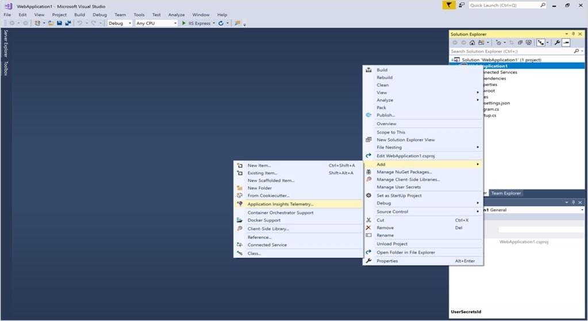 style="width:2.91667in;height:1.59375in" />

2.  SIM - You need to create a notification if the peak average response
    time of an Azure web app named az400-123456789-main is more than
    five seconds when evaluated during a five-minute period. The
    notification must trigger the \`https://contoso.com/notify\`
    webhook.

go to the web, app go to metrics, got to alerts, go to create/create new
rule

- select response time

- select static

- select operator greater than set threshold 5

- Period: Over the last 5 minutes

- next create an action group or select an existing one that send the
  notification to the webhook <https://contoso.com/notify%60>

- if you create a new action group just select the action you need in
  this case webhook and set the url review and create and the keep going
  with the alert configuration.

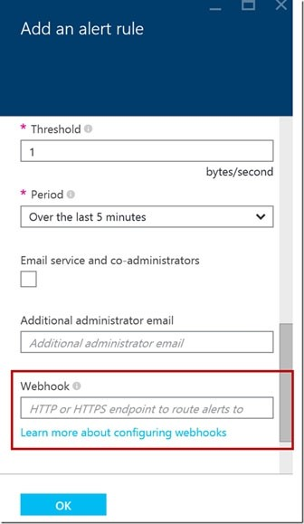

3.  SIM - You need to create and configure an Azure Storage account
    named az400lod123456789stor in a resource group named
    RG1lod123456789 to store the boot diagnostics for a virtual machine
    named VM1.

Step 1: To create a general-purpose v2 storage account in the Azure
portal, follow these steps:

1\. On the Azure portal menu, select All services. In the list of
resources, type Storage Accounts. As you begin typing, the list filters
based on your input. Select Storage Accounts.

2\. On the Storage Accounts window that appears, choose Add.

3\. Select the subscription in which to create the storage account.

4\. Under the Resource group field, select RG1lod1234567895. Next, enter
a name for your storage account named: az400lod123456789stor6. Select
Create.

Step 2: Enable boot diagnostics on existing virtual machineTo enable
Boot diagnostics on an existing virtual machine, follow these steps:

1\. Sign in to the Azure portal, and then select the virtual machine
VM1.

2\. In the Support + troubleshooting section, select Boot diagnostics,
then select the Settings tab.

3\. In Boot diagnostics settings, change the status to On, and from the
Storage account drop-down list, select the storage account
az400lod123456789stor.

4\. Save the change. You must restart the virtual machine for the
change.

4.  SIM - You have a web app that connects to an Azure SQL Database
    named db1.You need to configure db1 to send Query Store runtime
    statistics to Azure Log Analytics.

<!-- -->

1.  Log in to AZ portal and navigate to the AZ SQL database

2.  All resources and make sure that there is a Log Analytics Workspace,
    if no =\> create one

3.  Under Monitoring -\> Diagnostic settings

4.  \+ Add diagnostic setting

5.  Give the diagnostic setting a name

6.  Check Query Store Runtime Statistics

7.  Check basic

8.  Check Send to Log Analytics workspace and select the Log Analytics
    Workspace.

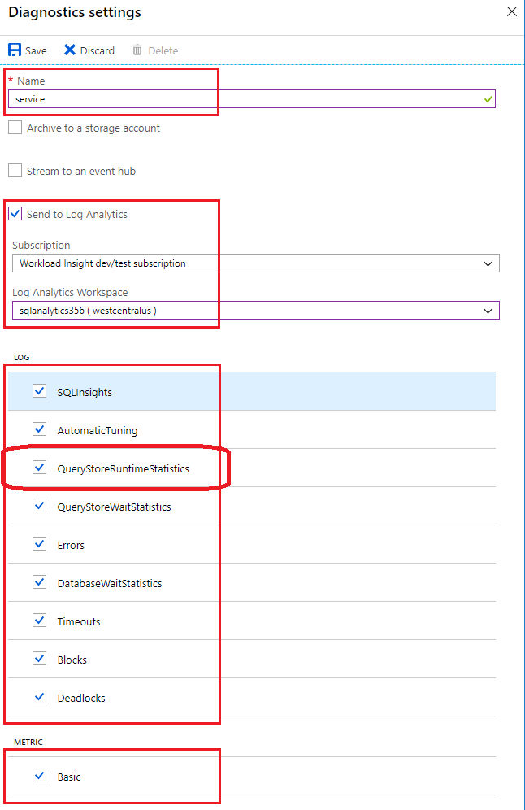

5.  SIM- You need to ensure that Microsoft Visual Studio 2017 can
    remotely attach to an Azure Function named fa-11566895.

- Navigate in the Azure portal to your function app fa-11566895

- click on Configuration in left panel

- Go to the "General settings" Under "

- Debugging" set Remote Debugging to On

- set Remote Visual Studio version to 2017.

6.  SIM- You need to ensure that an Azure web app named
    az400-123456789-main can retrieve secrets from an Azure key vault
    named az400-123456789-kv1 by using a system managed identity.The
    solution must use the principle of least privilege.

1.Turn on System assigned managed identity for Azure Web app -
az400-123456789-main.

(Based on role-based access control (RBAC) instead of access policy) on
Azure Key Vault

2\. At the key vault az400-123456789-kv1, go to: Access control (IAM) \>
Add role assignment \> Choose Key Vault Secrets User \> choose assign
access to managed identity \> Click select members \> Select the app
system managed identity

7.  SIM- Your company plans to implement a new compliance strategy that
    will require all Azure web apps to be backed up every five hours.

> You need to back up an Azure web app named az400-123456789-main every
> five hours to an Azure Storage account in your resource group.
>
> 1\. Select App Service az400-123456789-main 2. Under Settings -\>
> click Backups
>
> 3\. Configure custom backups
>
> 4\. Select the storage account and create new container if there is
> none
>
> 5\. Set schedule: Repeats every 5 Hours
>
> 6\. Click Configure

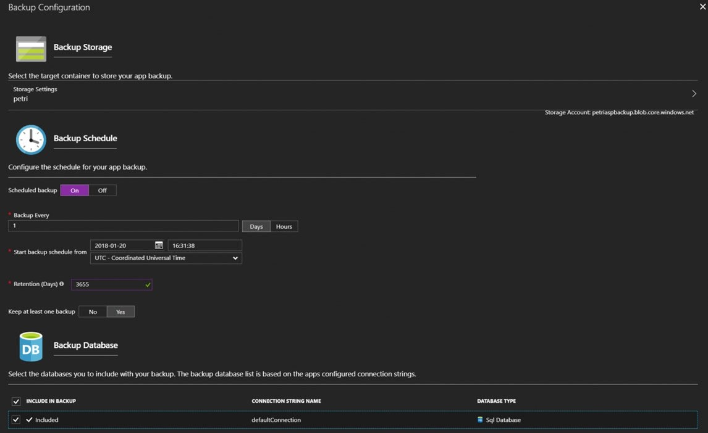

8.  SIM - You need to configure a virtual machine named VM1 to securely
    access stored secrets in an Azure Key Vault named
    az400-123456789-kv.

1\. Sign in to Azure portal

2\. Locate virtual machine VM1.

3\. Select Identity

4\. Enable the system-assigned identity for VM1 by setting the Status to
On. This creates an identity for the virtual machine within Azure Active
Directory (Azure AD).

5\. Allow the managed identity of VM1 in Key vault using Access control
(IAM) blade role assignment.

9.  SIM - You manage a website that uses an Azure SQL Database named db1
    in a resource group named RG1lod11566895.You need to modify the SQL
    database to protect against SQL injection.

- From the Azure portal, open your server or managed instance.

- Under the Security heading, select Security Center, select Defender
  for Cloud.

- Select Enable Microsoft Defender for SQL.

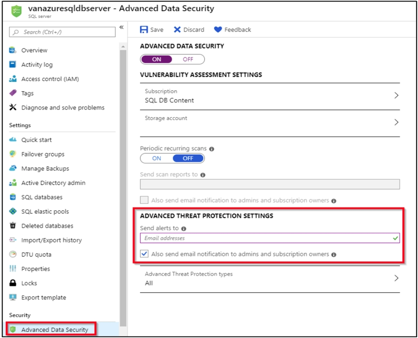

10. SIM - You need to prepare a network security group (NSG) named
    az400-123456789-nsg1 to host an Azure DevOps pipeline agent. The
    solution must allow only the required outbound port for Azure DevOps
    and deny all other inbound and outbound access to the Internet

1\. Open Microsoft Azure Portal and Log into your Azure account.

2\. Select security group (NSG) named az400-123456789-nsg1

3\. Select Settings, Outbound security rules, and click Add

4\. Click Advanced 5. Change the following settings:✑ Destination Port
range: 8080✑ Protocol. TCP✑ Action: Allow Note: By default, Azure DevOps
Server uses TCP Port 8080. The default Inbound NSG rule denies all i-net
traffic, while the outbound rule allows it under Rule
"AllowInternetOutBound" with priority 65001. Note that this rule refers
to 'any' in regards with port, protocol and source, while sets internet
for the destination =\> we have to create a 2nd outbound rule that
denies all traffic for service tag=internet and set its priority to be
lower than the rule allowing port 443

11. SIM- You have an Azure function hosted in an App Service plan named
    az400-123456789-func1.You need to configure az400-123456789-func1 to
    upgrade the functions automatically whenever new code is committed
    to the master branch of <https://>
    github.com/Azure-Samples/functions-quickstart.

\- Open Microsoft Azure Portal

\- Log into your Azure account, select App Services in the Azure portal
left navigation, and then select configure az400-123456789-func1.

-On the app page, select Deployment Center in the left menu.

-On the Build provider page, select Azure Pipelines (Preview), and then
select Continue

\- On the Configure page, in the Code section:For GitHub, drop down and
select the Organization, Repository, and Branch you want to deploy
continuously.

\- Select Continue.

\- On the Test page, choose whether to enable load tests, and then
select Continue.

-Depending on your App Service plan pricing tier, you may see a Deploy
to staging page. Choose whether to enable deployment slots, and then
select Continue

\- After you configure the build provider, review the settings on the
Summary page, and then select.

12. SIM- You plan to store signed images in an Azure Container Registry
    instance named az4009940427acr1.You need to modify the SKU for
    az4009940427acr1 to support the planned images. The solution must
    minimize costs.

1\) Go to ACR

2\) Go to Content trust

3\) You'll get notification on the top: Upgrade registry to Premium SKU
to enable Content trust policy. Click that notification.

4\) From dropdown pick Premium

5\) Save

6\) Now you can enable Content Trust

7\) Save

13. SIM- You plan to deploy a template named D:\Deploy.json to a
    resource group named Deploy-lod123456789.You need to modify the
    template to meet the following requirements, and then to deploy the
    template:✑ The address space must be reduced to support only 256
    total IP addresses.✑ The subnet address space must be reduced to
    support only 64 total IP addresses.

- Change the AddressPrefixes to 10.0.0.0/24 in order to support only 256
  total IP addresses. addressSpace": {"addressPrefixes":
  \["10.0.0.0/24"\]}

- Change the firstSubnet addressprefix to 10.0.0.0/26 to support only 64
  total IP addresses. "subnets":\[ { "name":"firstSubnet",
  "properties":{ "addressPrefix":"10.0.0.0/26" }

14. SIM- You need to configure an Azure web app named
    az400-123456789-main to contain an environmental variable named
    \`MAX_ITEMS\`. The environmental variable must have a value of 50.

- In the Azure portal, navigate to the az400-123456789-main app's
  management page. In the app's left menu, click Configuration \>
  Application settings.

- Click New Application settings

- Enter the following:

- ✑ Name: MAX_ITEMS

- ✑ Value: 50.

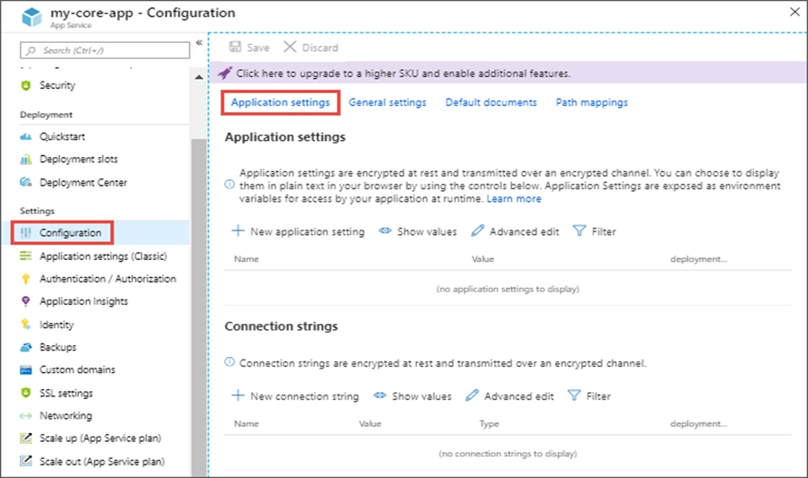

15. SIM- You need to ensure that the <https://contoso.com/statushook>
    webhook is called every time a repository named az400123456789acr1
    receives a new version of an image named dotnetapp.

1\. Sign in to the Azure portal.

2\. Navigate to the container registry az400123456789acr1.

3\. Under Services, select Webhooks

4\. Select the existing webhook <https://contoso.com/statushook>, and
double-click on it to get its properties.

5\. For Trigger actions select image push, Example web hook:

> 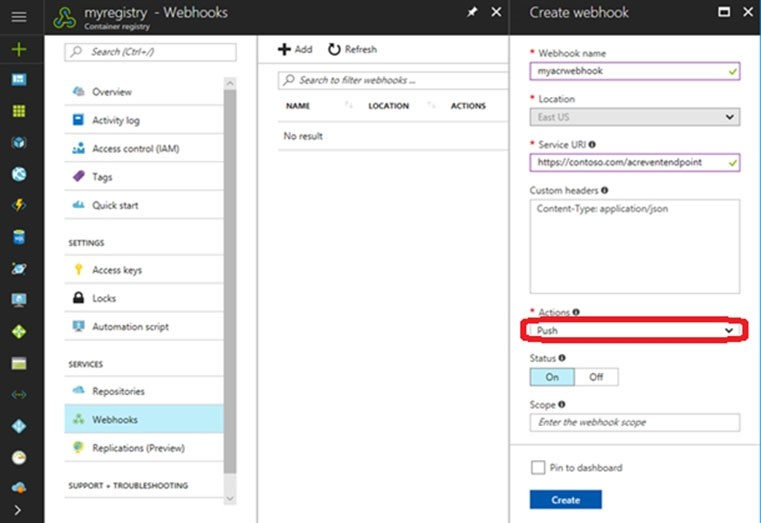 style="width:5in;height:3.42708in" />

16. SIM- You plan to add a new web farm that will be published by using
    an IP address of 10.0.0.5.You need to allow traffic from the web
    farm to an Azure Database for MySQL server named
    az400-123456789-mysql.

- Server-level firewall rules can be used to manage access to an Azure
  Database for MySQL Server from a specified IP address or a range of IP
  addresses. you can find this configuration under the Security heading.

- Click the Networking button and scroll to the bottom of the page to
  add or view firewall rules, give the rule a name

- set both Start IP and End IP to 10.0.0.5.

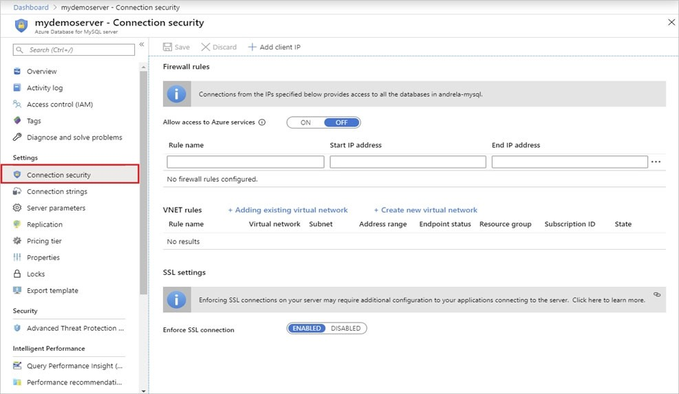

17. SIM- You need to create a virtual machine template in an Azure
    DevTest Labs environment named az400-123456789-dtl1. The template
    must be based on Windows Server 2019 Datacenter. Virtual machines
    created from the template must include the selenium tool and the
    Google Chrome browse

1\. Login to AZ Portal

2\. search for or deploy a Dev Test Lab resource =\> click on the "+Add
button"

3\. Search for the Windows Server 2019 Datacenter and select the base
image

4\. Click on Artifacts -\> search for Selenium -\> click on the '\>'
arrow sign next to it -\> verify that this also installs chrome =\> ok
=\> ok

5\. Click on tab Advanced Settings -\> View ARM template -\> search for
artifacts -\> you will see windows selenium; search for data center and
verify the image corresponds to the one in the task

6\. Click on the x-sign

7\. Go back to the "Basic Settings" tab

8\. Create

18. SIM- You plan to implement a CI/CD strategy for an Azure Web App
    named az400-123456789-main.You need to configure a staging
    environment for az400-123456789-main.

1\. In the Azure portal, search for and select App Services and select
your app az400-123456789-main

2\. In the left pane, select Deployment slots \> Add Slot.

3\. In the Add a slot dialog box, give the slot a name, and select
whether to clone an app configuration from another deployment slot.
Select Add to continue

4\. After the slot is added, select Close

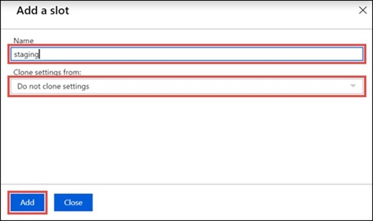

19. SIM- You have several apps that use an Azure SQL Database named db1.
    You need to ensure that queries to db1 are tuned by Azure over time.
    The solution must only apply to db1.

You can find Automatic Tuning here: Choose a SQL database (not a SQL
Server) -\> Overview -\>Features -\> Automatic tuning\> Apply.

Note: Individual automatic tuning settings can be separately configured
for each database. You can manually configure an individual automatic
tuning option, or specify that an option inherits its settings from the
server

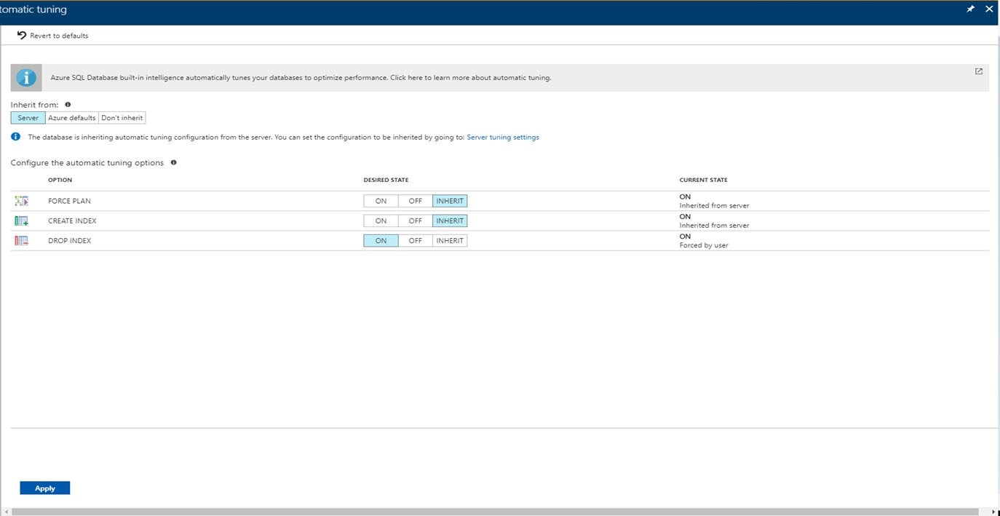

20. SIM - You need to ensure that an Azure web app named
    az400-123456789-main supports rolling upgrades. The solution must
    ensure that only 10 percent of users who connect to
    az400-123456789-main use update versions of the app. The solution
    must minimize administrative effort. Set up staging environments in
    Azure App Service

1\. Open Microsoft Azure Portal

2\. Log into your Azure account, select your app's resource page, in the
left pane, select Deployment slots \> Add Slot.

3\. In the Add a slot dialog box, give the slot a name, and select
whether to clone an app configuration from another deployment slot.
Select Add to continue.

4\. After the slot is added, select Close to close the dialog box. The
new slot is now shown on the Deployment slots page. By default, Traffic
% is set to 0 for the new slot, with all customer traffic routed to the
production slot.

5\. Select the new deployment slot to open that slot's resource page.

6\. Change TRAFFIC % to 10.

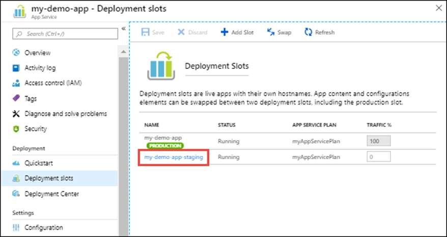

21. SIM- You plan to deploy a website that will be hosted in two Azure
    regions. You need to create an Azure Traffic Manager profile named
    az400123456789n1-tm in a resource group named RG1lod123456789. The
    solution must ensure that users will always connect to a copy of the
    website that is in the same country.

1\. Go to the Azure portal, navigate to Traffic Manager profiles and
click on the Add button to create a routing profile.

2, In the Create Traffic Manager profile, enter, or select these
settings:Name: az400123456789n1-tm -Routing method: Geographic -Resource
group: RG1lod123456789 -Note: Traffic Manager profiles can be configured
to use the Geographic routing method so that users are directed to
specific endpoints (Azure, External or Nested) based on which geographic
location their DNS query originates from. This empowers Traffic Manager
customers to enable scenarios where knowing a user's geographic region
and routing them based on that is important.

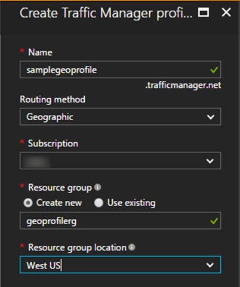

**Testlet 1**

Overview -

General Overview -

Woodgrove Bank is a financial services company that has a main office in
the United Kingdom.

Technical Requirements and Planned Changes

Planned Changes -

Woodgrove Bank plans to implement the following project management
changes:

Implement Azure DevOps for project tracking.

Centralize source code control in private GitHub repositories.

Implement Azure Pipelines for build pipelines and release pipelines.

Woodgrove Bank plans to implement the following changes to the identity
environment:

Deploy an Azure AD tenant named woodgrovebank.com.

Sync the Active Directory domain to Azure AD.

Configure App1 to use a service principal.

Integrate GitHub with Azure AD.

Woodgrove Bank plans to implement the following changes to the core
apps:

Migrate App1 to ASP.NET Core.

Integrate Azure Pipelines and the third-party build tool used to develop
App2.

Woodgrove Bank plans to implement the following changes to the DevOps
environment:

Deploy App1 to Azure App Service.

Implement source control for the DB1 schema.

Migrate all the source code from TFS1 to GitHub.

Deploy App2 to an Azure virtual machine named VM1.

Merge the POC branch into the GitHub default branch.

Implement an Azure DevOps dashboard for stakeholders to monitor
development progress.

Technical Requirements -

Woodgrove Bank identifies the following technical requirements:

The initial databases for new environments must contain both schema and
reference data.

An Azure Monitor alert for VM1 must be configured to meet the following
requirements:

\- Be triggered when average CPU usage exceeds 80 percent for 15
minutes.

\- Calculate CPU usage averages once every minute.

The commit history of the POC branch must replace the history of the
default branch.

The Azure DevOps dashboard must display the metrics shown in the
following table.

Access to Azure DevOps must be restricted to specific IP addresses.

Page load times for App1 must be captured and monitored.

Administrative effort must be minimized.

**Topic 10- Testlet 1**

Q- You need to configure the alert for VM1. The solution must meet the
technical requirements.

Which two settings should you configure?

1\. 1. Threshold value: 80% 2. Aggregation granularity: 15 minutes - -
Aggregation granularity Select the interval that's used to group the
data points by using the aggregation type function. Choose an
Aggregation granularity (period) that's greater than the Frequency of
evaluation to reduce the likelihood of missing the first evaluation
period of an added time series.

**Topic 14- Testlet 5**

Q1- You need to meet the technical requirements for controlling access
to Azure DevOps. What should you use?

C. Conditional access policies in Azure AD - can be used to control
access to Azure DevOps based on specific IP addresses or geographies.
This allows you to restrict access to Azure DevOps from certain
locations, ensuring that only authorized users can access the resources.
Azure Multi-Factor Authentication (MFA) and Azure role-based access
control (Azure RBAC) are also important security measures, but they do
not directly address the requirement of restricting access based on IP
addresses. On-premises firewall rules are not applicable in this
scenario as Azure DevOps is a cloud-based service.

Q2- You need to configure Azure Pipelines to control App2 builds. Which
authentication method should you use?

D. personal access token (PAT) - This task will run on the virtual
machines hosted in Azure, and will need to be able to connect back to
this pipeline in order to complete the deployment group requirements. To
secure the connection, they will need a personal access token (PAT).

Q3- You need to configure authentication for App1. The solution must
support the planned changes. Which three actions should you perform in
sequence?

1\) Create app 2) Add secret 3) Configure ID and secret - Woodgrove Bank
plans to implement the following changes to the identity environment:✑
Configure App1 to use a service principal.

**Topic 15- Testlet 6**

Q1- You need to replace the existing DevOps tools to support the planned
changes. What should you use? 

1\. Trello - Azure Boards

2\. Bamboo - Azure Pipelines

3\. BitBucket - GitHub repositories

Azure Boards is a standalone service within the Azure DevOps suite that
helps teams plan, track, and discuss work across the entire software
development process. It provides a flexible, customizable platform for
managing work items, such as user stories, bugs, tasks, and issues, so
you can track your work item's progress throughout the development
lifecycle. Azure Boards supports agile methodologies, including Scrum
and Kanban. It provides a range of features and integrations to help
teams collaborate and stay organized with dashboards, reports, and
notification.

Azure Pipelines automatically builds and tests code projects. It
supports all major languages and project types and combines continuous
integration, continuous delivery, and continuous testing to build, test,
and deliver your code to any destination.

Box 1: Azure Boards -

Azure Boards can be used to track work with Kanban boards, backlogs,
team dashboards, and custom reporting

You can create multiple Trello boards, which are spaces to store tasks
(for different work contexts, or even private boards)

You can easily share Trello boards with another person.

Box 2: Azure Pipelines -

You can use Bamboo to implement CI/CD (Continuous Integration and
Continuous Delivery) for a simple Azure function app using Atlassian
Bamboo. Bamboo does continuous delivery of the project from source code
to deployment. It has stages including Build, Test and Deploy.

Software teams in every industry are upgrading their continuous delivery
pipeline with Bamboo. Easy build import from popular open source tools,
user and group import from JIRA, seamless integration with Bitbucket,
and native support for Git, Hg, and SVN means you'll be building and
deploying like a champ.

Box 3: GitHub repositories -

Bitbucket can be used as the Git repository, but you can use any other
Git repository (Like TFS Git) for source control of the code.

Q2 - You need to the merge the POC branch into the default branch. The
solution must meet the technical requirements. Which command should you
run?

A. git rebase

The commit history of the POC branch must replace the history of the
default branch.

Rebasing is the process of moving or combining a sequence of commits to
a new base commit. Rebasing is most useful and easily visualized in the
context of a feature branching workflow. The general process can be
visualized as the following:

Note: The primary reason for rebasing is to maintain a linear project
history. For example, consider a situation where the main branch has
progressed since you started working on a feature branch. You want to
get the latest updates to the main branch in your feature branch, but
you want to keep your branch's history clean so it appears as if you've
been working off the latest main branch. This gives the later benefit of
a clean merge of your feature branch back into the main branch. Why do
we want to maintain a "clean history"? The benefits of having a clean
history become tangible when performing Git operations to investigate
the introduction of a regression.

Incorrect:

Not B: git-merge - Join two or more development histories together.

Squash merging is a merge option that allows you to condense the Git
history of topic branches when you complete a pull request. Instead of
each commit on the topic branch being added to the history of the
default branch, a squash merge adds all the file changes to a single new
commit on the default branch.

Not D: git merge --allow-unrelated-histories

By default, git merge command refuses to merge histories that do not
share a common ancestor. This option can be used to override this safety
when merging histories of two projects that started their lives
independently. As that is a very rare occasion, no configuration
variable to enable this by default exists and will not be added.

**Topic 16- Testlet 7**

Q1. You need to perform the GitHub code migration. The solution must
support the planned changes for the DevOps environment. What should you
use?

B. GitHub Importer - If your source code is stored on a code hosting
service using Git, Subversion, Mercurial, or Team Foundation Version
Control (TFVC) and is accessible from the public internet, you can move
the code to GitHub using GitHub Importer.

**Topic 19 - Testlet 10**

Q1- You are configuring the Azure DevOps dashboard. The solution must
meet the technical requirements.

Which widget should you use for each metric?

1\. Sprint Burndown, Release Pipeline Overview, Query Tile

-A guide for determining how well the team estimates and meets their
planned commitments. The Velocity widget tracks a team's capacity to
deliver work sprint after sprint. You configure the widget by selecting
a team, a work item type, an aggregation field, and the number of
sprints. The widget takes advantage of Analytics data. You can track the
velocity for a single team, not multiple teams.

Query tile - Display total number of results for query

Query results - Display results from a query Sprint burndown - report to
determine if your team is on track to complete its sprint plan
Cumulative flow diagram - to monitor the flow of work through a system

Release pipeline overview - use to view and track the status of a
release pipeline

Q2- You plan to deploy a new database environment. The solution must
meet the technical requirements.

You need to prepare the database for the deployment. How should you
format the export?

B. BACPAC

The initial databases for new environments must contain both schema and
reference data.

When you need to export a database for archiving or for moving to
another platform, you can export the database schema and data to a
BACPAC file. A BACPAC file is a ZIP file with an extension of BACPAC
containing the metadata and data from the database. A BACPAC file can be
stored in Azure Blob storage or in local storage in an on-premises
location and later imported back into Azure SQL Database, Azure SQL
Managed Instance, or a SQL Server instance.

A DacPac (Data-tier Application Package) is a single file that contains
the logical database schema and possibly the database's static data. It
doesn't contain the actual user data from the database

A BacPac (BACPAC) is a single file that contains the database schema,
plus the data contained in the database. It's essentially a database
backup in a single file.

DACPAC is primarily focused on database schema deployment and
management, while BACPAC includes both the schema and data of a
database, making it suitable for data migration and backups. DACPACs are
used for controlled schema deployments, while BACPACs are used for
transferring entire databases across environments.

Q3- You need to meet the technical requirements for monitoring App1.
What should you use?

3\. B. Azure Application Insights

Page load times for App1 must be captured and monitored

**Testlet 2**

Litware, Inc. is an independent software vendor (ISV). Litware has a
main office and five branch offices.

Existing Environment -

Application Architecture -

The company's primary application is a single monolithic retirement fund
management system based on ASP.NET web forms that use logic written in
VB.NET.

Some new sections of the application are written in C#.

Variations of the application are created for individual customers.
Currently, there are more than 80 live code branches in the
application's code base.

The application was developed by using Microsoft Visual Studio. Source
code is stored in Team Foundation Server (TFS) in the main office. The
branch offices access the source code by using TFS proxy servers.

Architectural Issues -

Litware focuses on writing new code for customers. No resources are
provided to refactor or remove existing code. Changes to the code base
take a long time, as dependencies are not obvious to individual
developers.

Merge operations of the code often take months and involve many
developers. Code merging frequently introduces bugs that are difficult
to locate and resolve.

Customers report that ownership costs of the retirement fund management
system increase continually. The need to merge unrelated code makes even
minor code changes expensive.

Customers report that bug reporting is overly complex.

Requirements -

Planned Changes -

Litware plans to develop a new suite of applications for investment
planning. The investment planning applications will require only minor
integration with the existing retirement fund management system.

The investment planning applications suite will include one multi-tier
web application and two iOS mobile applications. One mobile application
will be used by employees; the other will be used by customers.

Litware plans to move to a more agile development methodology. Shared
code will be extracted into a series of packages.

Litware has started an internal cloud transformation process and plans
to use cloud-based services whenever suitable.

Litware wants to become proactive in detecting failures, rather than
always waiting for customer bug reports.

Technical Requirements -

The company's investment planning applications suite must meet the
following technical requirements:

New incoming connections through the firewall must be minimized.

Members of a group named Developers must be able to install packages.

The principle of least privilege must be used for all permission
assignments.

A branching strategy that supports developing new functionality in
isolation must be used.

Members of a group named Team Leaders must be able to create new
packages and edit the permissions of package feeds.

Visual Studio App Center must be used to centralize the reporting of
mobile application crashes and device types in use.

By default, all releases must remain available for 30 days, except for
production releases, which must be kept for 60 days.

Code quality and release quality are critical. During release,
deployments must not proceed between stages if any active bugs are
logged against the release.

The mobile applications must be able to call the share pricing service
of the existing retirement fund management system. Until the system is
upgraded, the service will only support basic authentication over HTTPS.

The required operating system configuration for the test servers changes
weekly. Azure Automation State Configuration must be used to ensure that
the operating system on each test server is configured the same way when
the servers are created and checked periodically.

Current Technical Issue -

The test servers are configured correctly when first deployed, but they
experience configuration drift over time. Azure Automation State
Configuration fails to correct the configurations.

Azure Automation State Configuration nodes are registered by using the
following command.

**Topic 11-Testlet 2**

Q- How should you complete the code to initialize App Center in the
mobile application? 

1\. MSAnalytics.self - App Center Analytics helps you understand user
behavior and customer engagement to improve your app. The SDK
automatically captures session count, device properties like model, OS
version, etc. You can define your own custom events to measure things
that matter to your business. All the information captured is available
in the App Center portal for you to analyze the data. 2.
MSCrashes.self - App Center Crashes will automatically generate a crash
log every time your app crashes. The log is first written to the
device's storage and when the user starts the app again, the crash log
will be sent to App Center. Collecting crashes works for both beta and
live apps, i.e. those submitted to the App Store or Google Play. Crash
logs contain valuable information for you to help fix the crash

**Topic 13-Testlet 4**

Q1- How should you configure the release retention policy for the
investment planning depletions suite?

The proposed answers are clearly wrong. In fact they appear again in the
next question where it is asked for a service to stora mobile app
secrets. To set a retention policy configuration you should go to
Project Settings in the Devops portal and choose "Release retention".

Q2- Configure your mobile applications to can call the share pricing
service and configure a cloud service to store the secrets required

1\. Username and password, because is Basic authentication over HTTPS.

2\. Azure Key Vault, is the recommended storage location for secure
storing secrets (Username and password)

Shared Access Authorization Token, may not be the most suitable option,
if the app only supports basic authentication typically requires
providing the username and password, however Shared Access Authorization
Token is a token-based authentication (e.g. OAuth or JWT)

Q3- Which package feed access levels should be assigned to the
Developers and Team Leaders groups for the investment planning
applications suite?

Box 1: Reader -Members of a group named Developers must be able to
install packages.Feeds have four levels of access: Owners, Contributors,
Collaborators, and Readers. Owners can add any type of
identity-individuals, teams, and groups-to any access level.

Box 2: Owner -Members of a group named Team Leaders must be able to
create new packages and edit the permissions of package feeds.

**Topic 18 - Testlet 9**

Q1- To resolve the current technical issue, what should you do to the
Register-AzureRmAutomationDscNode command?

A. Change the value of the ConfigurationMode parameter.

Change the ConfigurationMode parameter from ApplyOnly to
ApplyAndAutocorrect.

The Register-AzureRmAutomationDscNode cmdlet registers an Azure virtual
machine as an APS Desired State Configuration (DSC) node in an Azure
Automation account.

Scenario: Current Technical Issue

The test servers are configured correctly when first deployed, but they
experience configuration drift over time. Azure Automation State
Configuration fails to correct the configurations.

Azure Automation State Configuration nodes are registered by using the
following command.

ConfigurationMode

\- ApplyOnly: DSC applies the configuration and does nothing further
unless a new configuration is pushed to the target node or when a new
configuration is pulled from a service. After initial application of a
new configuration, DSC does not check for drift from a previously
configured state. Note that DSC will attempt to apply the configuration
until it is successful before

\- ApplyAndAutoCorrect: DSC applies any new configurations. After
initial application of a new configuration, if the target node drifts
from the desired state, DSC reports the discrepancy in logs, and then
re-applies the current configuration.

Q2- Which branching strategy should you recommend for the investment
planning applications suite?

6\. D. feature isolation

Feature isolation is a special derivation of the development isolation,
allowing you to branch one or more feature branches from main, as shown,
or from your dev branches.

When you need to work on a particular feature, it might be a good idea
to create a feature branch.

Keep the lifetime of feature work and the associated feature branch
short-lived. Forward integrate (FI) changes from the parent branch
frequently. Reverse integrate (RI) back to the parent only when some
agreed team criteria, for example definition of done, is met. Rollback
of features on main can be costly and may reset testing.

A: Release isolation introduces one or more release branches from main.
The strategy allows concurrent release management, multiple and parallel
releases, and codebase snapshots at release time.

B: The Main Only strategy can be folder-based or with the main folder
converted to a Branch, to enable additional visibility features. You
commit your changes to the main branch and optionally indicate
development and release milestones with labels.

C: Development isolation: When you need to maintain and protect a stable
main branch, you can branch one or more dev branches from main. It
enables isolation and concurrent development. Work can be isolated in
development branches by feature, organization, or temporary
collaboration.

Q3- What should you use to implement the code quality restriction on the
release pipeline for the investment planning applications suite?

B. a deployment gate

Gates allow automatic collection of health signals from external
services and then promote the release when all the signals are
successful or stop the deployment on timeout. Typically, gates are used
in connection with incident management, problem management, change
management, monitoring, and external approval systems.

Some common use cases for deployment gates are:

Quality validation: Query pipeline metrics such as pass rate or code
coverage and deploy only if they are within a predefined threshold.

Q4- How should you configure the release retention policy for the
investment planning applications suite?

Scenario: By default, all releases must remain available for 30 days,
except for production releases, which must be kept for 60 days.

Box 1: Set the default retention policy to 30 days

The Global default retention policy sets the default retention values
for all the build pipelines. Authors of build pipelines can override
these values.

Box 2: Set the stage retention policy to 60 days

You may want to retain more releases that have been deployed to specific
stages.

Q5- Where should the build and release agents for the investment
planning applications suite run?

Built agent: A hosted service, Release agent: A hosted service

Case requirement: Litware has started an internal cloud transformation
process and plans to use cloud-based services whenever suitable.

To build and deploy Xcode apps or Xamarin.iOS projects, you'll need at
least one macOS agent. If your pipelines are in Azure Pipelines and a
Microsoft-hosted agent meets your needs, you can skip setting up a
self-hosted macOS agent.

Scenario: The investment planning applications suite will include one
multi-tier web application and two iOS mobile applications. One mobile
application will be used by employees; the other will be used by
customers.

**Testlet 3**

Contoso, Ltd. is a manufacturing company that has a main office in
Chicago.

Existing Environment -

Contoso plans to improve its IT development and operations processes by
implementing Azure DevOps principles. Contoso has an Azure subscription
and creates an Azure DevOps organization.

The Azure DevOps organization includes:

The Docker extension

A deployment pool named Pool7 that contains 10 Azure virtual machines
that run Windows Server 2019

The Azure subscription contains an Azure Automation account.

Requirements -

Planned changes -

Contoso plans to create projects in Azure DevOps as shown in the
following table.

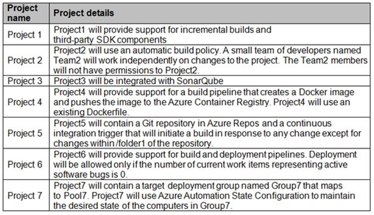

Technical requirements -

Contoso identifies the following technical requirements:

Implement build agents for Project1.

Whenever possible, use Azure resources.

Avoid using deprecated technologies.

Implement a code flow strategy for Project2 that will:

\- Enable Team2 to submit pull requests for Project2.

\- Enable Team2 to work independently on changes to a copy of Project2.

\- Ensure that any intermediary changes performed by Team2 on a copy of
Project2 will be subject to the same restrictions as the ones defined in
the build policy of Project2.

Whenever possible, implement automation and minimize administrative
effort.

Implement Project3, Project5, Project6, and Project7 based on the
planned changes.

Implement Project4 and configure the project to push Docker images to
Azure Container

Registry.

**Topic 12- Testlet 3**

Q1- You add the virtual machines as managed nodes in Azure Automation
State Configuration. You need to configure the managed computers in
Pool7. What should you do next?

C. Modify the ConfigurationMode property of the Local Configuration
Manager (LCM)- The Local Configuration Manager (LCM) is the engine of
Desired State Configuration (DSC). The LCM runs on every target node,
and is responsible for parsing and enacting configurations that are sent
to the node.
<https://learn.microsoft.com/en-us/powershell/dsc/managing-nodes/metaconfig?view=dsc-1.1#basic-settings> -
ConfigurationMode Specifies how the LCM actually applies the
configuration to the target nodes.

Here the question states "You add the virtual machines as managed nodes
in Azure Automation State Configuration".
Register-AzureRmAutomationDscNode does just that.

Since you have already done now the question is "What should you do
next?". In order to manatain the VMs status you need to set the
ConfigurationMode property to ApplyAndAutocorrect. It is true that you
could set the property directly in the Register-AzureRmAutomationDscNode
command but from the way the question is posed it does not seem to have
been specified. Since its default value is None you have to change it to
ApplyAndAutocorrect.

A deployment pool named Pool7 that contains 10 Azure virtual machines
that run Windows Server 2019

Q2 - You need to implement the code flow strategy for Project2 in Azure
DevOps. Which three actions should you perform in sequence? 

1\. Create a repository 2. Create a fork 3. Add a build policy for the
fork

 

Git repo forks are useful when people want to make experimental, risky,
or confidential changes to a codebase, but those changes need to be
isolated from the codebase in the original repo. A new fork is basically
a clone of the original repo pushed to a new remote repo. The fork is
independent of the original repo, and is a complete copy unless you
specify a single branch.

 

As an independent copy, changes you make to your fork, such as adding
commits or branches, aren't shared with the original repo. If you want
to merge your codebase changes into the original repo, you must create a
pull request (PR) to request review and approval of those changes.

 

. The forking process doesn't transfer any permissions, policies, or
build pipelines from the original repo to your fork.

 

The code in your main branch should pass tests, build cleanly, and
always be current. Your main branch needs these qualities so that
feature branches created by your team start from a known good version of
code.

 

Set up a branch policy for your main branch that: - Requires a pull
request to merge code. This approach prevents direct pushes to the main
branch and ensures discussion of proposed changes. - Automatically adds
reviewers when a pull request is created. The added team members review
the code and comment on the changes in the pull request. - Requires a
successful build to complete a pull request. Code merged into the main
branch should build cleanly.

Q3- You need to configure Azure Automation for the computers in Pool7.
Which three actions should you perform in sequence? 

1\. Create DSC config file with ext of .ps1 2. Run
Import-AzureRmAutomationDscConfiguration Azure PS cmdlet 3. Run
Start-AzureRmAutomationDscCompliationJob Azure PS cmdlet

 

Azure Automation State Configuration allows you to specify
configurations for your servers and ensure that those servers are in the
specified state over time.

\- Onboard VM to be managed by Azure Automation DSC

\- Upload a configuration to Azure Automation

\- Compile a configuration into a node configuration

\- Assign a node configuration to a managed node

\- Check the compliance status of a managed node

 

A DSC configuration must be compiled into a node configuration before it
can be assigned to a node. See DSC configurations.

 

Call the Start-AzAutomationDscCompilationJob cmdlet to compile the
TestConfig configuration into a node configuration named
TestConfig.WebServer in your Automation account.

 

\- In a text editor, type the following and save it locally as
TestConfig.ps1. Call the Import

-AzAutomationDscConfiguration cmdlet to upload the configuration into
your Automation account.

**Topic 17 -Testlet 8**

Q1- How should you configure the filters for the Project5 trigger?

Path filter to exclude, Path filter to include

Although a branchfilter is needed when using a pathfilter, "/" is not a
valid branchefilter. A branchefilter must be something like "main" or
"develop", etc. "When you specify paths, you must explicitly specify
branches to trigger on. You can't trigger a pipeline with only a path
filter; you must also have a branch filter, and the changed files that
match the path filter must be from a branch that matches the branch
filter."

Q2- In Azure DevOps, you create Project3. You need to meet the
requirements of the project. What should you do first?

D. From SonarQube, create a project.- From Azure DevOps, create a
service endpoint. you need SonarCloud server URL before. From SonarQube,
obtain an authentication token. you get it by log in to your SonarQube
project, My account, Security, Generate tokens.

Q3- You need to implement Project4. What should you do first?

C. Add a Docker task to the build pipeline

The build stage uses the Docker task Docker@2 to build and push your
Docker image to the container registry.

The following are the key benefits of using the Docker task instead of
directly using Docker client binary in a script. - Integration with
Docker registry service connection - The task makes it easy to use a
Docker registry service connection for connecting to any container
registry. Once signed in, you can add follow up tasks that execute other
tasks or scripts by leveraging the sign on used by the Docker task. For
example, use the Docker task to sign in to any Azure Container Registry,
and then use another task or script to build and push an image to the
registry.

Q4- You need to recommend a procedure to implement the build agent for
Project1. Which three actions should you recommend be performed in
sequence?

1\. Sign in to Azure Devops by using an account that is assigned agent
pool admin role

2\. Create a personal access token in the DevOps organization of Contoso

3\. Install and register Azure Pipelines agent on an Azure virtual
machine

Can register or unregister agents from the pool and manage membership
for all pools, as well as view and create pools. They can also use the
agent pool when creating an agent in a project. The system automatically
adds the user that created the pool to the Administrator role for that
pool.

Q5 - You need to implement Project6. Which three actions should you
perform in sequence? 

1\. Open release pipeline editor

2\. Enable Gates

3\. Add Query Work Items

Step 1: Open the release pipeline editor.

In the Releases tab of Azure Pipelines, select your release pipeline and
choose Edit to open the pipeline editor.

Step 2: Enable Gates.

Choose the pre-deployment conditions icon for the Production stage to
open the conditions panel. Enable gates by using the switch control in
the Gates section.

Step 3: Add Query Work items.

Choose + Add and select the Query Work Items gate.

Configure the gate by selecting an existing work
