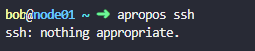
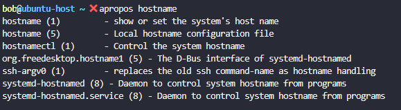
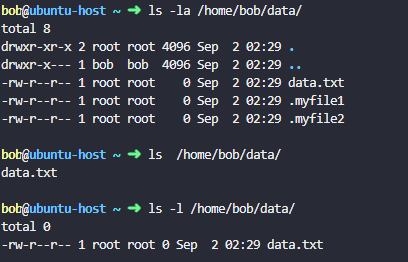
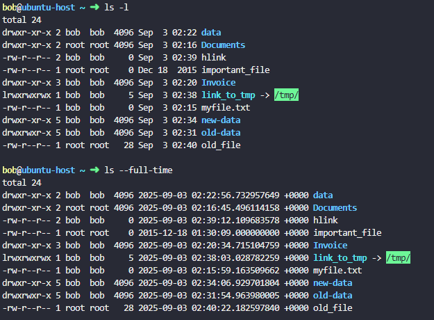
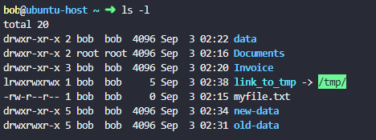
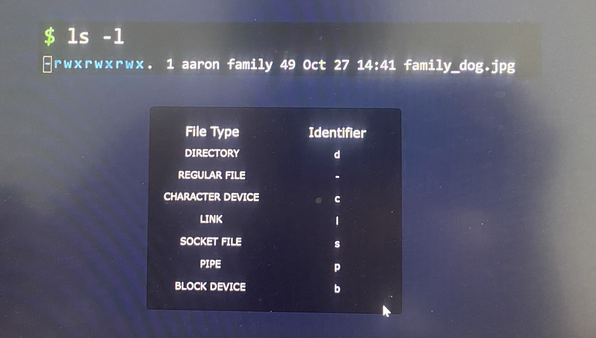
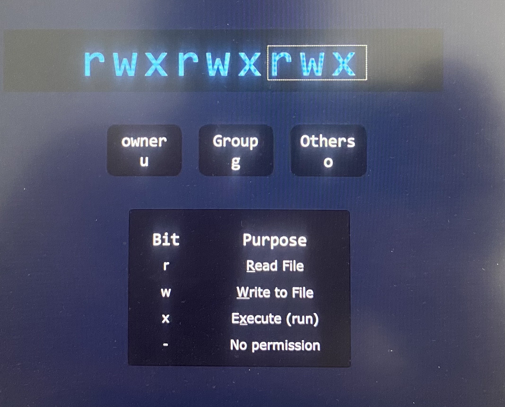

**Linux Foundation Certified Systems Administrator (LFCS)**

**Points breakdown for Exam Objectives**

1.  Essential commands - 20%

-Logging into Linux Systems

-Files and Directories

2.  Operational Deployment - 25%

-Automating System Maintenance Tasks

-Managing Startup Processes and Services

-Diagnosing and Managing Processes

-Scheduling Tasks

-Adjusting Kernel Runtime Parameters

3.  Users and Groups - 10%

-Creating, Modifying and Managing Local User

-Configuring System-wide Environment Profiles

-Setting User Resource Limits

-Controlling Access to Root Account

4.  Networking - 25%

-Configuring IPV4 and IPV6 Networking

-Hostname resolution

-Bridge and Bonding Devices

-Packet filtering

-Port Redirection

-NAT

-Reverse Proxies

-Load Balancers

-System Time Synchronization

-SSH Servers and Clients

5.  Storage - 20%

-Physical Storage Partitions

-Swap Space

-File Systems

-Mount Configurations

-Remote Filesystems(NFS)

-Network Block Devices(NBD)

-Storage Performance Monitoring

-Advanced File System Permissions

**Certification Details**

Some important LFCS certification details are listed below:

You will have two hours to complete the exam.

The exam is entirely performance-based. It simulates on-the-job tasks
with no multiple-choice or true/false questions.

The certification is valid for 2 years.

The exam is proctored and is available online through your browser, so
you can take it from home.

Important links:

Linux Foundation Certified System Administrator (LFCS):
<https://training.linuxfoundation.org/certification/linux-foundation-certified-sysadmin-lfcs/>

Exam requirements:
<https://docs.linuxfoundation.org/tc-docs/certification/instructions-lfcs-and-lfce#exam-environment>

Certification FAQs:
<https://training.linuxfoundation.org/about/faqs/certification-faq/>

To ensure your system meets the exam requirements, visit this link:
<https://syscheck.bridge.psiexams.com/>

Check out the full details of the Identification requirements for the
exam here:
<https://docs.linuxfoundation.org/tc-docs/certification/instructions-lfcs-and-lfce>

For additional information, visit:
[https://trainingsupport.linuxfoundation.org](https://trainingsupport.linuxfoundation.org/)

Get 30% Off Your Certification Enrollment!

Use code 30KK to get 30% OFF site-wide on any Linux Foundation
Certification.

If you're preparing for your Linux Foundation certification, now's a
great time to save! Click this link to get 30% off your enrollment on
any certification from the Linux Foundation. After clicking the link and
adding your course to cart, make sure to enter the code 30KK at checkout
to receive your 30% discount!

**LFCS Command Cheat Sheet** - [LFCS Command Cheat
Sheet](https://res.cloudinary.com/kodekloud/image/upload/v1719583892/course-resource-new/ksi3ej5znxkhuilnoang.pdf)

**Essential commands**

**Login Methods**

1.  Local text-mode console

2.  Local graphical-mode console

3.  Remote text-mode login - OpenSSH daemon(running on the server and
    listen to any incoming connections)/SSH client(for Linux or MacOS
    use native terminal emulator, for Windows use Putty)

4.  Remote graphical-mode login - Use VNC viewer, RDP for Windows

sudo apt update

sudo apt install xrdp

sudo systemctl status xrdp

Install XRDP on Linux to get remote desktop to Linux server. Typically
Linux servers don't have a desktop.

Console - This is screen that allows to login and type commands and also
displays text what is happening

Terminal - It allows to type commands. Type Ctrl + Alt + F2 after Linux
machine is booted

Terminal emulator - It allows to type commands. Open it if you have
Linux installed on your desktop with a graphical user interface

\>ip add ; list IP addresses the machines use

For Windows 10 or 11 - Start\> CMD \> ssh username@IP address of Linux
system

**Read and Use System Documentation**

***--help*** option for commands will be helpful when we forget about
the options

As example,

**ls --help**

**journalctl --help**

If it has multiple page for options, Linux has pager that simply a text
viewer of sorts that lets us scroll up and down with our arrow keys or
page up or page down. Press q to exit the page.

***man*** gives all important commands in Linux have their own manuals
or man pages to access the commands.

As example,

***man journalctl*** ; get short description of what the command does,
name general syntax of the command in synopsis, detailed description of
the command how it works, examples end of the manual

Sometimes you will have two man pages with the same name. For example,
printf is a command, but printf is also a function that can be used by
programmers.

Manual pages can fall into many sections and we can see those sections
by looking at the man page for man itself by typing in ***man man***

As example,

\>man 1 printf

\>man 3 printf

**--help** gives you fastest result than **man** which consume more time
in exam

***apropos*** ; a command that lets you search through all man pages if
you can't remember the command.

It looks at the short description of each man page and tries to see if
it matches the text that we entered. Apropos relies on a database which
is a program that must refresh periodically. If it has not refreshed, it
may throw an error if we search a text in manual.

***sudo mandb*** ; create the database manually if manual pages are not
indexed

***apropos -s 1,8 director*** ; filter the director word followed by
list of the section we specified

*TAB : Suggest and Autocomplete*

Press TAB button for incomplete command for auto completion.

systemc + TAB \> systemctl

systemctl + Add space + TAB twise \> gives list options as suggestions

\> ssh -V ; Display the version number and exit.

\> hostnamectl ; Control the system hostname

\> ssh -v alex@localhost ; check the output in verbose mode

\> ls -la /home/bob/data/ ; display the hidden files in the directory
with permissions

**Create, Delete, Copy and Move Files and Directories**

***Listing Files and Directories***

ls -la ; list all files and directories with pseudo hidden files and
directories with long listing format

ls -a ; list all files and directories with **all(-a)** even the files
beginning with .

ls /var/log ; list files and directories from different location

ls -l /var/log ; list files and directories from different location with
**long listing format(-l)** permission of files and directories, what
user group own it, when it was last modified

ls -alh ; list the files and directories and its size with **human
readable format(-h)**

ls -ld /home/bob/datadir ; list permission for the directory

ls --full-time /home/bob ; display the full/exact last modified time for
the files in /home/bob directory.

***Filesystem Tree***

-It has a root, branches and leaves where Linux file system tree is
inverted

Absolute path always start out with root directory represent by front
slash : /home/aaron/Documents/Invoice.pdf

***Current/Working Directory***

pwd ; to see current working directory**(print working directory**)

Every user starts in its home directory when they login to system -
/home/Jane

cd /var/log ; change current directory to the patch specified (**change
directory**)

cd .. ; take one directory up from current directory( .. Refers parent
directory of our current directory)

***Relative Path***

You can move from directory using relative path.

If you are in /home/aaron/,

Documents/Invoice.pdf ; path is /home/aaron/ Documents/Invoice.pdf

Invoice.pdf ; path is /home/aaron/Invoice.pdf

../ Invoice.pdf ; path is /home/Invoice.pdf

../../Invoice.pdf ; path is /Invoice.pdf

-----------------------------

If you are in /var/log/,

cd / ; Go to root directory

cd - ; Go to previous directory

cd ; Go return to home directory

***Creating Files***

touch Receipt.pdf ; create a new file inside the current directory

touch /home/aaron/ Receipt.pdf ; create a new file inside the different
directory

***Making Directories***

mkdir Receipts ; make new directory relative to current directory(**make
directory**)

mkdir -p /tmp/1/2/3/4/5/6/7/8/9 ;mkdir has a command line option to
automatically create all of these sub-directories automatically in one
shot even though structure of sub-directories from 1 to 8 does not exist

***Copying Files***

cp \[source\] \[destination\] ; **copy** file from source directory to
destination directory

cp Receipt.pdf Receipts/ ; to indicate destination is a directory, end
the path with front slash

cp Receipt.pdf Receipts/Receiptcopy.pdf ; copy file from source
directory to destination directory with **new name at destination**

cp -r \[source\] \[destination\] ; **copy** file and other
subdirectories **recursively** from source directory to destination
directory. -r command line option to copy contents in the directory
recursively.

cp -r Receipt/ BackupOfReceipts/ ; copy file and other subdirectories
recursively

***Moving Files***

mv \[source\] \[destination\] ; **move** file from source directory to
destination directory where original files are not available inside
source directory afterwards

mv Receipt.pdf Receipts/ ; move the file from source directory to
destination directory

mv Receipt.pdf OldReceipt.pdf ; **rename the file** to new name

mv /home/bob/lfcs/\* /home/bob/new-data/ ; move content excluding the
directory itself

mv Receipt/ OldReceipt/ ; **rename the directory** to new name

\*\*We don't need to use -r to move file recursively as mv take care it

***Deleting Files and Directories***

rm \[file or Directory\] ; **remove** files or directories

rm Receipt.pdf ; remove the file

rm -r Receipt/ ; remove the directory along with its files and other
subdirectories recursively

rm -rf /home/bob/lfcs ; remove the content recursively including the
directory itself

**Create and Manage Hard Links**

***Inode***

File systems like XFS, XT4 and other keep track of data with the help of
Inode numbers. Files/pictures that created have blocks of data scattered
all over the disk. The Inode track where those data blocks are stored as
well as metadata such as the data last modified, permissions, access
time and so on.

echo "Picture of Milo the dog" \> Pictures/fmaily_dog.jpg

stat Pictures/fmaily_dog.jpg ; get the output such as size, blocks, IO
block, Inode number, number of links

When we create a file with a name,

-Save the file with a name

-Create Inode number and data blocks

-Linux groups all the file's data under Inode number

-Hard links the file name to the Inode number

file name --\> Hard link --\> Inode number --\> data blocks

Why would you need more than one hard links for this data?

If you need to copy the data from one folder to another, we can simply
copy the file using following command.

cp -r /home/aaron/Pictures/ /home/jane/Pictures/

Where we have to store same size of data twice. However, to reduce use
of space for data by multiple times when copy same files between
folders, we can hard links the data to destination directory instead of
copying.

**ln path_to_target_file path_to_link_file**

target file - the file that you want to link with.

link file - the name of the file path that for new hard link that we
create.

ln /home/aaron/Pictures/family_dog.jpg
/home/jane/Pictures/family_dog.jpg

The only special thing about it is instead of pointing to a new inode,
it points to the same inode as the target file. Now the data is only
stored once, but the **same data can be accessed at different locations
through different file names.**

If we run the stat command now we can see the links are now two. Thus,
same 5000 files/pictures can be shared to different location through
hard links.

rm /home/aaron/Pictures/family_dog.jpg ; The hard link with the Aaron's
directory will be deleted, but Jane's still can access the picture
through the hard link she has with the name of file

rm /home/jane/Pictures/family_dog.jpg ; If the hard link with the Jane's
directory is deleted, the inode will have zero hard link to it. The data
blocks will be deleted from the file system if there is zero hard link
attached to it.

Technically, the data blocks are not actually erased, but they're just
marked as unused so that the system can overwrite them with new data. It
is intelligently removed only when everyone decides that they don't need
the data anymore.

***Limitations and Considerations of hard links***

- Only hard link to files, not directories

- Only hard link to files on the same file system. So you can't hard
  links to external drives mounted from you current file system

- Make sure that you have the read/write permissions to create the hard
  link to the destination file

- Only need to change permissions on one of the hard links. That's
  because you're actually changing permissions stored by the inode.
  Hence all other hard links will show the same new sets of permissions.

useradd -a G fmaily aaron

useradd -a G fmaily jane

chmod 660 /home/aaron/Pictures/family_dog.jpg ; Through this permission
set, /home/jane/Pictures/family_dog.jpg and all other hard links will
show the same new sets of permissions.

**Create and Manage Soft Links**

You might get shortcut on your desktop when you install program on
Windows. The application get launch once you double click the shortcut.
The app may not install on your desktop where it has files stored in
C:\Program Files\My app. Once you double click the shortcut, it will
redirect to executable file in the program files. Soft links in Linux is
similar to this.

**ln -s path_to_target_file path_to_link_file**

target file - the file that you want to link with.

link file - the name of the file path that new soft link that we create.

ln -s /home/aaron/Pictures/family_dog.jpg family_dog_shortcut.jpg

readlink family_dog_shortcut.jpg ; to see the path store in soft link

\* Permission of soft link is by default enabled

The soft link will break if you change the directory to something else.
You can see broken link highlighted in red when you check the output of
ls -l command

***Limitations and Considerations of soft links***

- You can soft link to files and directories

- You can soft link files on different file system

**List, Set and Change File Permissions**

***Owners and Groups***

ls -l command gives you owner and group of the file. Only owner of a
file or directory can change permissions on any file or directory .

chgrp \[group_name\] \[file/directory\] ; **change group** of file or
directory

chgrp sudo family_dog.jpg ; change the group to psudo for the file
family_dog.jpg

We can only change the groups that the user is part of. But root user
can change the group of a file and directory to whatever group exists on
the system.

groups ; list the groups that the user is part of

sudo chown \[user_name\] \[file/directory\] ; **change ownership** of
file or directory

\*Only root user can change the user owner. So we would use psudo
command to temporarily get root privileges.

sudo chown jane family_dog.jpg ; change the owner as jane for the file
family_dog.jpg.

sudo chown jane:family family_dog.jpg ; change both the user owner and a
group together for the file family_dog.jpg.

***File and Directory Permissions***

First digit of output of ls -l is identifier for file type.

***File Permissions***

rwx bit represent permission level for file type.

u - user(owner)

g - group

o - other users

Some files can be programs or shell scripts, which are instructions that
we can execute.

***Directory Permissions***

Unlike a file that may contain text to be read, executed or modified,
directories don't have such contents. Their contents are the files and
subdirectories they hold, so read, write and execute refers to these
files and the subdirectories they have inside the directory.

r - To read the content of the directory. It needs r to run ls command
in the directory

w - To write to the directory. It needs to able to create and delete
entries in the directory(mkdir)

x - To execute into the directory. It needs to change directory(cd)

When directories are meant to be accessible, you'll normally find both
the R and the X permissions

***Evaluating Permissions***

Permissions are evaluated in a linear fashion from left to right. If
user, group or other user matches first based on permission level, it
will accept or deny.

Assume the owner has no write permission to the file, but group that the
owner is part of has write permission, the write permission to owner is
denied.

***Adding*** ***Permissions***

chmod \[permissions\] \[file/directory\] ; To add the permission to file
or directory

u+\[list of permissions\]

chmod u+w family_dog.jpg ; add write permission to user

***Removing Permissions***

u-\[list of permissions\]

chmod o-r family_dog.jpg ; To remove the permission to file or directory

***Setting Exact Permissions***

We can set exact permissions on top of the preexisting permissions with
equal sign.

u=\[list of permissions\]

chmod g=r family_dog.jpg ; Set group permission only to write

chmod g= family_dog.jpg ; Disable permission to group on the file

chmod g-rwx family_dog.jpg ; Similarly disable permission to group on
the file

***Chaining Permissions***

We can group all of these operations(add, remove and set) into one
single command by separating our permissions for the user, group and
others with a comma.

chmod u+rw,g=r,o= family_dog.jpg

***Octal Permissions***

You can see list of permission displayed by stat command.

stat family_dog.jpg

chmod supports another way to set and modify permissions through octal
values.

The list of permissions displays by stat command.

Ignore the first zero because that's for special permissions like SUID,
SGID, and sticky bit.

With binary values,

With octal values,

chmod 640 family_dog.jpg ; set the permission to user, group and other
in octal values

**SUID, SGID and Sticky Bit**

***SUID(Set User Identification Bit)***

The SUID is a special permission that allows users to run executable
with the permissions of the executable's owner. It means that whenever
the file's executed, it's going to be executed as the user ID of the
owner of the file instead of the user ID of the person who running the
file.

- Emily has built an application that reads reports from a folder
  containing reports.

- Emily would like John's help with filing reports, but she doesn't want
  to give John full access to the folder that our application is
  reading.

- However, with an SUID bit set, he is able to run an executable using
  Emily's permissions without having Emily's permissions in that folder.

This is useful when you need to allow users to perform specific actions
that require elevated privileges, but you don't want to grant them full
access to the owner's account. Further it is useful when you use su
command to switch users, when you go to switch users or when you change
your password as a regular user

SUID is leading digit here in octal value which is **4**. Set execute
permission by setting 7 at second digit. It shows with S or s when we
run ls -l command.

S - SUID set without execute permission \> chmod 4664 suidfile

s - SUID set with execute permission \> chmod 4764 suidfile

***SGID***

SGID is a similar permission as SUID, but it applies to both executables
and directories.

This is useful when you have folks collaborating on files and you want
to maintain group ownership of those files in a directory.

SGID is leading digit here in octal value which is **2**. Set execute
permission by setting 7 at third digit. It shows with S or s when we run
ls -l command.

S - SGID set without execute permission \> chmod 2664 sgidfile

s - SGID set with execute permission \> chmod 2674 sgidfile

To find files that have the SUID bit or the SGID bit set.

find . -perm /4000 ; find any files that have the SUID bit

find . -perm /2000 ; find any files that have the SGID bit

To set both SUID bit or the SGID bit on the file, set first digit here
in octal value which is **6**.

S - SUID and SGID set without execute permission \> chmod 6664 both

s - SUID and SGID set with execute permission \> chmod 6774 both

find . -perm /6000 ; find files that have both SUID bit and SGID bit

***Sticky Bit***

Sticky bit is a special permission that can be set on directories and it
restricts file deletion in that directory. Only the directory owner or
Super user(root) can delete the files.

ls -ld stickydir/ ; check the long stading format for directory

chmod +t stickydir/ ; Set sticky bit on directory in shorthand

Sticky bit is leading digit here in octal value which is **1**. Set
execute permission by setting 7 at third digit. It shows with T or t at
last when we run ls -l command.

T - sticky bit set without execute permission

t - sticky bit set with execute permission

chmod 1777 stickydir/ ; Set sticky bit on directory in fine-grained with
execute permission

chmod 1666 stickydir/ ; Set sticky bit on directory in fine-grained
without execute permission

chmod u+s,g+s,o+t /home/bob/datadir ; Add the permissions for setuid,
setgid, and sticky bit altogether on the /home/bob/datadir directory.

bob@ubuntu-host ~ ➜ ls -ld /home/bob/datadir

drwsr-sr-t 2 bob bob 4096 Jan 7 09:32 /home/bob/datadir

**Search for Files**

***find***

find \[/path/to/directory\] \[search_parameters\]

find /usr/share/ -name '\*.jpg' ; find the files with the name end with
\*.jpg in the directory

find /lib64/ -size +10M ; find the files with size more than 10 MB in
the directory

find /dev/ -mmin -1 ; find the files modified in the last minutes

find /bin/ -name file1.txt ; find the file with the name

find -name file1.txt ; find the file from current directory if you don't
specify path

***Search Parameters -Name***

find -name felix ; find the file from exact name with case sensitive

find -iname felix ; find the file that not to be case sensitive or case
insensitive

find -name "f\*" ; find the files that start with a lowercase f. The
star is like a joker card for text. It will match anything, even if it's
zero characters or 100.

***Search Parameters -Modified Time***

find -mmin \[minute\] ; **m**odified **min**ute

find -mmin -5 ; find files modified in the last 4 minutes. Let's imagine
the time is 12:05 with -mmin -5, we'd see files created exactly from
1205 to 1201 and not 12:00. We backtrack from current time.

find -mmin +5 ; When you use a plus sign, the count skips the current
time, so it starts counting from 1204 instead, it shows us any object
that was created more than five minutes ago

find -mtime 2 ; it works with 24 hour periods

-mtime 0 matches what was modified in the last 24 hours

-mtime 1 matches what was modified between 24 and 48 hours ago

***Modify time*** refers to the time when the contents have been edited
and created.

***Change time*** refers to the time when the metadata(data about data
such as file permission) was changed.

find -cmin -5 ; find files with permissions changed in the last five
minutes

***Search Parameters - File size***

find -size \[size\]

find -size 512k ; find the filles exact size 512 KB

find -size +512k ; find the filles greater than 512 KB

find -size -512k ; find the filles less than 512 KB

sudo find /usr/ -type f -size +5M -size -10M ; find the files size
between 5 MB to 10 MB

***Search Expressions***

You can combine the search expressions with AND and OR operator

find -name "f\*" -size 512k ; find the file start with f AND size
exactly 512 KB

find -name "f\*" -o -size 512k ; find the file start with f OR size
exactly 512 KB

find -not -name "f\*" ; find the files that NOT start with f

find \\ -name "f\*" ; alternate NOT operator

find -perm 664 ; find files with exactly 664 permissions Permissions:
664 = u+rw, g+rw, o+r

find -perm -664 ; find files with at least 664 permissions which means
that even if the file has some extra permissions set, it will still show
up in the search results.

find -perm /664 ; find files with any of these permissions. If a user
can read the file but cannot write to it, it will still show up in
search results as read permission has been matched.

find -perm u=rw,g=rw,o=r ; find files with exactly 664 permissions

sudo find /var/log/ -perm -g=w ! -perm /o=rw \> /home/bob/data.txt ;
combine 2 expressions that have with NOT operator and redirects the
output to a file

sudo find /var/ -type d -name pets \> /home/bob/pets.txt ; find the
directories naming pets

sudo find /var -type f -perm 0777 -print ; Find all the files whose
permissions are 0777 in /var directory

**Compare and Manipulate File Content**

***cat***

cat /home/users.txt ; view the content of the file

tac /home/users.txt ; view the content reversed in the file from bottom
up

***tail***

To view the file that the content is very long such log files, program
records.

tail /var/log/apt/term.log ; tail by default shows the last 10 lines in
the file

tail -n 20 /var/log/apt/term.log ; to view desired number of lines in
the file

tail -20 /var/log/apt/term.log ; to view desired number of lines in the
file similarly

***head***

head /var/log/apt/term.log ; head by default shows the first 10 lines in
the file. But it shows only 9 lines in the display as 1st line is empty.

head -n 20 /var/log/apt/term.log ; to view desired number of lines in
the file

***Transforming Text: Sed***

If you need to edit large file using **<u>s</u>tream
<u>ed</u>itor**(sed) tool without editing the content manually.

sed 's/canda/canada/g' userinfo.txt ; **s** represents that this is
substitute command(search and replace), replace with canada, g
represents global search and replace all occurrence in each line. Wrap
the command between single quote to make sure the command
interpreter(bash) doesn't interfere with content.

sed 's/canda/canada/' userinfo.txt ; without g only replace substitute
in first line

sed -i 's/canda/canada/g' userinfo.txt ; edit the file **--in-place**
directly

sed -i 's/disabled/enabled/gi' /home/bob/values.conf ; Change all values
disabled to enabled in the /home/bob/values.conf config file, ignoring
the case sensitivity.

sed -i '500,2000s/enabled/disabled/g' /home/bob/values.conf ; Change all
values enabled to disabled in the /home/bob/values.conf config file from
line number 500 to 2000.

sed -i 's~#%\$2jh//238720//31223~\$2//23872031223~g' /home/bob/data.txt
; Replace all occurrences of string \#%\$2jh//238720//31223 with
\$2//23872031223 in the /home/bob/data.txt file

***cut***

To extract the part that need from a file.

cut -d ' ' -f 1 userinfo.txt ; extract 1st field that delimiter with
space in the file

-d ; delimiter

-f ; fields

cut -d ' ,' -f 3 userinfo.txt ; extract 3rd fields that delimiter with
space in the file

***uniq and sort***

uniq countries.txt ; extract unique entries removing only duplicate next
to each other

sort countries.txt ; sort the entries in the file

sort countries.txt \| uniq

Piping \| passes output from one command to another command

***Comparing Files: diff***

Compare the difference of 2 files with diff tool.

diff file1 file2 ; compare file1 and file2 , 1c1 - line1 of file1 is
changed in line1 of file2

diff -c file1 file2 ; to see the context of difference with -c option

diff -y file1 file2 ; to see side by side difference

sdiff file1 file2 ; Similarly to see side by side difference

diff -i file1 file2 ; Use -i or --ignore-case options to ignore case
sensitivity

**Pagers and Vi**

Pagers are programs that allow you to open multiple pages of text and
navigate through them while on the terminal. The two pagers are called
***less*** and ***more***.

***less***

sudo less /var/log/syslog ; Open the file in a pager

-file name can see bottom right corner

-Use arrow keys to move up and down through the file

**-/\[term\]** to search a term. It will show all the instances in
highlighted. Press **n** key to continue to move through new instance of
the search

-Pass **-i** option to ignore the case sensitivity after **/\[term\]**
and then that will start getting all instances of the term and to move
backwards through the previous results you would hold the shift key and
press **n**.

-Press **q** to quit

***more***

sudo more /var/log/syslog ; Open the file in a pager

-move thing by pressing space bar. It will let you know down at the
bottom showing percentage of page by moving

-Press **q** to quit

***Vim - Vi IMproved***

-give you nice little greeting screen once you access to vim editor

\- vim is mode sensitive. It has different modes to be in and different
keys and functions that are available depending on the mode

\- Press **i** to go **INSERT** mode to write text into a file and press
**ESC** to go **default** or **command** mode

vim test.txt ; create new test.txt and go to vim editor

\- :w to write to the file

\- ESC + :wq! to exit vim

\- ESC + :q! to exit vim without saving the file

\- Navigate in vim by pressing L to move right, H to move left, K to
move up, J to move down

\- /\[term\] to search something as case sensitive

\- /\[term\]\c to search something as case insensitive

\- :\[line number\] to navigate to exact line number

\- Press y two times to copy entire line of text

\- Press d two times to cut entire line of text

\- Press p to paste wherever you want while you are still in command
mode

Delete the first 1000 lines from the /home/bob/testfile file. - Make
sure the cursor is on the very first line; then without entering into
the insert mode, enter number 1000 and press dd immediately after that.
Finally save the file.

**Search files with Grep**

-grep lets you search through large test file

grep \[options\] 'search_pattern' \[file or directories\] ; general
syntax we use with grep

It's useful to make it a habit to wrap the search pattern between the
single quotes to prevent bash from interpreting special characters

grep 'password' /etc/ssh/sshd_config ; search the word in the file which
is case sensitive

grep -i 'password' /etc/ssh/sshd_config ; search the word in the file
which ignore case sensitive

grep -r 'password' /etc/ ; search the word through all files in
directories and its subdirectories with recursive option

The matched files are highlighted, so we can see at a glance where this
text was found. Also note the lines that mention permission denied.

grep -ri 'password' /etc/ ; search the word through all files in
directories and its subdirectories with recursive which ignore case
sensitive

sudo grep -ri 'password' /etc/ ; If we want to search through system
files that only the administrator account(root) where the output is not
color coded anymore

sudo grep -ri --color 'password' /etc/ ; To force grep to color code
output

grep -vi 'password' /etc/ssh/sshd_config ; search for lines that don't
contain the text password using **invert** match

grep -i 'password' /etc/ssh/sshd_config ; it gives output ignoring case
with plural passwords because plural form contains the word inside

grep -wi 'password' /etc/ssh/sshd_config ; it gives output ignoring case
with exact match 'password' with **words** option. But it has any
punctuation sign basically, but not a letter.

grep -oi 'password' /etc/ssh/sshd_config ; give **only matching** as
output not phrase that contain the word

**Analyse text using basic regular expressions**

***Regular expressions***

This regular expressions are built with the help of operators.

***^ "The lines begins with"***

grep '^#' /etc/login.defs ; search all lines begin with \# sign

grep -v '^#' /etc/login.defs ; search lines don't begin with \# sign
with invert option

grep '^PASS' /etc/login.defs ; search lines begin with PASS

grep -c '^2' textfile ; How many numbers the count
in /home/bob/textfile begin with the number 2

***\$ "The lines ends with"***

grep -w '7\$' /etc/login.defs ; search the number will be the last
character on the line with word option

grep 'mail\$' /etc/login.defs ; search all lines that end with the text
mail

***. "Match any ONE character" -***

grep -r 'c.t' /etc/ ; search any character in that spot . that match in
lines

grep -wr 'c.t' /etc/ ; If we only want to match whole words with this
regex and not parts of bigger words, like **cut**, **cat** not
exe**cut**e

***Special Characters***

grep '.' /etc/login.defs ; match each characters in the file one by one

***\\ Escaping for*** ***Special Characters***

grep '\\' /etc/login.defs

***\*: Match the previous element 0 or more times***

grep -r 'let\*' /etc/ ; search word match with **le, let, lett and so
on**, no matter how many t at the end

The asterisk allows the previous element to be omitted entirely and
appear once, or appear two or more times

grep -r '/.\*/' /etc/ ; begin with /; has 0 or more characters between;
ends with a /

***+: Match the previous element 1 or more times***

grep -r '0+' /etc/ ; It find matches with 0, 00, 000 and so on

Our plus sign works like a literal plus sign instead of an operator.
Because by default, grep uses basic regular expressions and its manual
page has this to say. In basic regular expressions, the metacharacters
?, +, {, \|, ( and ) lose their special meaning. Instead, use the
backslash versions of them.

grep -r '0\\' /etc

**Extended regular expressions**

Escaping turns a period(.) operator into the regular period character.
Escaping a plus sign turns it from a regular plus sign into the plus
sign operator. So to avoid confusion, we can simply use extended regular
expressions, which won't require us to remember what characters need to
be escaped for grep to consider them for regex operators.

grep **-E**r '0+' /etc/ = **egrep** -r '0+' /etc/ ; find all lines that
contain the digit zero, we can use the equivalent egrep command. Use
egrep instead of grep to avoid mistakes where you might forget to escape
a regex operator with a backslash

***{}; Previous element can exist "this many" times***

egrep -r '0{3,}' /etc/ ; To find all strings that contain at least three
zeros, we can use the brackets operator within. The first value
specifies the minimum amount of repetitions for the previous element,
and the second value specifies the maximum amount of repetitions.

egrep -r '10{,3}' /etc/ ; To find all strings that contain one, followed
by most three zeros

Note this will also match ones followed by no zeros, since we didn't
choose any specific minimum amount of repetitions.

egrep -r '0{3}' /etcd/ ; all strings that contain exactly three zeros.
Instead of two fields with a minimum and a maximum, we place one value
between our curly brackets.

***?: Make the previous element optional***

egrep -r 'disabled?' /etc/

The question mark character will let the previous element exist
precisely 0 or 1 times, basically makes it optional. This also matches
the work disabled, disable and also disables

If you want specifically match disable and disabled, add word option for
specific matches.

egrep -wr 'disabled?' /etc/

***\|: Match one thing Or the other***

egrep -r 'enabled\|disabled' /etc/ ; matches one word or the other

***\[\]: Ranges or sets***

egrep -r 'c\[au\]t' /etc/ ; find all the strings that contain the text
cat or cut

\[a-z\] - match any one lowercase letter from a to z

\[0-9\] - match any one digit from 0 to 9

\[abz954\] - ABC 954 will match any one character specified within A, B,
Z, nine, five, or four.

egrep -r '/dev/.\*' /etc/ ; Find all the strings that contain /dev/
followed by any random characters, but this matches weird stuff

egrep -r '/dev/\[a-z\]\*' /etc/ ; find /dev/ match any number of
lowercase letters from A to Z, the asterisk operator will apply to the
set specified before it A through Z

egrep -r '/dev/\[a-z\]\*\[0-9\]' /etc/ ; find /dev/ match any number of
lowercase letters from A to Z, Only things that have a number digit at
the end

egrep -r '/dev/\[a-z\]\*\[0-9\]?' /etc/ ; find /dev/ match any number of
lowercase letters from A to Z, having a digit at the end is optional

egrep -o '\b\[A-Z\]\[a-z\]{2}\b' /etc/nsswitch.conf \>
/home/bob/filtered1 ;Filter out the lines that contain any word that
starts with a capital letter and are then followed by exactly two
lowercase letters in /etc/nsswitch.conf file

***(): Subexpressions***

egrep -r '/dev/(\[a-z\]\*\[0-9\]?)\*' /etc/

egrep -r egrep -r '/dev/((\[a-z\]\|\[A-Z\])\*\[0-9\]?)\*' /etc/

***\[^\]: Negated Ranges or sets***

We add a carrot operator in there, we can negate them. That tells regex
that the elements in this set or range should not exist at this
position.

egrep -r 'https\[^:\]' /etc/ ; search the https string, but make sure
it's not followed by a colon sign character

egrep -r 'http\[^s:\]' /etc/ ; search the http string, but make sure
it's not followed by s and a colon sign character

egrep -r '/\[^a-z\]' /etc/ ; search matches / after anything except a-z
range

- We can negate ranges as well

- The SED utility also supports regular expressions.

- If you want to try out different regular expressions and see their
  effects, use <https://regexr.com/>

**Archive, Backup, Compress, Unpack, and Uncompress Files**

***Achieving(Packing), Compressing and Backup***

To backup data,

1.  You can pack all those files and directories into a single file like
    ***backup.tar*** -**Archive**

2.  Compress the backup.tar file to smaller compressed file like
    ***backup.tar.gz*** - **Compress**

3.  Copy the compressed file to a remote location to keep second copy -
    **Backup**

***Achieving(Packing)***

-The name tar comes from **<u>t</u>**ape **<u>ar</u>**chive

-Tar was used to prepare data that would be sent out to magnetic tapes.

-Tar is basically a packer and unpacker.

-It can take any number of separate files and directories and pack them
all to a single tar file which is called tarball.

-Packing all files to single package make easier to move it around,
upload it to a website, download the archive

***Packing Files and Directories with tar***

tar --list --file archive.tar ; To display the contents of that archive

tar -tf archive.tar ; To display the file list in that archive similarly

tar tf archive.tar ; To display the file list in that archive similarly

\*tar expects the path of a tar file immediately after the file
option(--file or -f)

tar --create --file archive.tar file1 ; To package file1 into
archive.tar

tar cf archive.tar file1 ; To package file1 into archive.tar similarly

tar --append --file archive.tar file2 ; To add new file2 into
archive.tar

tar rf archive.tar file2 ; To add new file2 into archive.tar similarly

tar --create --file archive.tar Pictures/ ; To add an entire directory
and its contents to a tar archive with relative path of directory

sudo tar cfP logs.tar /var/log/

Check out the path before extracting from archive.tar as follows

tar --list --file archive.tar = tar tf archive.tar

tar --extract --file archive.tar ; extract tar file with this command
and our files will end up in the current directory

tar xf archive.tar ; extract with this command and our files will end up
in the current directory and the paths we saw stored in the archive.

tar --extract --file archive.tar --directory /tmp/ = tar xf archive.tar
-C /tmp/ ; extract the files to other directory /tmp/

\*archive.tar also stores permission and ownership information of all
files and directories. If we login as different user rather than the
file owned, use root user privileges to extract the files.

sudo tar --extract --file archive.tar --directory /tmp/

**Compress and Decompress Files**

-Reducing the file is useful as it requires less storage space and it
helps transfer one system to system much faster

***Compression and decompression utilities***

-Most Linux systems will have at least three compression utilities
pre-installed such as gzip, bzip2, and xz.

These command creates compressed versions of these files and
automatically delete the original files after.

gzip file1

bzip2 file2

xz file3

To decompress these files, we would type in unzip and then the file
name.

gunzip file1.gz = gzip --decompress file1.gz

bunzip file2.bz2 = bzip2 --decompress file2.bz2

unxz file3.xz = xz --decompress file3.xz

When compressed file is decompressed, the original file is created and
compressed fille will be deleted.

Sometimes this automatic deletion of the compressed or uncompressed file
is undesired. In that case, we can use --keep option that can see with
gzip --help

gzip --keep file1

bzip2 --keep file2

xz --keep file3

gzip --list file1 ; list compressed file contents

The advantage of the ZIP utility is that it can also pack and compress
entire directories, or multiple files in the same archive, while
utilities like gzip and others can only create compressed data with a
single file inside to create an archive called archive ZIP.

zip archive file1 ; pack and compress file1

zip archive.zip file1 ; pack and compress file1 similarly

zip -r archive.zip Pictures/ ; pack and compress all the files in the
Pictures directory recursively

unzip archive.zip ; unpack and decompress the archive.zip

gzip, bzip2, xz utilities have no option to take a directory and jam it
in a single archive. They can only compress a single file. They only
compress and decompress file. To pack files, they use in conjunction
with tar utility.

tar --create --file archive.tar file1

gzip archive.tar

gzip --keep archive.tar

***Compression and decompression with tar***

Instead of going through two steps to archive and compress, make the tar
archive and then compress with single command.

tar --create --gzip --file archive.tar.gz file1 ; archive and compress
file1 with tar and gzip utility

tar czf archive.tar.gz file1 ; archive and compress file1 with tar and
gzip utility similarly

tar --create --bzip2 --file archive.tar.bz2 file1 ; archive and compress
file1 with tar and bzip2 utility

tar cjf archive.tar.bz2 file1 ; archive and compress file1 with tar and
bzip2 utility similarly

tar --create --xz --file archive.tar.xz file1 ; archive and compress
file1 with tar and xz utility

tar cJf archive.tar.bz2 file1 ; archive and compress file1 with tar and
xz utility similarly

tar --create --autocompress --file archive.tar.gz file1 ; auto compress
to automatically figure out what compression utility to where use based
on the filename extension we choose for our archive

tar caf archive.xz file1

tar --extract --file archive.tar.gz ;When unpacking and decompressing,
though, we don't have to tell tar what decompression utility to use. It
can figure that out all by itself

tar xf archive.tar.gz file1 ; extract and decompress archive.tar.gz

**Backup Files to a Remote System**

Copying files from one system to another(designated backup location).
The popular tool to backup data is **rsync** (**<u>r</u>emote**
**<u>sync</u>hronization**)

***Syncing Two Directories***

Some directory in local server synchronized with other directory on
remote server by copying data through network connection. The remote
server must have an SSH daemon running on it.

rsync -a Pictures/ <aaron@9.9.9.9:/home/aaron/Pictures/>

-a is the archive option to make sure that rsync also synchronizes
subdirectories, file permission, modification time and so on

Make sure to always have a front slash / at the end of directory names.
Your local directory is the source which will be recreated at the
destination.

rsync -a <aaron@9.9.9.9:/home/aaron/Pictures/> Pictures/

The cool thing about rsync tool is when you run the command next time,
rsync will only copy data that's been changed. Skipping old data that's
still identical at both locations, which means that future backups will
be optimized and take less time to complete.

You can rsync two local directories as well, instead of one local and
one remote.

***Disk Imaging***

sudo dd if=/dev/vda of=diskimage.raw bs=1M status=progress

Use **dd** utility to backup an entire disk or partition where it takes
sort of picture of all the data on the disk or partition. This is bit by
bit copy, which is why it's called imaging.

Before saving a disk or partition image, you should unmount that disk or
partition to make sure that no data is being changed while you back it
up.

**sudo** as you need root permission to be able to access disk data.

**if** is input file, you specify the path of your disk or partition
device

**of** is output file, you specify the path to your output file where
you want to store the image.

**bs** is block size, you specify 1M or larger. The default block size
is much smaller if we don't specify here which leading to inefficient
read write operation.

**status=progress** tells dd to show the progress it is making.

If you want to restore a disk image from a file back to disk, just
reverse the **if** and **of** options.

Note that you don't want to run this command on a virtual machine
because it will overwrite your virtual disk.

**Use Input-Output Redirection (e.g \>, \>\>,\| , 2\> )**

***Redirecting Output***

If you consider sort utility in Linux, sort gets input data from file
and then it orders input properly and generates some text output with
sorted results. Many Linux utilities work this way.

Output redirection save the output to a text file instead display on the
screen. It is not necessary that the file exists beforehand, the
redirection can automatically create it.

Why it is called redirection is that because programs have a default
location(terminal window) where they send output.

To redirect the output to a file, simply add a greater than sign to the
end of your command and specify the target file where you want to
redirect or save that content. When you redirect output this way, the
file is overwritten.

sort file.txt \> sortedfile.txt

Alternatively; sort file.txt 1\> sortedfile.txt

Instead of overriding, we can add or append new output with two greater
than signs. The top line is the oldest content and the bottom line is
the newest.

***stdin, stdout, and stderr***

There are two types of output. One output is for normal text and data
that was successfully processed. The other output is for error messages,
warning messages or anything that signals something went wrong. That's
why we use the one and greater than sign, followed by a file name to
signal that we want to redirect normal output

Since there are two types of output the greater than sign can then be
prefixed with 1 or 2 digits prefix.

***Redirecting Errors***

Some commands displays a lot of permission denied errors. The error
messages are normally useful, but it may harder to spot our results when
error message jumble with the results we expect. Redirecting errors to
specific location(/dev/null) to get rid this mess to get clean output.

Here we redirected error messages off screen to /dev/null or the black
hole of Linux. Whatever you send to dev null is simply discarded.

We can also redirect normal output and error output both at the same
time to two different files.

Sometimes output generated that normal messages are intertwined with
error messages. If want to save the output exactly same way we see, we
use following.

1st part(\>) says standard output should go to all_output.txt file

2nd part(2\>&1) says standard error goes to standard output. &1
instructs our command to redirect to stdout instead of a file.

&1 is stdout and &2 stderr

If you wrongly place the two greater than ampersand one in the first
spot, it redirects errors to the current location of standout, which is
on screen because standard out at this point still directs to its
default location instead of file and get lost the output.

***Redirecting Input***

We redirect input from file to program using less than sign.

sendmail <someone@example.com> \< emailcontent.txt

***Heredoc and Here String***

With *here document* or here doc like EOF, we signal that the input we
want to pass ends before the last line where we type EOF. Remember where
any text can be used instead of EOF. We can type multiple lines of text
to be passed in as the input data to this command.

cat \<\<EOF \| sudo tee /etc/sysctl.d/k8s.conf

net.ipv4.ip_forward = 1

EOF

The advantage is this can contain both the command and the input it
should work with, grouped into a single block of text that can be easily
copied or pasted, shared on the internet.

The *here string* can pass a string line, a string as input to our
program.

Note that bc is a command line calculator, you open and enter its
environment, the you type mathematical expressions.

bc \<\<\<1+2+3+4

10

The here string you can pass input without needing to open the utility
and use the keyboard to type into bc.

This might be useful in scripts where you want to automatically solve
some math expression and get the result, but keyboard input cannot be
available.

***Piping***

Most Linux utilities are very small and usually deal with a single task
type. To do multiple task like grep for searching and sort for sorting
text. e.g search uncommented line and sort text alphabetically/

We have to somehow send output from grep directly to sort which we can
do with the pipe sign. This is called piping output from program A to
program B on the command line.

We can keep adding as many pipe signs as we want. Thus we grep for
searching and sort for sorting text, column to arrange all the columns
nicely.

Piping basically allows us to interconnect many programs and do much
more complex things than a single utility can do on its own.

**Work with SSL Certificates**

-SSL used in the past and nowadays it is actually TLS which closed a lot
of security holes of SSL.

-Certificates authenticate website and encrypt the network traffic
between user and website.

-The utility we normally use on Linux to create and manage TLS
certificate is **openssl**

Openssl can be used for:

-Creation and management of private keys, public keys and parameters

-Public key cryptographic operations

\-***Creation of X.509 certificates***, CSRs and CRLs

-Calculation of Message Digests and Message Authentication Codes

-Encryptions and Decryption with Ciphers

-SSL/TLS Client and Server Tests

-Handling of S/MIME signed or encrypted mail

-Timestamp requests, generation and verfication

\>openssl help ; show all subcommand and options

\>man openssl ; To see the manuals available for openssl

\>man openssl req ; show manual for openssl req standard command

\>man openssl x509 ; show manual for openssl x509 standard command

We can have few useful tips by typing /EXAMPLE, it will help to find the
example section. Find the commands to generate CSR and create
self-signed certificate

\>man openssl-x509

*Certificate Signing Requests* is used to sign the generated digital
certificate from Certificate Authority. Any browser can now check the
signature and validate the certificate is legitimate.

*Generating a Key and CSR*

We use a single command to generate new key RSA 2048 bits(-newkey), save
the private key in file(-keyout), save the certificate signing
request(-out)

\>openssl req -newkey rsa:2048 -keyout key.pem -out req.pem

The pick a password to protect and encrypt the private key file and add
few details that will be included in the CSR.

It generates base64 encoded private key(key.pem) and certificate
request(req.pem). We can now send the CSR to CA and get signed.

*Generating a self-signed certificate*

This certificate is for use internally where we can skip generate CSR.

\>openssl req -x509 -noenc -newkey rsa:4096 -days 365 -keyout
mypriavte.key -out mycertificate.crt

-x509 : generate x509 type certificate instead CSR

-noenc : opnssl not ask for a password to encrypt this key. But this is
not recommended.

-newkey rsa:4096 : generate new key RSA 4096 bits

-days 365 : makes a certificate valid for 365 days

-keyout mypriavte.key: save the private key in file

-out mycertificate.crt : save the certificate to a file

Add the details required for the organization such as Country Name,
State or Province Name, Locality Name, Organization Name, Common Name,
Email Address

It generates a base64 encoded certificate.

\>openssl x509 -help ; show all subcommand and options for openssl x509

\>openssl x509 -in mycertificate.crt -text ; output the certificate file
insert as text form

**Git-Basic Operations**

**-**In modern day, multiple developers work on same project. Each
person will add, delete and modify code in random places

-Tracking the changes made on project by multiple developers in
different times is messy. So we need a way to track all of these changes
and keep things organized. The solution is to use a distributed version
control system like git.

-Git has repositories that are places where code is stored alongside
information about each change.

-We do change individually on local repository, then integrate it into
remote repository

-Git has repositories that are places where code is stored alongside
information about each change.

-When you want to update the remote repository with the latest changes
you made, you push the latest code from local to remote.

-When you want to get access to the latest changes your team members
made, you do a pull from the remote repository to your local one.

-git usually comes pre-installed on most modern versions of Linux

sudo apt install git ; install git

git config --global user.name "jeremy" ; set username globally

git config --global user.email "<jeremy@kodekloud.com>" ; set email
globally as useful information for other team members

If we omit the global parameter, we can set the username and email
address on a per repository basis.

Create a directory and tell it to start tracking everything that will
happen in this directory. It creates hidden directory that is called
.git. It will store all the respository infromation.

git init ; initialize the directory

If we want to pick a different identity in the directory non globally so
that remove global parameter.

git config user.name "jeremy"

git config user.email "<jeremy@kodekloud.com>

echo "This is the ORIGINAL line of code in file1" \> file1

Git does not continuously track every change to our project directory.
Instead, every time we make changes, we have to inform git that
something happened.

**Git- Staging and Committing Changes**

There are three steps to modifying code and then tracking changes with
git.

\- Make changes in the working area.

\- Add the changes we want to track with git to the staging area

\- Committing our changes

Why doesn't check the working area and track all the changes
automatically? Why do we have to add these changes to the staging area?

Because git can't know when we finish making our changes. It may be line
of codes add to a file or number of files add to working area.

If you do make changes on multiple files and no idea on which file you
made changes.

git status ; shows untracked files in working directory

*Staging Changes*

git add file1 file2 ; add the files to the staging area where it shows
git is prepared for committing stages

Staging area checks how these staged files looked at the certain point
in time. Staging area makes sort of snapshot on contents in files

It shows how unstage a file from git using git rm, but it's not
recommended to use the git rm command without --cached, as we might
accidentally remove the file from the project entirely instead of just
removing it from the staging area.

git reset file1 ; unstage file from staging area

You can simplify staging multiple files to staging area with following
options.

git add "\*.html" ; stage all files with .html extension. Use quotes
when you have \* character

git add products/ ; stage all files in products sub directory in current
directory

git add "products/\*.html" ; stage all files with .html extension in
products sub directory

git reset "products/\*.html" ; unstage all files with .html extension in
products sub directory

*Committing Changes*

It is standard practice to add comment for each commit. Add the comment
between double quote.

git commit -m "Added out first two files to get project started"

After a git commit was made in a local repository and then uploaded to
this remote repository and we see a list of files that were modified

git rm file3 ; remove a file from project directory

git restore --staged \<file3\> ; unstage the removed from staging area
by restoring

But the git rm command also stages this change for the future commit. So
it stages the removal of the file from the project. Check the git
status.

git commit -m "removed buggy feature"

It shows two types of changes that we can track with git adding new
files and removing files from the project.

The type of change modifying old files, which simply means that git can
track what lines of code we change in our files, and this gives us the
opportunity to check out another git feature, **branches**.

**Git- Branches and Remote Repositories**

*Git branches*

Software project can have multiple versions. A part of the team is
constantly fixing bugs in version 1.0 with 1.0 branch. At the same
another part of the team is working on version 1.1 on an entirely
different 1.1 branch to build new feature. Thus people can work on two
versions two branches without interfering each other, and git will track
each branch separately.

The branches can go similar but slightly different directions, time to
time branches are reunited which is called merging

The master branch is default one that git works with and we use this
branch to track the stable version of software project.

git branch 1.1-testing ; create a new branch giving a name

git branch --delete \<branch name\> ; delete a branch

git branch

git branch --list ; see all available branches. The output shows a
branch with \* which is currently selected branch

git checkout 1.1-testing ; switch to new feature branch. Git updates the
working directory to reflect state of that branch

We can modify any file in the directory within feature branch and
running git status shows the modified files, further provide useful
suggestion.

git commit -a -m "some message here" ; -a allows to skip the whole git
add \<file name\> and to go straight with git commit

- Do not work on multiple branches simultaneously in the same directory
  unless you are switching cleanly using git checkout.

- If you try to manually copy files between branches or mix changes
  without committing, Git may show merge conflicts or untracked files.

- If you want to work on multiple branches at the same time, you can
  clone the repo into **different folders** or use Git **worktree**

We made many changes in git repository. To track the changes done by
multiple teams use following command.

git log ; To track the changes done by multiple teams

git log --raw ; to see what files were actually changed

**A** - added files in a commit

**D** - deleted files in a commit

**M** - modified files in a commit

It shows commit hash for each commit which uniquely identifies each
entry

If you want see what lines of code were actually changed in this commit.

git show \<first few characters of commit hash\>

Minus (-) sign - old content that was removed

Plus(+) sign - new content that was added

**HEAD** points to is the project state that we'll see in our working
area. By pointing head to a different commit, we can basically travel in
time exploring the project state as it was in that commit. Hence we can
essentially explore various stages in the lifecycle of our software
project.

If you do change on feature branch cloning repository from master
branch, the HEAD point to in master branch should be behind the HEAD
point to in feature branch. To point HEAD of master branch as same as
HEAD of feature branch, we use **merging branches** where merge feature
branch to master branch.

git checkout master ; switch to master branch first if you merge master
branch with feature branch

git merge 1.1-testing ; merge master branch with feature branch

*Remote repositories*

We work with our local repository only. As a part of large team, we want
to periodically make our code changes available to other members.

GitHUb and GitLab are platform to host remote repositories.

When we upload our changes to a remote repository, this is called a push
operation where we push all of commits to remote repo.

When we download changes it's called a pull operation where pull the
available commits from the remote repo.

git stores all information about our local repository in the hidden git
directory. This is where git will store information about any remote
repositories.

git remote -v ; check if any remote repositories are associated with
this repository. v stands for verbose

git remote add origin \<connection string copied from website\> ;
associate the origin points to connection string

Then configure the SSH keys that will allow us to log into remote repo.

ssh-keygen ; generate key pair by picking the default settings and save
private keys in default location. Pick passphrase to encrypt our private
key

cat ~/.ssh/id_ed25519.pub ; get the public key copied and then add SSH
key in GitHub setting page

git push origin master ; upload all the commits we did locally in master
branch to remote repository

git pull origin master ; pull the commits we did remotely in master
branch to local repository

let's imagine that our new team member wants to start working on our
project from zero.

mkdir work

cd work

git clone \<connection string copied from website\> ; It'll create a
local repository in this local repo will be pre-configured with project
specific settings such as the remote origin will be added automatically
and all of the project files and commits will be downloaded

Enter git followed by a space and then press the tab key twice, it shows
all the subcommands

man git list ; check the manual

You will never become a DevOps engineer if you don’t know how Linux
works.

Before Kubernetes, Terraform, or CI/CD tools, learn:

\- how services run (systemd, service, journalctl, targets)

\- how permissions work (chmod, chown, umask, sticky bit)

\- how storage works (mount, fstab, df, du, LVM, RAID basics)

\- how users are managed (useradd, passwd, groups, sudoers)

\- how to debug systems (logs, journalctl, ps, top, netstat, lsof)

\- how Linux operates (processes, file system, systemd, signals)

\- how to check performance (top, iostat, vmstat, strace, sar, perf)

\- how networking works (interfaces, ports, DNS, routing, firewalls)

\- how to use the command line (bash, grep, awk, sed, pipes, redirects)

\- how to write automation scripts (bash scripts, cron jobs,
conditionals, loops)

Without Linux, you’ll always feel lost in production.
